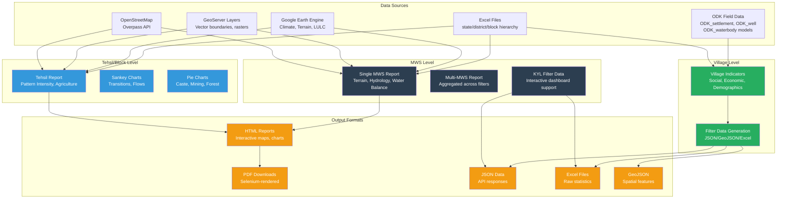
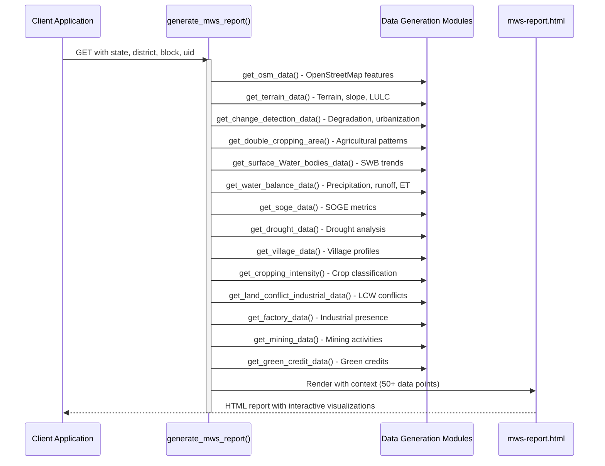
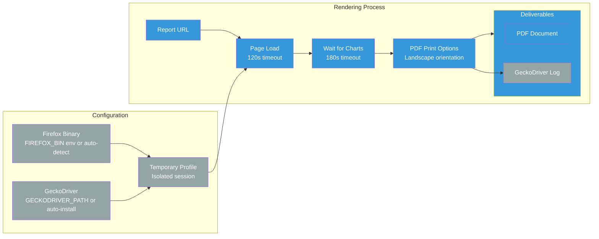
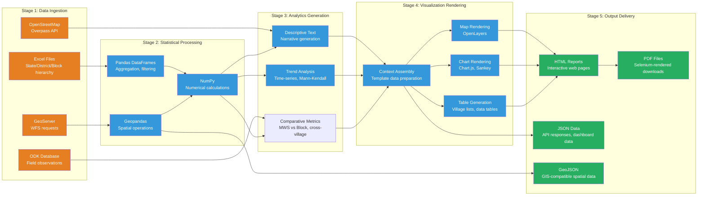

# Multi-Level Reporting (MWS, Tehsil, Village)

The Core Stack Backend implements a sophisticated three-level geospatial reporting system that enables comprehensive watershed analysis and natural resource management across multiple administrative boundaries. This reporting framework processes and visualizes complex environmental, hydrological, and socio-economic data at the **Micro-Watershed (MWS)**, **Tehsil/Block**, and **Village** levels, supporting data-driven decision-making for water resource planning and ecosystem restoration.

## Architecture Overview

The multi-level reporting system follows a hierarchical architecture where data flows from granular village-level observations to aggregated block-level insights, with detailed MWS-specific analyses serving as the foundational reporting unit. Each reporting level serves distinct analytical purposes while maintaining data consistency through shared data sources and processing pipelines.

The system processes data through specialized generation modules for each administrative level, with visualization templates and export capabilities enabling flexible consumption. The three-level hierarchy ensures that reporting can be tailored to different stakeholder needs—from village-level ground teams to block-level planning officers and watershed specialists requiring MWS-specific technical details.



## MWS-Level Reporting

### Single MWS Report Generation

The single MWS report provides comprehensive watershed-level analysis for individual micro-watersheds, integrating terrain, hydrological, and socio-economic data. The `generate_mws_report` API endpoint orchestrates data collection from multiple specialized modules and renders the results using the `mws-report.html` template.

**Request Processing Flow**:

**Key Data Modules**:

The single MWS report generation leverages 12+ specialized data extraction functions from `dpr/gen_mws_report.py` (2619 lines), each responsible for specific analytical domains:

* **Terrain Analysis** (`get_terrain_data`): Calculates terrain characteristics including slope distributions, land use classifications across slope categories (plain vs. sloped terrain), and comparative analysis between MWS and block-level areas. Uses GeoServer layers for spatial data retrieval.
* **Hydrological Assessment** (`get_water_balance_data`): Processes annual precipitation, runoff, and evapotranspiration data to compute water balance metrics, identifying years with favorable (good\_rainfall) and unfavorable (bad\_rainfall) conditions.
* **Surface Water Bodies** (`get_surface_Water_bodies_data`): Analyzes seasonal variations (Kharif, Rabi, Zaid) in surface water body extents, deriving trend descriptions and multi-year water body classifications.
* **Drought Analysis** (`get_drought_data`): Calculates drought incidence severity, identifying moderate and severe drought weeks, dry spell patterns, and generating drought year classifications.
* **Agricultural Land Use** (`get_cropping_intensity`, `get_double_cropping_area`): Classifies cropland into single, double, triple, and uncultivated categories, with temporal tracking across multiple growing seasons.
* **Village Profile** (`get_village_data`): Extracts demographic information including village names, Scheduled Caste (SC) and Scheduled Tribe (ST) populations, and categorizes NREGA works by type (SWC, LR, plantation, IOF, OFL, CA, OFW).

**Visualization Components**:

The `mws-report.html` template (2974 lines) implements comprehensive visualizations using **OpenLayers** for interactive mapping and **Chart.js** for statistical charts:

* **Interactive Maps**: Dual-map layouts showing MWS boundaries within block context, with layer controls for terrain, water bodies, and infrastructure features
* **Time-series Charts**: Multi-year precipitation, runoff, and evapotranspiration trends
* **Bar Charts**: Cropping intensity classifications, surface water body seasonal distributions
* **Village Tables**: Detailed demographic and NREGA asset information for all villages within the MWS

### Multi-MWS Aggregated Reports

The multi-MWS reporting capability enables analysis across multiple micro-watersheds with user-defined filters. The `dpr/gen_multi_mws_report.py` module provides specialized aggregation functions for comparative analysis.

**Filter-Based Aggregation**:

The `get_mws_data` function generates descriptive narratives summarizing selected MWS clusters based on filter criteria (e.g., terrain clusters, cropping patterns, water stress levels). This function identifies villages intersecting selected MWS boundaries using the `mws_intersect_villages` Excel sheet.

**Specialized Aggregation Modules**:

* **Terrain Aggregation** (`get_terrain_mws_data`): Aggregates terrain cluster classifications across multiple MWS
* **Land Use Aggregation** (`get_lulc_mws_data`): Processes land use/land cover statistics
* **Degradation Metrics** (`get_degrad_mws_data`, `get_reduction_mws_data`): Tracks land degradation and reduction trends
* **Urbanization Analysis** (`get_urban_mws_data`): Monitors urban expansion patterns
* **Cropping Patterns** (`get_cropping_mws_data`): Aggregates agricultural intensity metrics
* **Surface Water Analysis** (`get_surface_wb_mws_data`): Multi-MWS water body assessments
* **Water Balance** (`get_water_balance_mws_data`): Comparative hydrological analysis
* **Drought Assessment** (`get_drought_mws_data`): Cross-MWS drought vulnerability evaluation



These aggregated reports support regional planning initiatives by enabling comparative analysis across watershed clusters, identifying common patterns and outliers for targeted intervention strategies.

### MWS Indicators for KYL (Know Your Landscape)

The `stats_generator/mws_indicators.py` module generates structured indicator data specifically designed for the Know Your Landscape (KYL) interactive dashboard interface.

**Data Structure**:

The module processes 25+ Excel sheets containing MWS-level statistics including:

* **Hydrological Data** (`hydrological_annual`): Annual precipitation, runoff, and groundwater metrics
* **Terrain Data** (`terrain`, `terrain_lulc_slope`, `terrain_lulc_plain`): Terrain classifications and slope-specific land use
* **Agricultural Data** (`croppingIntensity_annual`, `croppingDrought_kharif`): Cropping intensity and drought impacts
* **Change Detection** (`change_detection_degradation`, `change_detection_afforestation`, `change_detection_deforestation`, `change_detection_urbanization`, `change_detection_cropintensity`): Temporal change analysis
* **Infrastructure** (`restoration_vector`, `aquifer_vector`, `soge_vector`): Water infrastructure locations
* **Economic Factors** (`lcw_conflict`, `factory_csr`, `mining`, `green_credit`): Industrial and economic indicators

**Output Formats**:

The `generate_mws_data_for_kyl_filters` function supports three export formats:

| Format | Extension | Use Case |
| --- | --- | --- |
| Excel | `.xlsx` | Raw data download, offline analysis |
| JSON | `.json` | Web application integration, API consumption |
| GeoJSON | `.geojson` | GIS visualization, spatial analysis |

The module implements caching to avoid regenerating data files when unchanged, checking for existing files before processing. Regeneration can be forced via the `regenerate` parameter.

## Tehsil/Block-Level Reporting

Tehsil (also referred to as Block) level reporting provides aggregated insights across multiple MWS within a single administrative unit, focusing on comparative patterns, thematic analyses, and socio-economic dimensions.

### Tehsil Report Generation

The `generate_tehsil_report` API endpoint processes block-level data through the `dpr/gen_tehsil_report.py` module (2691 lines), generating comprehensive analyses that emphasize comparative metrics across MWS boundaries.

**Data Processing Modules**:

**Thematic Analysis Categories**:

The Tehsil report organizes data into 12 thematic categories, each with specialized visualization types:

1. **OSM Infrastructure** (`get_tehsil_data`): Extracts OpenStreetMap features (forests, water bodies, roads, settlements) for the block boundary
2. **Pattern Intensity** (`get_pattern_intensity`): Classifies MWS patterns for comparative analysis
3. **Agricultural Water Stress** (`get_agri_water_stress_data`): Identifies MWS with high groundwater stress
4. **Drought Incidence** (`get_agri_water_drought_data`): Generates weighted drought timeline showing historical drought patterns
5. **Irrigation Risk** (`get_agri_water_irrigation_data`): Maps irrigation risk zones with temporal tracking
6. **Agricultural Yield** (`get_agri_low_yield_data`): Identifies low-yield areas with Sankey diagram visualization of yield transitions
7. **Forest Degradation** (`get_forest_degrad_data`): Tracks forest degradation with transition Sankey diagrams
8. **Mining Presence** (`get_mining_presence_data`): Maps mining activities with pie chart distributions
9. **Socio-Economic: Caste** (`get_socio_economic_caste_data`): Caste demographic analysis with pie charts
10. **Socio-Economic: NREGA** (`get_socio_economic_nrega_data`): NREGA asset and employment analysis
11. **Fishery Potential** (`get_fishery_water_potential_data`): Fishery opportunity assessment with temporal trends
12. **Agroforestry Transitions** (`get_agroforestry_transition_data`): Agroforestry adoption patterns with Sankey visualization

```mermaid
flowchart TD
    subgraph Input["Input Parameters"]
        S[State]
        D[District]
        B[Block/Tehsil]
    end
    
    subgraph Modules["Processing Modules"]
        TD[get_tehsil_data<br/>OpenStreetMap features]
        PI[get_pattern_intensity<br/>MWS pattern classifications]
        AWS[get_agri_water_stress_data<br/>Groundwater stress levels]
        AWD[get_agri_water_drought_data<br/>Drought incidence timeline]
        AWI[get_agri_water_irrigation_data<br/>Irrigation risk assessment]
        ALY[get_agri_low_yield_data<br/>Yield anomalies]
        FD[get_forest_degrad_data<br/>Forest degradation status]
        MP[get_mining_presence_data<br/>Mining impact zones]
        SEC[get_socio_economic_caste_data<br/>Caste demographics]
        SEN[get_socio_economic_nrega_data<br/>NREGA participation]
        FWP[get_fishery_water_potential_data<br/>Fishery opportunities]
        AAT[get_agroforestry_transition_data<br/>Agroforestry trends]
    end
    
    subgraph Outputs["Output Components"]
        Charts[Charts]
        JSON[JSON Data]
        Maps[Maps]
    end
    
    S --> TD
    D --> TD
    B --> TD
    S --> PI
    D --> PI
    B --> PI
    S --> AWS
    D --> AWS
    B --> AWS
    S --> AWD
    D --> AWD
    B --> AWD
    S --> AWI
    D --> AWI
    B --> AWI
    S --> ALY
    D --> ALY
    B --> ALY
    S --> FD
    D --> FD
    B --> FD
    S --> MP
    D --> MP
    B --> MP
    S --> SEC
    D --> SEC
    B --> SEC
    S --> SEN
    D --> SEN
    B --> SEN
    S --> FWP
    D --> FWP
    B --> FWP
    S --> AAT
    D --> AAT
    B --> AAT
    
    PI --> Charts
    AWS --> Charts
    AWD --> Charts
    AWI --> Charts
    ALY --> Charts
    FD --> Charts
    MP --> Charts
    SEC --> Charts
    SEN --> Charts
    FWP --> Charts
    AAT --> Charts
    
    TD --> Maps
    PI --> JSON
    AWS --> JSON
    AWD --> JSON
    AWI --> JSON
    ALY --> JSON
    FD --> JSON
    MP --> JSON
    SEC --> JSON
    SEN --> JSON
    FWP --> JSON
    AAT --> JSON
    
    classDef data fill:#3498db,color:#fff
    classDef viz fill:#e74c3c,color:#fff
    
    class Charts,Maps viz
    class JSON data
```



**Visualization Methods**:

The `block-report.html` template (2705 lines) extends the visualization capabilities with specialized chart types:

* **Sankey Diagrams**: Using `chartjs-chart-sankey` plugin for flow visualizations (forest degradation transitions, yield changes, agroforestry adoption)
* **Pie Charts**: Categorical distributions (caste composition, mining categories)
* **Timeline Charts**: Temporal tracking of drought incidence, irrigation risk, and fishery potential
* **Gradient Legends**: Visual scales for continuous variables (water stress, yield anomalies)
* **Interactive Maps**: Multi-layer block maps with MWS boundary overlays

The block-level report emphasizes comparative analysis, enabling identification of MWS clusters with similar characteristics, outliers requiring attention, and systematic patterns across the administrative unit.

## Village-Level Reporting

Village-level reporting focuses on granular demographic, social, and economic indicators, providing detailed profiles for individual settlements within watersheds.

### Village Indicators Generation

The `stats_generator/village_indicators.py` module processes village-specific data from Excel sheets, generating indicator datasets suitable for field-level planning and monitoring.

**Data Sources**:

The module reads two primary Excel sheets from the block-level Excel file:

* **Social Economic Indicators** (`social_economic_indicator`): Village demographic data including:

  + Total population counts
  + Scheduled Caste (SC) percentage
  + Scheduled Tribe (ST) percentage
  + Literacy rates
* **NREGA Assets** (`nrega_assets_village`): NREGA (National Rural Employment Guarantee Act) asset data by village and asset type

**Indicator Calculation**:

For each village, the module calculates:

| Indicator | Description | Data Type |
| --- | --- | --- |
| `village_id` | Unique village identifier | Integer |
| `total_population` | Total resident population | Integer |
| `percent_st_population` | ST population percentage | Float (4 decimal places) |
| `percent_sc_population` | SC population percentage | Float (4 decimal places) |
| `literacy_level` | Literacy rate percentage | Float (4 decimal places) |
| `total_assets` | Total NREGA assets | Integer (-1 if no data) |

**GeoJSON Integration**:

A key feature of village-level reporting is the automatic integration of indicator data with panchayat boundary GeoJSON files. The module:

1. Queries GeoServer for the `panchayat_boundaries` layer using the `{district}_{block}` layer name
2. Matches village indicator data with GeoJSON features using `vill_ID` property
3. Updates GeoJSON feature properties with calculated indicators
4. Exports enriched GeoJSON for GIS visualization

This integration enables choropleth mapping and spatial analysis of demographic and socio-economic patterns across the watershed.

**Output Formats**:

The module generates three output files:

* **JSON**: `{district}_{block}_KYL_village_data.json` - Structured indicator records for API consumption
* **Excel**: `{district}_{block}_KYL_village_data.xlsx` - Spreadsheet format for offline analysis
* **GeoJSON**: `{district}_{block}_KYL_village_data_panchayat_boundaries_nw.geojson` - Enriched spatial data for mapping

The `generate_village_data_for_kyl` API endpoint provides parameterized access to this data generation process, with optional regeneration control via the `regenerate` parameter.

## PDF Report Generation

To enable offline distribution and archiving of reports, the system implements automated PDF generation using browser automation with Selenium.

### Selenium-Based Rendering

The `dpr/gen_report_download.py` module uses Firefox in headless mode to render HTML reports as PDF documents, preserving interactive visualizations and map content.

**Configuration and Setup**:

**Key Features**:

* **Environment Isolation**: Creates temporary Firefox profiles to prevent cross-session conflicts, with explicit environment variable cleanup (LD\_LIBRARY\_PATH, GTK\_PATH, etc.)
* **Flexible Binary Detection**: Attempts multiple Firefox binary locations (explicit path, /usr/bin/firefox-esr, /usr/bin/firefox, /usr/local/bin/firefox)
* **Automated Driver Management**: Uses `webdriver-manager` to automatically install compatible GeckoDriver versions
* **Viewport Optimization**: Sets 1600x1200 viewport to ensure maps and charts render at appropriate scales for PDF output
* **Configurable Timeouts**: 120-second page load timeout and 180-second chart rendering timeout
* **Landscape Orientation**: Default PDF generation in landscape format suitable for map-heavy reports




The `render_pdf_with_firefox` function accepts the report URL and returns raw PDF bytes, which can then be served as downloadable files via the API endpoints.

**Error Handling and Logging**:

The module implements comprehensive error handling and logging:

* Geckodriver output is captured to a dedicated log file for debugging
* Failed rendering attempts are logged with detailed exception information
* Environment variable sanitization prevents Conda/GTK/NSS library conflicts

This PDF generation capability enables the system to serve static report downloads while maintaining the richness of interactive HTML visualizations through accurate browser-based rendering.

## Data Models and Integration

The multi-level reporting system integrates data from multiple sources through Django models and external data connections.

### ODK Field Data Models

The `dpr/models.py` module defines models for collecting field data through Open Data Kit (ODK) forms, which feed into the reporting system:

**ODK Settlement Data** (`ODK_settlement`):

* Geographic coordinates (latitude, longitude)
* Household demographics (number of households, caste distributions)
* NREGA participation (job card holders, work days, demand patterns)
* GPS point and system metadata
* Moderation status tracking

**Water Infrastructure Models**:

* `ODK_well`: Well location, ownership, functionality status, beneficiaries
* `ODK_waterbody`: Water body dimensions, management, ownership, beneficiaries
* `ODK_groundwater`: Recharge structures, work types, dimensions

**Agricultural Models**:

* `ODK_agri`: Irrigation works, work dimensions
* `ODK_crop`: Cropping patterns by season (Kharif, Rabi, Zaid), productivity data

**Livelihood Data** (`ODK_livelihood`):

* Livestock development
* Fishery activities
* Common asset information

**Maintenance Models**:

* `GW_maintenance`, `SWB_RS_maintenance`, `SWB_maintenance`, `Agri_maintenance`: Track maintenance activities for different infrastructure types

The `is\_moderated` boolean field across all ODK models enables content validation workflows, ensuring that field-collected data is reviewed before inclusion in official reports. This moderation capability is critical for maintaining data quality in multi-stakeholder environments.

These models provide the foundation for collecting ground-truth data that complements remote sensing and geospatial analyses in the reporting system.

## API Reference

### MWS Report Endpoints

**Generate Single MWS Report**:

* **Endpoint**: `GET /dpr/generate_mws_report/`
* **Parameters**:
  + `state`: State name (lowercase)
  + `district`: District name (lowercase)
  + `block`: Block name (lowercase)
  + `uid`: MWS unique identifier
* **Response**: HTML report with interactive visualizations
* **Template**: `templates/mws-report.html`
* **Processing**: ~12 data generation modules, 50+ data points
* **Authentication**: `@api_security_check(auth_type="Auth_free")`

**Download MWS Report as PDF**:

* **Endpoint**: `GET /dpr/download_mws_report/`
* **Parameters**: Same as generate\_mws\_report
* **Response**: PDF file (Selenium-rendered)
* **Processing**: HTML rendering → PDF conversion
* **Authentication**: `@auth_free`

### Tehsil Report Endpoints

**Generate Tehsil/Block Report**:

* **Endpoint**: `GET /dpr/generate_tehsil_report/`
* **Parameters**:
  + `state`: State name (lowercase)
  + `district`: District name (lowercase)
  + `block`: Block name (lowercase)
* **Response**: HTML report with Sankey diagrams and comparative charts
* **Template**: `templates/block-report.html`
* **Processing**: ~12 thematic analysis modules
* **Authentication**: `@api_security_check(auth_type="Auth_free")`

### Village Data Endpoints

**Generate Village Data for KYL**:

* **Endpoint**: `GET /stats_generator/generate_village_data_for_kyl/`
* **Parameters**:
  + `state`: State name (lowercase)
  + `district`: District name (lowercase)
  + `block`: Block name (lowercase)
  + `regenerate`: Force regeneration ("true"/"false")
* **Response**: JSON file with village indicators
* **Outputs**: JSON, Excel, and GeoJSON files
* **Authentication**: `@auth_free`

**Generate MWS Data for KYL**:

* **Endpoint**: `GET /stats_generator/generate_mws_data_for_kyl/`
* **Parameters**:
  + `state`: State name (lowercase)
  + `district`: District name (lowercase)
  + `block`: Block name (lowercase)
  + `file_type`: Output format ("xlsx", "json", "geojson")
  + `regenerate`: Force regeneration ("true"/"false")
* **Response**: File download in specified format
* **Processing**: 25+ Excel sheets, MWS-level indicators
* **Authentication**: `@auth_free`

All report generation endpoints use `@auth\_free` decorator, enabling public access without API key authentication. However, the endpoints implement parameter validation through `valid\_gee\_text()` function to sanitize state, district, and block names before processing.


## Data Flow and Processing Architecture

The multi-level reporting system implements a layered data processing architecture that transforms raw geospatial and field data into actionable insights.

**Processing Pipeline**:

**Key Processing Patterns**:

1. **Excel-Based Processing**: The system relies heavily on Excel files organized in a three-level directory structure (state/district/block), with each block file containing 25+ sheets for different data domains. Pandas is used for data extraction, filtering, and aggregation.
2. **Geospatial Integration**: GeoServer WFS requests provide vector data for MWS boundaries, panchayat boundaries, and infrastructure features. Geopandas handles coordinate transformations and spatial operations.
3. **Spatial Filtering**: Multiple functions implement spatial filtering to identify features (villages, water bodies, infrastructure) within MWS boundaries using `filter_within_boundary` helper functions.
4. **Time-Series Analysis**: The `pymannkendall` library (imported in `gen_multi_mws_report.py`) enables statistical trend detection in climatic and hydrological time-series data.
5. **Context Assembly**: API endpoints assemble 50+ data points into template context dictionaries, which are then rendered through Django templates with embedded JavaScript for client-side visualization.



## Usage Scenarios and Best Practices

### Scenario 1: Watershed Restoration Planning

**Use Case**: A planning officer needs to assess restoration opportunities across a block and prioritize micro-watersheds for intervention.

**Workflow**:

1. Generate Tehsil report to identify MWS clusters with high degradation patterns and low forest cover
2. Use Sankey diagrams to understand forest degradation transitions and identify intervention points
3. Generate specific MWS reports for prioritized watersheds to assess detailed terrain, water balance, and village profiles
4. Export MWS data as JSON for integration with planning dashboards
5. Download PDF reports for offline stakeholder meetings

**Best Practice**: Start with Tehsil-level analysis for pattern identification, then drill down to specific MWS for detailed planning documentation.

### Scenario 2: Agricultural Drought Assessment

**Use Case**: Agricultural department officials need to understand drought vulnerability and irrigation infrastructure distribution across villages.

**Workflow**:

1. Generate Tehsil report with agricultural water stress and drought incidence data
2. Review irrigation timeline charts to identify years with high risk
3. Use village-level indicators to assess demographic vulnerability (SC/ST populations, literacy rates)
4. Cross-reference with MWS reports for detailed water balance analysis
5. Download enriched GeoJSON files for GIS visualization of drought-prone zones

**Best Practice**: Combine agricultural metrics from Tehsil reports with village demographic data to target vulnerable communities for drought mitigation programs.

### Scenario 3: Multi-Stakeholder Dashboard Integration

**Use Case**: Develop a web dashboard that displays watershed indicators with interactive filtering capabilities.

**Workflow**:

1. Use `generate_mws_data_for_kyl` API to generate JSON data with all MWS indicators
2. Use `generate_village_data_for_kyl` API to get village-level demographic data
3. Import enriched GeoJSON files for choropleth mapping
4. Implement client-side filtering using the JSON indicator data
5. Serve interactive maps using the generated GeoJSON with embedded indicators

**Best Practice**: Leverage the caching mechanism (regenerate=false) to avoid unnecessary processing, only regenerate when underlying Excel data changes.

### Performance Considerations

**Report Generation Time**:

* MWS report: ~30-60 seconds (depends on network latency for GeoServer/OSM calls)
* Tehsil report: ~45-90 seconds (more complex Sankey chart rendering)
* Village data: ~10-20 seconds (Excel processing and GeoJSON enrichment)

**Optimization Strategies**:

1. **Caching**: All KYL data generation modules implement file-based caching, checking for existing outputs before processing
2. **Batch Processing**: For generating reports across multiple blocks, consider async task processing with Celery to avoid timeouts
3. **Regeneration Control**: Use `regenerate=false` (default) to leverage cached data, only regenerate when Excel sources are updated
4. **PDF Generation**: PDF rendering via Selenium is resource-intensive; consider generating during off-peak hours for large batches

When integrating reports into external systems, prefer the JSON/GeoJSON APIs over HTML scraping. The JSON outputs are structured, versioned, and designed for programmatic consumption, while HTML structure may change between template updates.

## Integration with Other System Components

The multi-level reporting system integrates with several other Core Stack Backend components to provide comprehensive watershed analysis.

### Google Earth Engine Integration

While detailed GEE integration is covered in [Google Earth Engine Integration and Authentication](./9-google-earth-engine-integration-and-authentication), the reporting system consumes GEE-derived products through:

* Climate data: Precipitation, evapotranspiration, drought indices
* Terrain data: Elevation, slope, terrain classifications
* Land Use Land Cover: Historical LULC maps for change detection
* Water balance components: Runoff, groundwater recharge estimates

These GEE outputs are stored in Excel sheets and processed through the reporting pipeline.

### Hydrological Computing Modules

The reporting system builds upon the hydrological computing capabilities described in [Hydrological Computing Modules](./10-hydrological-computing-modules), utilizing:

* Surface water body extent calculations
* Drought severity classifications
* Water balance component estimates
* Catchment area delineation

The reporting layer aggregates these technical analyses into decision-friendly narratives and visualizations.

### Administrative Boundaries Management

The system relies on the administrative boundary hierarchy managed through [Administrative Boundaries Management](./20-administrative-boundaries-management), using:

* State, district, block/tehsil boundary definitions
* MWS boundary delineations
* Panchayat/village boundary layers

These boundaries define the spatial extent for all reporting levels and enable spatial filtering of village and infrastructure data.

### ODK Data Collection

Field data collected through the bot interface and ODK forms (as described in [WhatsApp and Facebook Bot Integration](./16-whatsapp-and-facebook-bot-integration) ) flows into the reporting system through:

* Village settlement profiles
* Water infrastructure condition assessments
* Agricultural practice observations
* Livelihood and asset data

This ground-truth data complements remote sensing analyses, providing validation and local context.

### Statistics and Indicator Calculation

The reporting system implements the statistical methodologies detailed in [Statistics and Indicator Calculation](./26-statistics-and-indicator-calculation) , including:

* Time-series trend analysis
* Spatial aggregation techniques
* Comparative metrics across boundaries
* Statistical significance testing

These calculations support the data-driven narratives and visualizations presented in reports.

## Troubleshooting Guide

### Common Issues and Solutions

**Issue 1: Report generation returns error-page.html**

**Symptoms**: API call succeeds but renders error page instead of expected report.

**Potential Causes**:

* Missing Excel file for specified state/district/block
* Required data sheets not present in Excel file
* GeoServer layer not available
* Network timeout during data fetching

**Troubleshooting Steps**:

1. Check server logs for specific exception details
2. Verify Excel file exists at correct path: `data/stats_excel_files/{STATE}/{DISTRICT}/{district}_{block}.xlsx`
3. Validate that required sheets (e.g., "terrain", "hydrological\_annual") exist in Excel file
4. Test GeoServer connectivity using the WFS request URLs in browser

**Issue 2: PDF generation fails or produces empty PDF**

**Symptoms**: PDF download request fails or resulting PDF is blank/incomplete.

**Potential Causes**:

* Firefox binary not found
* Geckodriver compatibility issues
* Charts or maps not rendering within timeout period
* JavaScript errors in report template

**Troubleshooting Steps**:

1. Check geckodriver.log for driver errors
2. Verify Firefox binary path: Set `FIREFOX_BIN` environment variable if auto-detection fails
3. Increase timeout values in `render_pdf_with_firefox` function parameters
4. Test HTML report rendering in browser before attempting PDF conversion

**Issue 3: Village data generation shows NREGA assets as -1**

**Symptoms**: Village indicator JSON shows `total_assets: -1` for all villages.

**Potential Causes**:

* `nrega_assets_village` sheet missing from Excel file
* Village ID mismatch between sheets
* Data parsing errors in NREGA sheet

**Troubleshooting Steps**:

1. Verify Excel file contains `nrega_assets_village` sheet
2. Check that `vill_id` column in NREGA sheet matches `village_id` in `social_economic_indicator` sheet
3. Review console output for NREGA parsing exceptions

**Issue 4: Sankey charts not rendering in Tehsil report**

**Symptoms**: Block report loads but Sankey diagram areas are blank.

**Potential Causes**:

* Missing `chartjs-chart-sankey` library dependency
* Invalid data structure for Sankey input
* JavaScript errors in chart initialization

**Troubleshooting Steps**:

1. Verify `[[email protected]](/cdn-cgi/l/email-protection)` script tag is present in `block-report.html`
2. Check browser console for JavaScript errors
3. Validate that Sankey data JSON structure matches expected format (source, target, value properties)

## Extension and Customization

The multi-level reporting system is designed for extensability, enabling addition of new analytical modules and visualization types.

### Adding New Data Modules

To add a new data module to MWS reports:

1. **Create data extraction function** in [`dpr/gen_mws_report.py`](../dpr/gen_mws_report.py):

```python
def get_new_data_category(state, district, block, uid):
    try:
        df = pd.read_excel(
            DATA_DIR_TEMP + state.upper() + "/" + district.upper() + "/" +
            district.lower() + "_" + block.lower() + ".xlsx",
            sheet_name="new_data_sheet"
        )

                mws_data = df[df['UID'] == uid]

        # Process data and generate descriptions
        processed_data = process_data(mws_data)
        description = generate_description(processed_data)

        return description, processed_data

    except Exception as e:
        logger.exception("Exception in get_new_data_category :: ", e)
        return "", {}
```

2. **Integrate in API endpoint** in [`dpr/api.py`](../dpr/api.py):

```python
# Add data extraction call
new_data_desc, new_data_values = get_new_data_category(
    result["state"], result["district"], result["block"], result["uid"]
)

# Add to context dictionary
context.update({
    "new_data_desc": new_data_desc,
    "new_data_values": json.dumps(new_data_values),
})
```

3. **Add visualization in template** in [`templates/mws-report.html`](../templates/mws-report.html):

```html
<div class="section">
    <h2>New Data Category</h2>
    <p>{{ new_data_desc }}</p>
    <div class="chart-container">
        <canvas id="newDataChart"></canvas>
    </div>
</div>

<script>
// Add chart initialization code
new Chart(document.getElementById('newDataChart'), {
    type: 'bar',
    data: JSON.parse('{{ new_data_values|safe }}'),
    options: { /* chart options */ }
});
</script>
```

### Adding New Indicators to Village Reports

To add new village-level indicators:

1. **Extract data with** [`stats_generator/village_indicators.py`](../stats_generator/village_indicators.py):

```python
# Add new indicator calculation
new_indicator = round(village_row["new_indicator_column"].iloc[0], 4)

# Add to results dictionary
results.append({
    # ... existing fields ...
    "new_indicator": new_indicator,
})
```

2. **Add GeoJSON integration** if spatial visualization is needed:

```python
if match:
    feature["properties"].update(match)
    # New indicators automatically included in GeoJSON
```

### Customizing Report Styling

Report templates use inline CSS for consistency and print support. To customize styling:

1. **Modify CSS** in template `<style>` blocks (lines 30-100 in most templates)
2. **Update chart colors** in JavaScript Chart.js configuration
3. **Modify map styles** in OpenLayers layer definitions
4. **Adjust print settings** in `@media print` CSS blocks for PDF output

## Summary

The Core Stack Backend's multi-level reporting system provides a comprehensive framework for watershed analysis across MWS, Tehsil/Block, and Village administrative boundaries. The system integrates remote sensing data, field observations, and geospatial infrastructure to deliver actionable insights through interactive HTML reports, PDF downloads, and structured JSON/GeoJSON exports.

Key strengths of the system include:

* **Hierarchical Analysis**: Three-level reporting structure enables analysis from granular village profiles to aggregated block-level patterns
* **Rich Visualizations**: OpenLayers maps, Chart.js charts, and Sankey diagrams provide multiple perspectives on complex data
* **Flexible Outputs**: HTML, PDF, JSON, Excel, and GeoJSON formats support diverse use cases and stakeholder needs
* **Field Data Integration**: ODK models enable ground-truthing of remote sensing analyses
* **Caching and Performance**: File-based caching and efficient data processing optimize for repeated access

The system serves as a foundational component for data-driven watershed management, supporting restoration planning, drought mitigation, agricultural development, and community engagement initiatives.

**Recommended Learning Path**:

1. Start with [Detailed Project Report (DPR) Generation System](./24-detailed-project-report-dpr-generation-system)  to understand broader report generation patterns
2. Review [Statistics and Indicator Calculation](./26-statistics-and-indicator-calculation)  for statistical methodologies
3. Explore [Administrative Boundaries Management](./20-administrative-boundaries-management)  for spatial data foundations
4. Study [Hydrological Computing Modules](./10-hydrological-computing-modules) for technical data sources