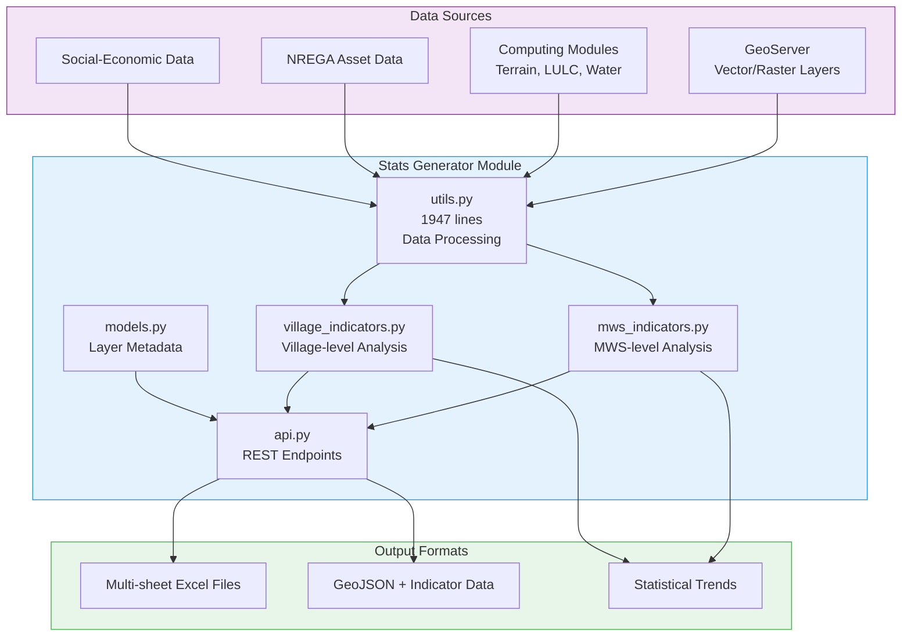

# Statistics and Indicator Calculation

The Statistics and Indicator Calculation system forms the analytical backbone of the Core Stack Backend, providing comprehensive statistical analysis and indicator computation for Micro-Watershed (MWS) and Village-level geographic units. This system aggregates data from multiple geospatial computing modules, applies statistical methods including trend analysis, and delivers results through Excel-based reports and JSON APIs for integration with downstream applications like the Know Your Landscape (KYL) platform.

## System Architecture

The statistics generator operates as a centralized data processing pipeline that transforms raw geospatial layer data into actionable statistical indicators. The architecture follows a modular design where computing modules feed processed data into the stats\_generator, which then applies statistical calculations and formats output for various consumption patterns.

The system maintains a **LayerInfo** model that tracks which vector layers require Excel generation, along with temporal bounds (start\_year, end\_year) for time-series analysis . This metadata-driven approach allows the system to dynamically process layers based on administrative configuration rather than hardcoded mappings.

[stats_generator/models.py#L5-L24](../stats_generator/models.py#L5-L24)

## Micro-Watershed Indicator Calculation

Micro-Watershed (MWS) indicators provide hydrological, agricultural, and environmental metrics computed at the watershed level. The `generate_mws_data_for_kyl_filters` function orchestrates the retrieval and aggregation of 21 distinct indicator types from pre-generated Excel files, transforming them into filterable datasets for the KYL platform [stats_generator/mws_indicators.py#L51-L885](../stats_generator/mws_indicators.py#L51-L885).

### Core Indicator Categories

| Category | Sheet Name | Key Metrics | Time Series |
| --- | --- | --- | --- |
| **Hydrological** | hydrological\_annual | ET, Runoff, Groundwater (G), ΔG, Precipitation, Well Depth | Annual (2001-2024) |
| **Terrain** | terrain, terrain\_lulc\_slope, terrain\_lulc\_plain | Elevation, slope, terrain clusters | Static |
| **Agriculture** | croppingIntensity\_annual, croppingDrought\_kharif | Cropping intensity, single/double/triple crop area, crop drought risk | Annual + Seasonal |
| **Water Bodies** | surfaceWaterBodies\_annual | Surface water extent, permanence | Annual |
| **Change Detection** | change\_detection\_\* | Afforestation, deforestation, degradation, urbanization, crop intensity change | Multi-year |
| **Assets** | nrega\_annual | NREGA work categories, asset counts | Annual |
| **Tree Health** | ccd, ch, overall\_tree\_change | Canopy cover density, canopy height, tree change | Annual |
| **Socio-Economic** | soge\_vector, lcw\_conflict, factory\_csr, mining, green\_credit | Social indicators, land conflicts, CSR activities, mining sites | Static |

The cropping intensity trend analysis employs the Mann-Kendall test for trend detection combined with a custom Sen's slope calculation to quantify the magnitude of change, providing both direction (increasing/decreasing/no trend) and rate of change metrics.




### Statistical Trend Analysis

The system implements robust statistical trend analysis for time-series indicators. For cropping intensity, it calculates trends by first extracting annual values across available years, then applying the Mann-Kendall test to detect significant trends:

```python
crp_intensity_T = df_crp_intensity_mws_data.filter(
    like="cropping_intensity_unit_less"
).dropna()  # Drop rows with NaN for trend calculation
crp_intensity_T = crp_intensity_T.squeeze().tolist()[:-3]
result = mk.original_test(crp_intensity_T)

# Sen's slope calculation for magnitude
def sens_slope(data):
    slopes = []
    for i in range(len(data) - 1):
        for j in range(i + 1, len(data)):
            s = (data[j] - data[i]) / (j - i)
            slopes.append(s)
    return np.median(slopes)
```

The trend output is encoded as integers: `1` for increasing, `-1` for decreasing, and `0` for no trend <stats_generator/mws_indicators.py#L135-L156>. This standardized encoding enables downstream applications to perform trend visualizations and comparisons across different watersheds.

### Hydrological Annual Metrics Processing

The `parse_geojson_annual_mws` function extracts and structures annual hydrological data from GeoJSON features, parsing JSON-encoded yearly metrics for each watershed <stats_generator/utils.py#L1586-L1626>. The function processes 21 data points (7 metrics × 3 recent years) per watershed, organizing them into a nested dictionary structure keyed by watershed UID and year.

Each hydrological metric receives appropriate unit formatting—evapotranspiration, runoff, groundwater, precipitation in millimeters, and well depth in meters—with columns named using the fiscal year format (e.g., `ET_in_mm_2020-2021`, `WellDepth_in_m_2020-2021`). All numeric values are rounded to two decimal places for consistency <stats_generator/utils.py#L1609-L1626>.

## Village-Level Indicator Calculation

Village-level indicators aggregate data to the administrative boundary level, providing socio-economic and asset information suitable for community-level planning and governance. The `get_generate_filter_data_village` function combines social-economic indicators with NREGA asset data to create comprehensive village profiles <stats_generator/village_indicators.py#L13-L146>.

### Village Indicator Components

| Indicator | Source | Calculation | Data Type |
| --- | --- | --- | --- |
| **Population** | Social-Economic Sheet | Direct extraction | Integer |
| **SC/ST Percentage** | Social-Economic Sheet | Categorical proportion calculation | Float (4 decimal) |
| **Literacy Rate** | Social-Economic Sheet | Direct extraction | Float (4 decimal) |
| **Total Assets** | NREGA Village Sheet | Sum across all work categories | Integer |
| **Village ID** | Panchayat Boundaries | Geographic identifier | String |

The village indicator generation process performs spatial joins to associate computed indicators with geographic boundaries. After calculating indicators from Excel sheets, the system retrieves the panchayat boundaries GeoJSON from GeoServer and updates each feature's properties with the computed statistics <stats_generator/village_indicators.py#L119-L133>.

### NREGA Asset Integration

The NREGA (National Rural Employment Guarantee Act) asset integration process performs complex spatial analysis to count agricultural and infrastructure assets within each geographic unit. The `create_excel_for_nrega_assets` function uses geospatial joins to intersect NREGA point locations with watershed polygons, categorizing assets into work types like soil conservation, plantations, irrigation, and livelihood assets <stats_generator/utils.py#L1189-L1292>.

Asset counting requires robust date parsing to handle multiple timestamp formats from the source data. The system attempts 12 different date formats to correctly classify assets into fiscal years for annual aggregation:

```python
date_formats = [
    "%d-%b-%y %H:%M:%S.%f",
    "%d-%b-%y %H:%M:%S",
    "%d-%m-%y %H:%M:%S.%f",
    "%d-%m-%y %H:%M:%S",
    "%d-%b-%Y %H:%M:%S.%f",
    "%d-%b-%Y %H:%M:%S",
    "%d-%m-%Y %H:%M:%S.%f",
    "%d-%m-%Y %H:%M:%S",
    "%Y-%m-%d %H:%M:%S.%f",
    "%Y-%m-%d %H:%M:%S",
    "%Y/%m/%d %H:%M:%S.%f",
    "%Y/%m/%d %H:%M:%S",
    "%Y-%m-%dT%H:%M:%SZ",
]
```

This flexibility ensures accurate annual asset counts regardless of the source system's date formatting conventions <stats_generator/utils.py#L1221-L1235>.

## Data Processing and Excel Generation

The `utils.py` module contains the core data processing logic with specialized functions for converting GeoJSON data to structured Excel sheets. Each indicator type has a dedicated `create_excel_for_*` function that extracts relevant properties from GeoJSON features, performs calculations, and writes formatted data to Excel sheets <stats_generator/utils.py#L239-L1947>.


### Excel Sheet Generation Process

The `get_vector_layer_geoserver` function orchestrates the multi-sheet Excel generation process by querying the LayerInfo model for configured layers, retrieving corresponding GeoJSON data from GeoServer, and delegating to indicator-specific creation functions <stats_generator/utils.py#L35-L237>. This approach allows the system to dynamically add new indicator types without modifying the orchestration logic.

### Change Detection Indicators

Change detection indicators compute land use transitions between time periods. For example, the degradation detection function extracts high-density, low-density, and missing-data areas for each year, enabling analysis of forest health trends over time <stats_generator/utils.py#L603-L638>. Similarly, canopy height metrics categorize trees into short, medium, and tall height classes, providing insights into forest structure evolution <stats_generator/utils.py#L638-L676>.

All numeric values in Excel outputs are automatically rounded to two decimal places using pandas `select_dtypes` and `round()` methods, ensuring consistency across all indicator sheets regardless of the source data precision.

## API Endpoints and Data Access

The system provides five REST API endpoints for accessing statistical data, all marked with `@auth_free` decorator to allow public access for KYL integration <stats_generator/api.py#L13-L99>.

### Available Endpoints

| Endpoint | Method | Parameters | Purpose | Output |
| --- | --- | --- | --- | --- |
| `/download_excel_layer/` | GET | state, district, block | Download existing stats Excel | .xlsx file |
| `/generate_stats_excel_file/` | GET | state, district, block | Force regenerate Excel file | .xlsx file |
| `/add_new_layer_data_to_excel/` | GET | state, district, block, sheets | Add specific sheets to existing Excel | Success response |
| `/download_kyl_data/` | GET | state, district, block, file\_type, regenerate | Download MWS filter data | .json or .geojson |
| `/download_kyl_village_data/` | GET | state, district, block, regenerate | Download village indicators | .json |

### File Regeneration Workflow

The `generate_stats_excel_file` function implements a complete regeneration pipeline that deletes existing files and rebuilds them from source data <stats_generator/utils.py#L1861-L1920>. This workflow ensures data consistency when source layers are updated:

1. Delete existing Excel file if present
2. Regenerate vector layer data 


from GeoServer
3. Generate tehsil JSON boundaries
4. Regenerate MWS indicator data
5. Regenerate village indicator data
6. Return the newly generated file

All geographic parameters (state, district, block) are validated and sanitized using `valid_gee_text` from gee\_utils before processing, preventing injection attacks <stats_generator/api.py#L16-L37>.

## Administrative Configuration

The Django admin interface provides management capabilities for the LayerInfo model, enabling administrators to configure which layers require Excel generation without code changes <stats_generator/admin.py#L5-L53>.

### LayerInfo Model Fields

| Field | Type | Description |
| --- | --- | --- |
| layer\_name | CharField | Name of the GeoServer layer |
| layer\_type | ChoiceField | "raster" or "vector" |
| workspace | CharField | GeoServer workspace name |
| excel\_to\_be\_generated | BooleanField | Flag for Excel generation |
| start\_year | PositiveIntegerField | Beginning year for time series |
| end\_year | PositiveIntegerField | Ending year for time series |
| style\_name | CharField | GeoServer style reference |

The admin interface provides list filtering by layer type, Excel generation flag, and year ranges, along with search functionality for layer names and descriptions <stats_generator/admin.py#L20-L23>.

## Data Storage and Caching

Generated statistical files are stored in a hierarchical directory structure following the pattern: `{EXCEL_PATH}/data/stats_excel_files/{STATE}/{DISTRICT}/{DISTRICT}_{BLOCK}.{ext}` <stats_generator/mws_indicators.py#L56-L62>. This organization supports efficient lookups and prevents file conflicts between administrative units.

The system implements intelligent caching for KYL data downloads. When `regenerate` parameter is not set, it checks for existing JSON files and serves them directly, avoiding redundant computation. Only when explicitly requested or when cached files are missing does the system perform full regeneration <stats_generator/village_indicators.py#L20-L30>.

## Integration with Computing Modules

The statistics generator depends on outputs from various computing modules across the system. These modules generate the base GeoJSON layers that feed into the statistical pipeline:

* **Hydrological Computing**: Annual water balance components (ET, runoff, groundwater) <computing/drought/>
* **Land Use Land Cover**: Multi-year LULC classifications for change detection <computing/lulc/>
* **Terrain Analysis**: Elevation, slope, and terrain descriptors <computing/terrain_descriptor/>
* **Tree Health**: Canopy cover density and height metrics <computing/tree_health/>
* **Crop Grid**: Cropping intensity and agricultural metrics <computing/crop_grid/>
* **Water Bodies**: Surface water mapping and permanence analysis <computing/surface_water_bodies/>

The system maintains loose coupling through GeoServer integration—computing modules publish layers to GeoServer, and the stats generator consumes them via WFS requests without direct module dependencies <stats_generator/utils.py#L28-L34>.

## Next Steps

For comprehensive understanding of the reporting and analytics ecosystem, explore:

* **[Multi-Level Reporting (MWS, Tehsil, Village)](/25-multi-level-reporting-mws-tehsil-village)**  - Learn how statistical data feeds into detailed project reports
* **[Detailed Project Report (DPR) Generation System](/24-detailed-project-report-dpr-generation-system)**  - Understand how indicators integrate into formal reporting documents
* **[Excel-based Data Processing](/27-excel-based-data-processing)**  - Deep dive into Excel manipulation patterns and templates

For the foundational computing modules that generate the source data, refer to:

* **[Hydrological Computing Modules](/10-hydrological-computing-modules)**  - Water balance calculations
* **[Land Use Land Cover Analysis](/12-land-use-land-cover-analysis)**  - LULC change detection methodology
* **[Climate Analysis and Drought Assessment](/11-climate-analysis-and-drought-assessment)**  - Drought causality analysis