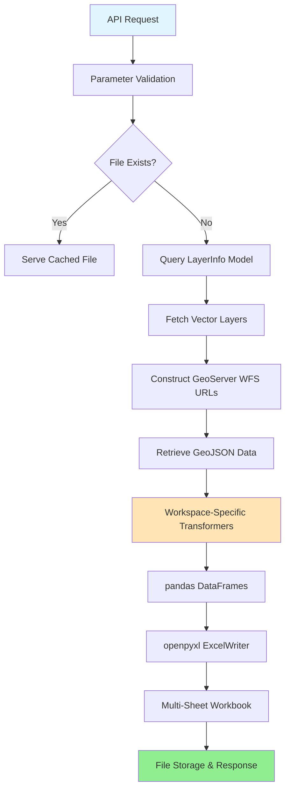

# Excel-based Data Processing

The Excel-based Data Processing system in the core-stack-backend orchestrates the extraction, transformation, and delivery of geospatial and statistical data into structured Excel workbooks. This system serves as the primary data export mechanism, consuming vector layers from GeoServer, processing them through specialized transformers, and delivering multi-sheet Excel files containing indicators ranging from hydrological metrics to socio-economic statistics. The architecture supports on-demand generation, caching strategies, and batch processing capabilities for administrative divisions at the state, district, and block levels.

Sources: [stats\_generator/models.py](../stats_generator/models.py#L5-L24), [stats\_generator/api.py](../stats_generator/api.py#L1-L113)

## Core Architecture Overview

The Excel processing pipeline follows a layered architecture that separates concerns between data source management, transformation logic, and API delivery. The system leverages Django models for configuration, pandas/openpyxl for Excel manipulation, and GeoServer's Web Feature Service (WFS) for geospatial data retrieval.

The configuration model `LayerInfo` serves as the central registry, defining which vector layers require Excel generation through the `excel_to_be_generated` boolean flag. Each layer entry contains workspace information, temporal boundaries (, ), and metadata that drives the processing pipeline. This design enables dynamic layer registration without code modifications, supporting administrative workflows for adding new data sources.

`start_year`

`end_year`

Sources: [stats\_generator/models.py](../stats_generator/models.py#L5-L24), [stats\_generator/utils.py](../stats_generator/utils.py#L18-L28)

## API Endpoints and Data Flow

The system exposes three primary API endpoints for Excel management, each serving distinct use cases in the data delivery lifecycle. These endpoints are designed with authentication-free access (`@auth_free`) to support integration with external dashboards and reporting systems.

| Endpoint | Purpose | Parameters | Behavior |
| --- | --- | --- | --- |
| `/download_excel_layer/` | Retrieve existing or generate new Excel file | `state`, `district`, `block` | Serves cached file if available, otherwise triggers generation |
| `/generate_stats_excel_file/` | Force regeneration of Excel file | `state`, `district`, `block` | Deletes existing file, regenerates all sheets, returns new file |
| `/add_new_layer_data_to_excel/` | Add specific sheets to existing workbook | `state`, `district`, `block`, `sheets` | Appends or replaces specified sheets without regenerating entire file |

Sources: [stats\_generator/urls.py](../stats_generator/urls.py#L1-L32), [stats\_generator/api.py](../stats_generator/api.py#L8-L25)

The download workflow implements a lazy generation strategy that optimizes for repeated access patterns. When a request arrives for a specific state-district-block combination, the system checks the filesystem at `data/stats_excel_files/{STATE}/{DISTRICT}/{DISTRICT}_{BLOCK}.xlsx`. If the file exists, it's immediately streamed as an HTTP response with the appropriate MIME type. If not found, the full generation pipeline executes, creating the directory structure and processing all configured layers.

Sources: [stats\_generator/utils.py](../stats_generator/utils.py#L1802-L1862), [stats\_generator/utils.py](../stats_generator/utils.py#L35-L65)

## Sheet Generation Modules

The core processing logic resides in modular transformer functions, each responsible for converting GeoJSON feature collections into structured pandas DataFrames. These transformers are workspace-aware, meaning different data types invoke specific processing routines. The dispatch mechanism in `get_vector_layer_geoserver()` maps workspace names to transformer functions, enabling extensible addition of new data types.

### Hydrological and Water Resources

Hydrological data processing handles complex time-series metrics including evapotranspiration (ET), runoff, groundwater change (DeltaG), and precipitation. The system supports both annual and seasonal aggregations, with specialized parsing for JSON-embedded metrics within GeoJSON properties.

The `create_excel_annual_mws()` function demonstrates the pattern of extracting nested JSON data from feature properties, where each year's metrics are stored as a stringified JSON object keyed by year (e.g., "2017-2018"). The transformer parses these nested structures, applies unit conversions (mm for precipitation/metrics, meters for well depth), and generates columns with descriptive naming conventions like `ET_in_mm_2017-2018`.

Sources: [stats\_generator/utils.py](../stats_generator/utils.py#L1586-L1645), [stats\_generator/utils.py](../stats_generator/utils.py#L1115-L1190)

Surface Water Bodies (SWB) processing implements dynamic year range generation based on configuration parameters. The transformer calculates area distribution across crop seasons (Kharif, Rabi, Zaid) by applying percentage values to total area measurements. Key transformations include:

* UID parsing to handle multi-part identifiers (e.g., "MWS\_001\_MWS\_002" → "MWS\_001", "MWS\_002")
* Dynamic column generation for each year in the specified range
* Area allocation across split UIDs using proportional division
* Aggregation by UID with sum reduction for overlapping features

Sources: [stats\_generator/utils.py](../stats_generator/utils.py#L1115-L1190)

### Terrain and Land Use Analysis

Terrain analysis transforms topographical clustering results into interpretable descriptions. The `create_excel_for_terrain()` function maps cluster IDs to human-readable categories through a lookup dictionary: 0 = "Broad Sloppy and Hilly", 1 = "Mostly Plains", 2 = "Mostly Hills and Valleys", 3 = "Broad Plains and Slopes". The output includes percentage breakdowns of terrain composition (hill slope, plain, ridge, slopy, valley areas), with numeric values rounded to two decimal places for reporting consistency.

Sources: [stats\_generator/utils.py](../stats_generator/utils.py#L993-L1040)

Land Use Land Cover (LULC) integration generates two complementary sheets analyzing terrain characteristics in different slope contexts. The `create_excel_for_terrain_lulc_slope()` and `create_excel_for_terrain_lulc_plain()` functions process identical base data but apply classification logic specific to slope and plain terrain types, enabling comparative analysis of vegetation patterns across topographical gradients.

Sources: [stats\_generator/utils.py](../stats_generator/utils.py#L1033-L1080), [stats\_generator/utils.py](../stats_generator/utils.py#L1074-L1115)

### NREGA Assets and Socio-Economic Data

National Rural Employment Guarantee Act (NREGA) asset processing represents one of the most complex transformations, involving cross-referencing asset locations with administrative boundaries and temporal aggregation. The `create_excel_for_nrega_assets()` function performs a spatial join between asset locations and MWS (Micro-Watershed) boundaries, then aggregates asset counts by work category and fiscal year.

The village-level asset transformer (`create_excel_village_nrega_assets`) implements comprehensive data filling to ensure all villages are represented even with zero assets. The process:

1. Initializes a zero-filled DataFrame with all village-year-category combinations
2. Maps NREGA work categories to simplified groupings (e.g., "SWC - Landscape level impact" → "Soil and water conservation")
3. Iterates through asset records, incrementing counts based on creation date
4. Applies column sorting for consistent presentation (year-then-category ordering)
5. Removes duplicates by village identifier

Sources: [stats\_generator/utils.py](../stats_generator/utils.py#L1189-L1292), [stats\_generator/utils.py](../stats_generator/utils.py#L1293-L1360)

### Change Detection and Temporal Analysis

Change detection processing generates separate sheets for different transformation types: afforestation, deforestation, degradation, urbanization, and crop intensity changes. Each transformer follows a consistent pattern of extracting change metrics from GeoJSON properties and presenting them alongside spatial identifiers (UIDs). This modular approach enables selective inclusion of change indicators based on analytical requirements.

Sources: [stats\_generator/utils.py](../stats_generator/utils.py#L708-L840)

### Micro-Watershed Connectivity Analysis

The MWS connectivity transformer (`create_excel_for_mws_connectivity`) processes directional flow relationships between watersheds. It extracts upstream and downstream relationships encoded as numeric direction codes (0-8) and presents them alongside connectivity identifiers. The direction mapping translates codes to compass directions (0 = No Direction, 1 = North-East, etc.), replacing empty strings with "unknown" for data quality visibility.

Sources: [stats\_generator/utils.py](../stats_generator/utils.py#L239-L273)

## Multi-Level Data Generation

The system supports generating data at multiple administrative granularities through separate API endpoints for MWS-level and village-level aggregation. This hierarchical approach enables analytical workflows at different scales while maintaining data consistency through shared transformer functions.

### MWS-Level Indicators

The `generate_mws_data_for_kyl_filters()` function orchestrates extraction of 22 distinct indicator types from generated Excel sheets. When the `regenerate` parameter is set, the function bypasses caching and forces fresh data generation. The sheet catalog includes:

* Hydrological metrics (annual)
* Terrain descriptors (slope and plain variants)
* Cropping intensity and drought correlations
* NREGA asset counts (annual and village)
* Change detection products (five transformation types)
* Restoration, aquifer, and SOGE vector data
* Land Conflict Watch (LCW), factory CSR, mining, and green credit locations

The function implements a robust error handling pattern, attempting to parse each sheet independently and marking unavailable data as -1 rather than failing the entire operation. This design prioritizes partial data delivery over complete failure, which is critical for dashboard applications where some layers may be temporarily unavailable.

Sources: [stats\_generator/mws\_indicators.py](../stats_generator/mws_indicators.py#L51-L120)

### Village-Level Indicators

Village-level processing (`get_generate_filter_data_village`) extracts socio-economic indicators and aggregates them by village identifier. The function reads two sheets from the base Excel file: `social_economic_indicator` and `nrega_assets_village`. It then computes village-level statistics including:

* Total population counts
* Scheduled Caste (SC) and Scheduled Tribe (ST) percentages
* Literacy rates
* Total asset counts from NREGA data (or -1 if NREGA data unavailable)

The transformer generates both JSON and Excel outputs for KYL (Know Your Landscape) integration, and performs a subsequent GeoJSON update by joining the generated statistics with panchayat boundary geometries fetched from GeoServer. This produces an enriched GeoJSON where village polygons contain computed socio-economic metrics as properties.

Sources: [stats\_generator/village\_indicators.py](../stats_generator/village_indicators.py#L13-L146)

## Configuration and Deployment

### Layer Registration

Adding new layers for Excel processing requires database entries in the `LayerInfo` model. The registration process involves:

1. Setting `layer_type` to "vector" (Excel processing currently supports vector data only)
2. Enabling `excel_to_be_generated` to true
3. Specifying the GeoServer `workspace` and `layer_name`
4. Setting `start_year` and `end_year` for temporal layers (null for static layers)
5. Optionally providing `layer_desc` for documentation

The layer name supports placeholder substitution using `{district}` and `{block}` templates, enabling dynamic layer resolution based on request parameters.

Sources: [stats\_generator/models.py](../stats_generator/models.py#L5-L24), [stats\_generator/utils.py](../stats_generator/utils.py#L65-L75)

### Batch Processing Utilities

For scenarios requiring bulk Excel generation across multiple locations, the system includes a batch processing script (`utilities/location_excel_update.py`). This utility reads location definitions from a JSON configuration file and sequentially calls the download API for each state-district-block combination. The script implements proper error logging and HTTP exception handling to ensure partial failures don't halt the entire batch operation.

The configuration file format expects an array of objects with `state`, `district`, and `block` keys, enabling systematic updating of entire state or district coverage areas without manual intervention.

Sources: [utilities/location\_excel\_update.py](utilities/location_excel_update.py#L5-L36), [utilities/update\_excel\_script.py](utilities/update_excel_script.py#L4-L16)

## Error Handling and Data Quality

The Excel processing system implements multiple layers of error handling to ensure robust operation in production environments:

* **API-level validation**: Parameters undergo GEE text validation to prevent injection attacks
* **Network resilience**: GeoServer requests include exception handling with detailed error logging
* **Sheet-level isolation**: Parsing failures for individual sheets don't prevent generation of other sheets
* **Data type safety**: Numeric columns are explicitly rounded to two decimal places before export
* **Filesystem validation**: Directory creation with `exist_ok=True` prevents race conditions

The transformer functions consistently employ pandas for data manipulation, leveraging its vectorized operations for performance and type safety. Empty DataFrames are handled gracefully, with the system generating empty sheets rather than failing when data is unavailable.

Sources: [stats\_generator/utils.py](../stats_generator/utils.py#L1800-L1862), [stats\_generator/api.py](../stats_generator/api.py#L8-L25)

## Integration Patterns

The Excel processing system integrates with other core-stack-backend modules through well-defined interfaces:

* **GeoServer Integration**: All vector data retrieval uses WFS GetFeature requests with GeoJSON output format, constructed dynamically through the `get_url()` utility function
* **Authentication**: Uses `auth_free` decorator for public access, enabling integration with external dashboards
* **Task Processing**: Excel generation can be triggered through scheduled tasks or on-demand API calls
* **File Management**: Files are stored in a hierarchical directory structure mirroring administrative boundaries, with path resolution using Django's `EXCEL_PATH` setting

The system supports selective sheet regeneration through the `add\_sheets\_to\_excel()` function, which uses pandas ExcelWriter in append mode with `if\_sheet\_exists='replace'`. This enables efficient updates when only specific data sources change without regenerating the entire workbook.

Sources: [stats\_generator/utils.py](../stats_generator/utils.py#L1915-L1947), [stats\_generator/utils.py](../stats_generator/utils.py#L28-L33)

## Performance Considerations

The Excel processing pipeline is optimized for memory efficiency and response times through several design choices:

* **Streaming responses**: Large Excel files are streamed to the client without full memory buffering
* **Lazy evaluation**: Sheets are generated on-demand rather than pre-computing all possible combinations
* **Pandas vectorization**: Data transformations use pandas' C-optimized operations rather than Python loops
* **Append mode**: ExcelWriter operates in append mode when adding sheets to existing files, avoiding full file rewrites
* **Selective fetching**: The `specific_sheets` parameter enables processing only requested workspaces when adding new layers

For deployments handling high concurrent request volumes, consider implementing a caching layer (e.g., Redis) to track file generation status and prevent duplicate processing when multiple users request the same location simultaneously.

Sources: [stats\_generator/utils.py](./stats_generator/utils.py#L55-L65), [stats\_generator/utils.py](./stats_generator/utils.py#L1802-L1862)

## Next Steps

For comprehensive understanding of the reporting ecosystem, explore these related documentation pages:

* [Multi-Level Reporting (MWS, Tehsil, Village)](./25-multi-level-reporting-mws-tehsil-village)  - Details the hierarchical reporting framework that consumes these Excel outputs
* [Google Earth Engine Integration and Authentication](./9-google-earth-engine-integration-and-authentication)  - Explains the data generation pipelines that populate the GeoServer layers
* [Detailed Project Report (DPR) Generation System](./24-detailed-project-report-dpr-generation-system)  - Describes how Excel data feeds into comprehensive reporting workflows
* [Statistics and Indicator Calculation](./26-statistics-and-indicator-calculation)  - Provides deeper insight into the statistical methodologies applied during transformation