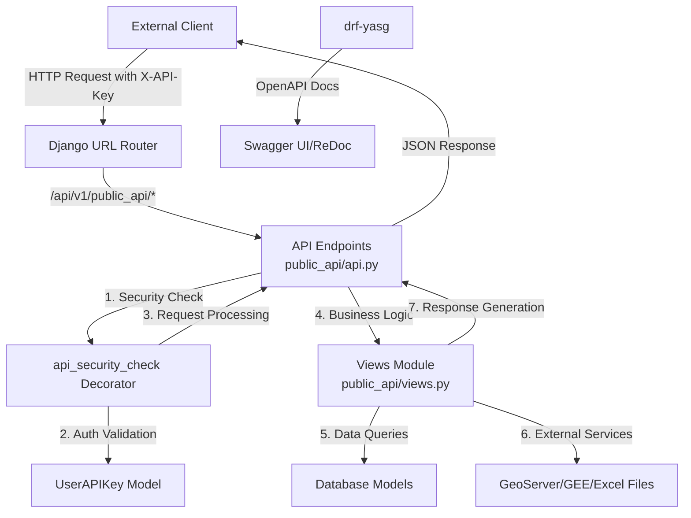
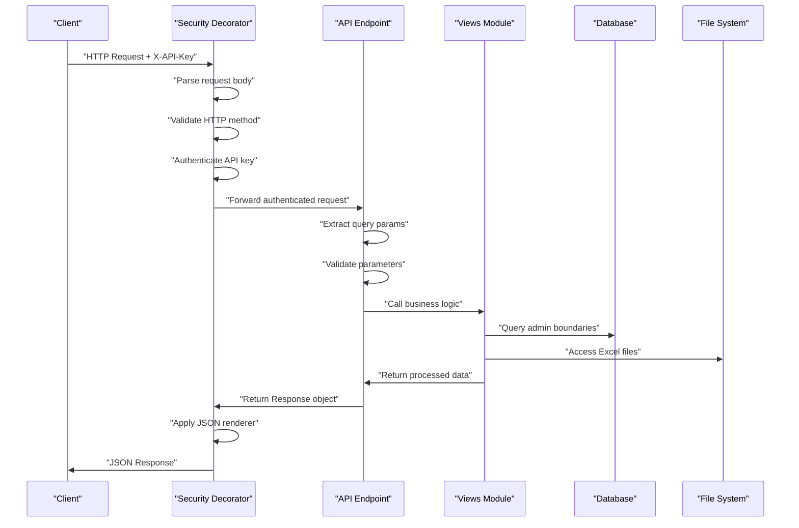

# Public API Architecture and Design

The Public API module provides external access to the CoRE Stack's geospatial and hydrological data services through a well-defined REST API architecture. This system enables third-party applications to retrieve administrative boundaries, micro-watershed (MWS) data, generated geospatial layers, reports, and key performance indicators through standardized endpoints secured by API key authentication. The architecture follows a clean separation of concerns with dedicated modules for API definitions, business logic, and OpenAPI documentation, all integrated into the main application through the Django URL routing system.

## Core Architecture Components

The Public API system is structured around four primary files that handle distinct responsibilities within the request-response lifecycle. The `api.py` module contains the actual API endpoint definitions that receive HTTP requests and orchestrate responses. Each endpoint is decorated with security checks and Swagger documentation schemas. The `urls.py` module maps URL patterns to these endpoint functions, while `swagger_schemas.py` maintains comprehensive OpenAPI 2.0 specifications for all endpoints. The `views.py` module encapsulates business logic and data retrieval functions, keeping the API endpoints focused on request handling and response formatting. This separation ensures maintainability and allows for independent testing of each component layer.

Sources: [public\_api/api.py](../public_api/api.py#L1-L420), [public\_api/swagger\_schemas.py](../public_api/swagger_schemas.py#L1-L544), [public\_api/urls.py](../public_api/urls.py#L1-L25), [public\_api/views.py](../public_api/views.py#L1-L312)

## API Endpoint Categories

The Public API exposes eight distinct endpoints organized around specific data retrieval use cases. The **administrative lookup** endpoints include `get_admin_details_by_lat_lon` and `get_mwsid_by_latlon`, which enable reverse geocoding to identify state, district, tehsil, and MWS information from coordinate pairs. The **MWS data retrieval** endpoints consist of `get_mws_data` for comprehensive MWS information and `get_mws_kyl_indicators` for accessing key indicator metrics filtered by specific parameters. The **resource access** endpoints include `get_generated_layer_urls` for retrieving geospatial layer metadata and `get_mws_report` for accessing generated reports. Finally, the **aggregated data** endpoint `get_active_locations` provides proposed block data for activated locations, supporting planning and decision-making workflows.

Sources: [public\_api/urls.py](../public_api/urls.py#L5-L24), [public\_api/api.py](../public_api/api.py#L39-L405)

| Endpoint | Method | Purpose | Key Parameters |
| --- | --- | --- | --- |
| `/api/v1/public_api/get_admin_details_by_latlon/` | GET | Reverse geocode to admin boundaries | `latitude`, `longitude` |
| `/api/v1/public_api/get_mwsid_by_latlon/` | GET | Get MWS ID from coordinates | `latitude`, `longitude` |
| `/api/v1/public_api/get_mws_data/` | GET | Retrieve comprehensive MWS data | `state`, `district`, `tehsil`, `mws_id` |
| `/api/v1/public_api/get_mws_kyl_indicators/` | GET | Get MWS indicator data | `state`, `district`, `tehsil`, `mws_id`, `indicator` |
| `/api/v1/public_api/get_tehsil_data/` | GET | Get tehsil-level JSON data | `state`, `district`, `tehsil`, `file_type` |
| `/api/v1/public_api/get_generated_layer_urls/` | GET | Retrieve layer metadata URLs | `state`, `district`, `tehsil` |
| `/api/v1/public_api/get_mws_report/` | GET | Get MWS report URLs | `state`, `district`, `tehsil`, `mws_id` |
| `/api/v1/public_api/get_active_locations/` | GET | Get activated location data | None |

## Security Architecture

API security is implemented through a custom decorator `@api_security_check` that provides flexible authentication strategies including API key-based authentication specifically for public endpoints. The decorator validates the `X-API-Key` header against the `UserAPIKey` model in the geoadmin module, checking both key validity and expiration status. This model extends `AbstractAPIKey` from the rest\_framework\_api\_key library and includes fields for key name, active status, creation timestamp, expiration time, and last-used tracking. The security layer automatically updates the `last_used_at` timestamp on each successful authentication and returns appropriate HTTP status codes for unauthorized, forbidden, or expired key scenarios. The decorator also enforces HTTP method restrictions and validates required headers, providing a comprehensive security wrapper around all public API endpoints.

Sources: [utilities/auth\_check\_decorator.py](utilities/auth_check_decorator.py#L22-L126), [geoadmin/models.py](geoadmin/models.py#L76-L96)

The API key model includes an `is_expired` property that checks expiration dynamically, allowing for time-based access control without manual key revocation. This enables temporary access grants for third-party integrations with automatic expiration.

## Request-Response Flow

The request handling pipeline follows a consistent pattern across all public API endpoints. When an HTTP request arrives at a public endpoint, it first encounters the security decorator which parses the request body, validates HTTP methods, and authenticates the API key. Upon successful authentication, the request proceeds to the endpoint function which extracts and validates query parameters using helper functions like `is_valid_string` and `is_valid_mws_id`. The endpoint then delegates to business logic functions in the views module, which may query database models like `StateSOI`, `DistrictSOI`, and `TehsilSOI` for administrative boundary data, access `Layer` models from the computing module for geospatial layer information, or read pre-generated Excel files from the file system. The views module may also integrate with Google Earth Engine utilities for spatial computations or GeoServer for raster data access. Finally, the endpoint returns a Django REST Framework Response object with appropriate HTTP status codes and JSON-formatted data, which the decorator wraps with proper renderer configuration for consistent JSON output.

Sources: [public\_api/api.py](../public_api/api.py#L39-L90), [public\_api/views.py](../public_api/views.py#L27-L80), [utilities/auth\_check\_decorator.py](utilities/auth_check_decorator.py#L129-L135)

## OpenAPI Documentation Integration

The Public API leverages the drf-yasg library to generate comprehensive interactive API documentation. The `swagger_schemas.py` module defines reusable OpenAPI parameters for common inputs like geographic coordinates, administrative divisions, and MWS identifiers, ensuring consistency across endpoints. Each schema specifies the parameter location, data type, required status, and detailed descriptions. The module also defines standard response schemas for common error conditions including bad requests, unauthorized access, not found errors, and internal server errors. Individual endpoint schemas combine these reusable components with operation-specific parameters and response definitions. The main project URL configuration integrates these schemas into the global Swagger UI and ReDoc interfaces at `/swagger/` and `/redoc/` respectively, providing developers with interactive documentation that includes request examples, response schemas, and the ability to execute API calls directly from the documentation interface. The global schema view is configured with project metadata including title "CoRE Stack APIs", version "v1", and contact information.

Sources: [public\_api/swagger\_schemas.py](../public_api/swagger_schemas.py#L1-L96), [nrm\_app/urls.py](nrm_app/urls.py#L26-L67)

## Data Access Patterns

The Public API employs multiple data access strategies depending on the type of information requested. For administrative boundary lookups, the system queries the `StateSOI`, `DistrictSOI`, and `TehsilSOI` models which contain standardized geographic boundaries. These models are filtered using case-insensitive lookups on names to handle variations in capitalization. For geospatial layer information, the API queries the `Layer` model from the computing module, filtering by state, district, and block (tehsil) associations while excluding specific keyword patterns like "run off", "evapotranspiration", and "MWS" to focus on relevant layers. The layer metadata includes GeoServer workspace information, layer types, and download URLs for both vector and raster formats. For statistical data and indicators, the system may access pre-generated Excel files stored in a structured directory hierarchy organized by state and district, with file existence validation before access attempts. This hybrid approach combining database queries with file system access provides flexibility for different data types while maintaining performance through appropriate caching and indexing.

Sources: [public\_api/views.py](../public_api/views.py#L54-L80), [public\_api/views.py](../public_api/urls.py#L40-L46), <computing/models.py>

## Integration Points

The Public API module serves as an integration hub connecting multiple subsystems within the CoRE Stack. It interfaces with the **geoadmin** module for administrative boundary data and API key management, with the **computing** module for generated geospatial layer information, and with the **stats\_generator** module for statistical indicator calculations. The API also provides access to Google Earth Engine assets through utility functions for Earth Engine authentication and asset path management. File-based resources including Excel reports and generated documents are accessed through a centralized `EXCEL_PATH` configuration setting. GeoServer integration provides Web Coverage Service (WCS) endpoints for raster data downloads, with URLs constructed dynamically based on workspace and layer names. The water rejuvenation module implements a similar public API pattern, providing endpoints for waterbody data access that follow the same architectural conventions with API key security and Swagger documentation, demonstrating consistency across the platform's public-facing interfaces.

Sources: [public\_api/api.py](../public_api/api.py#L32-L36), [waterrejuvenation/api.py](waterrejuvenation/api.py#L27-L30), [public\_api/views.py](../public_api/views.py#L3-L23)

## Error Handling and Validation

The Public API implements comprehensive error handling through multiple validation layers. The security decorator catches authentication failures and returns appropriate 401 Unauthorized responses with detailed error messages. Within individual endpoints, parameter validation functions check for required parameters and validate data formats, returning 400 Bad Request responses for invalid inputs. The business logic layer in the views module catches database query exceptions and handles cases where requested data does not exist, returning 404 Not Found responses. Global exception handling in the security decorator catches unexpected errors and returns 500 Internal Server Error responses while logging the exception details for debugging. This multi-layered approach ensures that API consumers receive clear, actionable error messages at each stage of request processing, enabling robust integration and troubleshooting.

Sources: [utilities/auth\_check\_decorator.py](utilities/auth_check_decorator.py#L114-L119), [public\_api/api.py](../public_api/api.py#L49-L60), [public\_api/views.py](../public_api/views.py#L27-L37)

## Next Steps

To deepen your understanding of the API architecture and related systems, explore the [Authentication and Authorization System](./7-authentication-and-authorization-system)  documentation for details on the broader authentication framework. For information on the geospatial data processing capabilities that these APIs expose, refer to the [Google Earth Engine Integration and Authentication](./9-google-earth-engine-integration-and-authentication)  documentation. To understand how API keys are managed within the multi-tenant organization structure, see the [Multi-Tenant Organization and User Management](./6-multi-tenant-organization-and-user-management)  documentation.