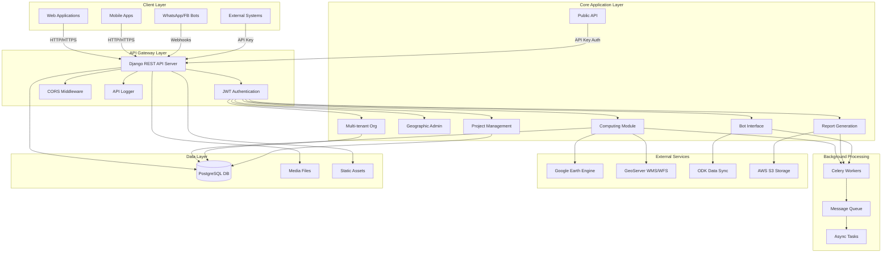
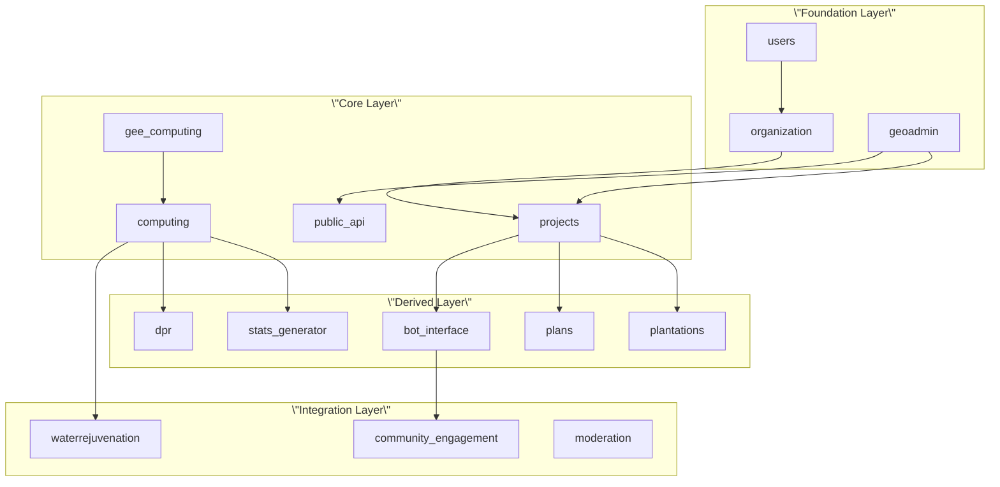

# Project Architecture and Module Organization

The CoRE Stack Backend is a Django-based geospatial platform designed for natural resource management, combining traditional web services with Google Earth Engine (GEE) computing capabilities. The architecture follows a modular Django application pattern where each functional domain operates as an independent app with clear separation of concerns. This organization enables both synchronous API operations and asynchronous background processing while maintaining scalability across multiple geospatial analysis domains.

## Core Framework and Architecture

The system is built on Django 4.2 with PostgreSQL as the primary database, utilizing Celery with RabbitMQ for asynchronous task processing. The framework employs REST API principles through Django REST Framework, with JWT-based authentication and comprehensive API documentation via Swagger/OpenAPI standards. The architecture follows a multi-tenant pattern where organizations can manage projects independently while sharing core computational resources.

The main project configuration lives in `nrm_app/settings.py`, which defines the installed applications, middleware stack, authentication mechanisms, and database connections. The URL routing is centralized in `nrm_app/urls.py`, aggregating endpoints from all module apps under the `/api/v1/` prefix. Celery configuration in `nrm_app/celery.py` enables automatic task discovery across all registered Django apps.

Sources: [README.md](README.md#L1-L106), [nrm\_app/settings.py](../nrm_app/settings.py#L1-L100), [nrm\_app/urls.py](../nrm_app/urls.py#L1-L68), [nrm\_app/celery.py](../nrm_app/celery.py#L1-L19)

## High-Level Architecture Diagram

## Module Organization Overview

The project comprises 17 functional modules, each encapsulating specific domain logic. These modules follow Django's app convention with models, views, URLs, serializers, and optionally asynchronous tasks. The module organization can be categorized into five functional domains: Core Infrastructure, Geospatial Computing, Data & Reporting, User & Project Management, and Integration & Automation.

### Core Infrastructure Modules

| Module | Purpose | Key Components |
| --- | --- | --- |
| `users` | User authentication and permissions | Custom User model, role-based access, JWT tokens |
| `organization` | Multi-tenant organization management | Organization model, user-org relationships |
| `geoadmin` | Administrative boundary services | State, district, block hierarchies, API key management |
| `apiadmin` | API usage tracking and logging | Request/response logging, analytics |

The `users` module extends Django's AbstractUser with custom fields for account types (individual/organization), organization associations, and project-specific permission management through the `UserProjectGroup` model. The `organization` module provides the foundation for multi-tenancy, allowing organizations to manage separate projects and resources. The `geoadmin` module serves public-facing endpoints for administrative boundary data and manages API key generation for external access.

Sources: [users/models.py](../users/models.py#L8-L133), [organization/models.py](../organization/models.py#L11-L34), [geoadmin/api.py](../geoadmin/api.py#L19-L330), [apiadmin/middleware.py](../apiadmin/middleware.py#L1-L41)

### Geospatial Computing Modules

The `computing` module serves as the primary geospatial computation engine, containing 30+ analysis algorithms organized in subdirectories by functional domain. Each analysis follows a consistent pattern: API endpoints trigger asynchronous tasks, which interact with Google Earth Engine, process results, and store layers in the database with optional GeoServer synchronization.

**Computing Subdomains:**

| Domain | Directory | Analyses |
| --- | --- | --- |
| Hydrology | `mws/`, `water_rejuvenation/` | Micro-watersheds, precipitation, runoff, evapotranspiration, groundwater changes |
| Climate | `drought/` | Drought frequency, intensity, causality analysis |
| Terrain | `terrain_descriptor/` | Terrain classification, slope analysis, drainage lines |
| Land Use | `lulc/`, `lulc_X_terrain/`, `cropping_intensity/` | LULC classification, terrain intersections, cropping patterns |
| Water Bodies | `surface_water_bodies/` | Water body mapping, census, pond merging |
| Tree Health | `tree_health/` | Canopy cover density, height, change detection |
| Planning | `clart/`, `catchment_area/`, `zoi_layers/` | CLART water structure planning, catchment areas, zones of influence |

The `computing/api.py` file contains 40+ API endpoints, each decorated with security checks using the `@api_security_check` decorator. Notable functions include `generate_mws_layer`, `lulc_v3`, `generate_drought_layer`, `generate_terrain_descriptor`, and `change_detection`. The module maintains data models for `Dataset` and `Layer` in `computing/models.py`, tracking layer metadata, GEE asset paths, and sync status to GeoServer.

Sources: [computing/api.py](../computing/api.py#L72-L1516), [computing/models.py](../computing/models.py#L5-L72), [computing/path\_constants.py](../computing/path_constants.py#L1-L9), [README.md](README.md#L63-L95)

### Data & Reporting Modules

| Module | Purpose | Key Capabilities |
| --- | --- | --- |
| `stats_generator` | Statistical indicator calculation | MWS indicators, village-level statistics, Excel generation |
| `dpr` | Detailed Project Report generation | Multi-level reports (MWS, tehsil, village), resource reports |
| `public_dataservice` | Public data access | Data export, format conversion |

The `dpr` module generates comprehensive reports for different administrative levels: MWS reports (micro-watershed level), tehsil reports (block level), and resource reports. The `stats_generator` module calculates environmental and socio-economic indicators, outputting results as Excel files with multiple sheets. Both modules use asynchronous Celery tasks for long-running computations.

Sources: [dpr/api.py](../dpr/api.py#L69-L506), [stats\_generator/api.py](../stats_generator/api.py#L13-L113)

### User & Project Management Modules

| Module | Purpose | Key Features |
| --- | --- | --- |
| `projects` | Project tracking and lifecycle | Project models, state/district/block association, app types |
| `plantations` | Plantation site management | Site suitability analysis, tracking |
| `plans` | Planning workflow coordination | Layer building, management commands |
| `community_engagement` | Community member management | Member data, engagement metrics |

The `projects` module defines four application types: `plantation`, `watershed`, `waterbody`, and `community_engagement`. Projects are associated with organizations and geographic boundaries, enabling scoped access to data and computations. The `plantations` and `plans` modules provide specialized functionality for their respective domains.

Sources: [projects/models.py](../projects/models.py#L7-L54), [nrm\_app/settings.py](../nrm_app/settings.py#L95-L107)

### Integration & Automation Modules

| Module | Purpose | Integration Points |
| --- | --- | --- |
| `bot_interface` | Conversational bot orchestration | WhatsApp, Facebook, state machine logic |
| `gee_computing` | Google Earth Engine account management | GEE account CRUD, authentication |
| `waterrejuvenation` | Water structure domain logic | CLART integration, water structure planning |
| `moderation` | Content moderation workflow | Media approval, user moderation |

The `bot_interface` module implements a sophisticated state machine (`statemachine.py`) with `StateMapData` and `SmjController` classes managing conversation flow, state transitions, pre/post actions, and session persistence. This enables complex multi-step conversations with users while maintaining context across interactions.

Sources: [bot\_interface/statemachine.py](../bot_interface/statemachine.py#L5-L938), [gee\_computing/views.py](../gee_computing/views.py#L16-L24)

## Application Configuration and Integration

All modules are registered in `nrm_app/settings.py` under `INSTALLED_APPS`. Each module follows the Django app configuration pattern, extending `AppConfig` class. The settings file also configures:

* **Authentication**: JWT tokens with 90-day access tokens and 120-day refresh tokens
* **CORS**: Configured origins for development and production environments
* **REST Framework**: JSON rendering, JWT authentication, permission classes
* **Database**: PostgreSQL connection with environment variables
* **Static/Media**: File serving configuration for user uploads and computed outputs

The middleware stack includes security middleware, session management, CORS handling, authentication, and optionally API hit logging (currently commented out in production).

```mermaid
graph LR
    subgraph "API Endpoints"
        APIServer[/api/v1/]
        
        subgraph "Core Services"
            GA[geoadmin - boundaries & keys]
            ORG[organization - org management]
            USR[users - auth & users]
            PRJ[projects - project CRUD]
        end
        
        subgraph "Computing Services"
            CMP[computing - 40+ algorithms]
            GEE[gee_computing - GEE accounts]
        end
        
        subgraph "Reporting Services"
            DPR[dpr - reports]
            STS[stats_generator - statistics]
        end
        
        subgraph "Integration Services"
            BOT[bot_interface - webhooks]
            CE[community_engagement - community data]
            WR[waterrejuvenation - water structures]
            PUB[public_api - external access]
        end
    end
    
    APIServer --> GA
    APIServer --> ORG
    APIServer --> USR
    APIServer --> PRJ
    APIServer --> CMP
    APIServer --> GEE
    APIServer --> DPR
    APIServer --> STS
    APIServer --> BOT
    APIServer --> CE
    APIServer --> WR
    APIServer --> PUB
```

Sources: [nrm\_app/settings.py](../nrm_app/settings.py#L75-L200), [computing/apps.py](../computing/apps.py#L1-L7)

## API Endpoint Organization

All API endpoints are prefixed with `/api/v1/` and organized by module:

The main URL configuration in `nrm_app/urls.py` includes all module URL configurations and sets up Swagger UI and ReDoc documentation at `/swagger/` and `/redoc/` respectively. The `public_api` module provides authenticated external access to internal data using API keys, while other modules use JWT-based authentication.

Sources: [nrm\_app/urls.py](../nrm_app/urls.py#L39-L67), [public\_api/api.py](../public_api/api.py#L39-L420)

## Security and Access Control

The system implements three authentication mechanisms:

1. **JWT Authentication**: Used for web and mobile applications, with tokens issued via `rest_framework_simplejwt`
2. **API Key Authentication**: Used for external public API access via `rest_framework_api_key`
3. **Auth-free Endpoints**: Public endpoints for administrative boundaries and static resources

The `@api_security_check` decorator enforces authentication based on method type and auth type. CORS is configured per environment with specific allowed origins for development and production. The `apiadmin` middleware (optional) logs all API hits for analytics and auditing purposes.

Sources: [nrm\_app/settings.py](../nrm_app/settings.py#L156-L187), [apiadmin/middleware.py](../apiadmin/middleware.py#L1-L41), [computing/api.py](../computing/api.py#L72-L95)

## Data Flow Patterns

The system follows distinct data flow patterns based on operation type:

### Synchronous API Flow

Client → API Gateway → Auth Check → View Logic → Database Query → Response

### Asynchronous Computing Flow

Client → API Endpoint → Security Check → Celery Task Queue → Worker Process → GEE Computation → Result Storage → GeoServer Sync → Notification → Client Polling

### Bot Conversation Flow

User Message → Webhook → State Machine → State Transition → Pre-action → Business Logic → Post-action → Response Message → Session Update

These patterns enable both immediate response requirements and long-running geospatial computations without blocking the API server.

## Module Dependency Graph

## Development and Deployment Considerations

The installation script (`installation/install.sh`) provides automated setup including PostgreSQL, Apache with mod\_wsgi, Conda environment, static file collection, and log configuration. The system uses environment variables for sensitive configuration including database credentials, ODK credentials, and GEE authentication. The codebase includes comprehensive test files in each module for automated testing.

Sources: [README.md](README.md#L1-L51), [nrm\_app/settings.py](../nrm_app/settings.py#L30-L60)

## Next Steps

To deepen your understanding of specific architectural components, continue with:

* [Django Project Settings and Environment Variables](./5-django-project-settings-and-environment-variables)  - Detailed configuration management
* [Multi-Tenant Organization and User Management](./6-multi-tenant-organization-and-user-management)  - User/Organization models and permissions
* [Google Earth Engine Integration and Authentication](./9-google-earth-engine-integration-and-authentication)  - GEE account setup and computing module integration
* [State Machine Architecture for Bot Conversations](./15-state-machine-architecture-for-bot-conversations)  - Bot interface state machine patterns
* [Public API Architecture and Design](./28-public-api-architecture-and-design)  - External API design and key management