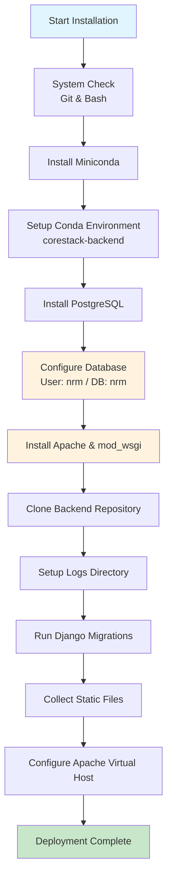
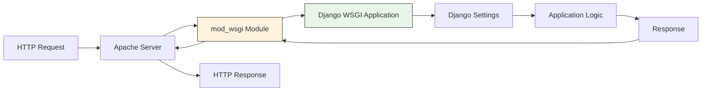

# Environment Configuration and Setup

This page provides a comprehensive guide to setting up the CoRE Stack Backend development environment. The backend is a Django-based geospatial computing platform that integrates Google Earth Engine, PostgreSQL, Apache, and Celery for processing remote sensing data and managing natural resource monitoring systems.


## System Requirements

Before proceeding with the installation, ensure your system meets the following prerequisites:

| Requirement | Specification | Purpose |
| --- | --- | --- |
| **Operating System** | Linux (Ubuntu 20.04+ recommended) | Primary development and deployment environment |
| **Git** | Latest stable version | Version control and repository cloning |
| **Bash Shell** | Pre-installed on Linux | Script execution and environment setup |
| **Disk Space** | Minimum 10 GB free space | For conda environment, dependencies, and geospatial data |
| **RAM** | Minimum 8 GB (16 GB recommended) | Memory-intensive geospatial processing and GEE operations |

**Note for Windows Users**: The installation script is designed for Linux environments. If you're using Windows, you'll need to install Windows Subsystem for Linux (WSL) first before proceeding with the installation.



Sources: [README.md](README.md#L11-L20), [installation/install.sh](installation/install.sh#L1-L10)

## Installation Architecture

The installation process follows a systematic approach to set up all required components in the correct order:

This architecture ensures that each component is properly configured before dependent components are installed, minimizing configuration errors and ensuring system stability.

Sources: [installation/install.sh](installation/install.sh#L14-L178)

## Automated Installation Script

The project provides a comprehensive automated installation script (`installation/install.sh`) that handles the entire setup process. This script is the recommended method for both development and production environments.

### Script Configuration

The installation script includes configurable parameters at the top:

| Variable | Default Value | Description |
| --- | --- | --- |
| `MINICONDA_DIR` | `$HOME/miniconda3` | Installation path for Miniconda |
| `CONDA_ENV_NAME` | `corestack-backend` | Name of the conda environment |
| `BACKEND_DIR` | `/var/www/data/corestack` | Deployment directory for the application |
| `POSTGRES_USER` | `nrm` | PostgreSQL database user |
| `POSTGRES_DB` | `nrm` | PostgreSQL database name |
| `POSTGRES_PASSWORD` | `nrm@123` | PostgreSQL user password |
| `APACHE_CONF` | `/etc/apache2/sites-available/corestack.conf` | Apache configuration file location |

For production environments, modify these variables in the script before execution to match your security requirements and organizational standards. Avoid using default credentials in production deployments.

Sources: [installation/install.sh](installation/install.sh#L6-L13)

### Installation Steps

To perform the automated installation, execute the following commands in your terminal:

```bash
cd installation

# Make the script executable
chmod +x install.sh

# Run the installation script
sudo ./install.sh
```

The script will perform the following operations automatically:

1. **Miniconda Installation**: Downloads and installs Miniconda if not already present
2. **Conda Environment Setup**: Creates the `corestack-backend` environment from `environment.yml`
3. **PostgreSQL Installation**: Installs PostgreSQL server and creates the required database and user
4. **Apache Installation**: Installs Apache web server with mod\_wsgi module
5. **Repository Cloning**: Clones or updates the backend repository
6. **Directory Setup**: Creates necessary directories including logs folder
7. **Django Initialization**: Runs migrations and collects static files
8. **Apache Configuration**: Sets up the virtual host configuration for serving the application

Sources: [README.md](README.md#L21-L31), [installation/install.sh](installation/install.sh#L22-L177)

## Conda Environment Configuration

The project uses Conda for Python environment management, providing isolated and reproducible dependency sets. The `environment.yml` file specifies all required packages and their versions.

### Key Dependencies

The environment includes several categories of dependencies critical for the application's functionality:

| Category | Key Packages | Purpose |
| --- | --- | --- |
| **Core Framework** | django=5.2, djangorestframework=3.15.2 | Web framework and API layer |
| **Geospatial** | gdal=3.6.2, geopandas=1.0.1, rasterio=1.4.3, shapely=2.0.1 | Spatial data processing |
| **Google Earth Engine** | earthengine-api=1.5.9, geetools=1.15.0, geemap | Cloud-based geospatial computing |
| **Task Processing** | celery=4.4.0, kombu=4.6.3, billiard=3.6.4.0 | Asynchronous task queue |
| **Data Processing** | pandas=2.2.3, numpy=1.26.4, scipy=1.15.2, xarray=2024.3.0 | Numerical computing |
| **Visualization** | matplotlib=3.10.0, seaborn=0.13.2, bokeh=2.4.3, folium=0.14.0 | Data visualization |
| **Web Services** | boto3=1.37.10, google-cloud-storage=3.1.0, aiohttp=3.11.10 | Cloud integrations |
| **API Documentation** | drf-yasg=1.21.7 | Swagger/OpenAPI documentation |

Additional pip packages include essential libraries like `django-environ`, `psycopg` for PostgreSQL, `selenium` for browser automation, and `pystac` for STAC metadata handling.

Sources: [installation/environment.yml](installation/environment.yml#L1-L390)

### Environment Activation

After installation, activate the conda environment:

```bash
conda activate corestack-backend
```

Verify the installation by checking the Python version and key packages:

```bash
python --version  # Should show Python 3.10.13
python -c "import django; print(django.VERSION)"  # Should show Django 5.2
python -c "import ee; print('GEE configured')"  # Should confirm GEE API availability
```

Sources: [README.md](README.md#L37-L40), [installation/environment.yml](installation/environment.yml#L200-L390)

## Django Configuration Management

The application uses `django-environ` for secure environment variable management. This approach separates configuration from code and provides better security for sensitive credentials.

### Environment Variables

The `nrm_app/settings.py` file reads configuration from environment variables using the `environ.Env()` class. Below are the critical environment variables that must be configured:

| Variable | Category | Description |
| --- | --- | --- |
| `SECRET_KEY` | Security | Django secret key for cryptographic signing |
| `DEBUG` | Development | Boolean flag for debug mode (True/False) |
| `DB_NAME`, `DB_USER`, `DB_PASSWORD` | Database | PostgreSQL connection credentials |
| `ODK_USERNAME`, `ODK_PASSWORD` | External API | ODK form system credentials |
| `GEE_SERVICE_ACCOUNT_KEY_PATH` | Google Earth Engine | Path to GEE authentication JSON file |
| `S3_ACCESS_KEY`, `S3_SECRET_KEY`, `S3_BUCKET` | Storage | AWS S3 configuration |
| `EMAIL_HOST_USER`, `EMAIL_HOST_PASSWORD` | Communication | Email service credentials |
| `GEOSERVER_URL`, `GEOSERVER_USERNAME`, `GEOSERVER_PASSWORD` | Geospatial | GeoServer connection settings |

Create a `.env` file in the project root directory to store these environment variables. The installation script sets up default PostgreSQL credentials, but all other variables should be configured according to your deployment environment.

Sources: [nrm\_app/settings.py](nrm_app/settings.py#L20-L60)

### Key Configuration Sections

The Django settings file is organized into logical sections with `MARK:` comments for easy navigation:

1. **Database Settings**: PostgreSQL configuration with environment-based credentials <nrm_app/settings.py#L49-L53>
2. **Installed Apps**: Core Django apps, REST framework, and project-specific applications <nrm_app/settings.py#L71-L130>
3. **CORS Configuration**: Cross-origin resource sharing settings for API access <nrm_app/settings.py#L131-L152>
4. **JWT Settings**: Simple JWT configuration for token-based authentication <nrm_app/settings.py#L168-L189>
5. **Static and Media Files**: Configuration for static assets and user-uploaded content <nrm_app/settings.py#L269-L280>
6. **Logging**: Comprehensive logging setup with console, file, and email handlers <nrm_app/settings.py#L288-L330>



Sources: [nrm\_app/settings.py](nrm_app/settings.py#L1-L395)

## Web Server Configuration

### Apache with mod\_wsgi

The installation script configures Apache with mod\_wsgi to serve the Django application in production. The Apache virtual host configuration includes:

Key Apache configuration directives:

* **WSGIDaemonProcess**: Creates a dedicated process group with access to the conda environment
* **WSGIScriptAlias**: Maps the root URL to the WSGI application entry point
* **Alias Directories**: Serves static files (`/static`) and media uploads (`/media`) directly
* **Error and Access Logs**: Configured to `/var/log/apache2/` for monitoring

Sources: [installation/install.sh](installation/install.sh#L119-L146), [nrm\_app/wsgi.py](nrm_app/wsgi.py#L1-L32)

### WSGI Application

The `nrm_app/wsgi.py` file configures the WSGI application entry point with environment-specific GDAL settings:

```python
os.environ.setdefault("DJANGO_SETTINGS_MODULE", "nrm_app.settings")

if DEBUG:
    # Development: Use conda environment paths
    conda_env = os.path.dirname(site.__file__).split('/lib')[0]
    os.environ['GDAL_DATA'] = f"{conda_env}/share/gdal"
    os.environ['LD_LIBRARY_PATH'] = f"{conda_env}/lib"
else:
    # Production: Use deployment-specific paths
    os.environ['GDAL_DATA'] = '/home/ubuntu/prod_dir/nrm-app/venv/envs/corestack/share/gdal'
    os.environ['LD_LIBRARY_PATH'] = '/home/ubuntu/prod_dir/nrm-app/venv/envs/corestack/lib'
```

This configuration ensures GDAL can locate its data files and libraries for geospatial processing operations.

Sources: [nrm\_app/wsgi.py](nrm_app/wsgi.py#L14-L32)

## Celery Configuration

The application uses Celery for asynchronous task processing, enabling long-running geospatial computations to execute without blocking web requests.

### Celery Setup

The `nrm_app/celery.py` file configures Celery to work with Django:

```python
os.environ.setdefault("DJANGO_SETTINGS_MODULE", "nrm_app.settings")

app = Celery("nrm_app")

app.config_from_object("django.conf:settings")
app.autodiscover_tasks(INSTALLED_APPS)
```

Celery reads configuration from Django settings and automatically discovers tasks from all installed Django applications.

Sources: [nrm\_app/celery.py](nrm_app/celery.py#L1-L19)

### Running Celery Workers

To process background tasks, start the Celery worker:

```bash
conda activate corestack-backend
celery -A nrm_app worker -l info -Q nrm
```

Parameters explained:

* `-A nrm_app`: Specifies the Django application module
* `-l info`: Sets log level to INFO
* `-Q nrm`: Specifies the RabbitMQ queue named "nrm"

For development, you may run Celery with the `--autoscale` option to automatically adjust worker count based on workload. In production, consider using supervisor or systemd to manage Celery worker processes as services.

Sources: [README.md](README.md#L44-L46), [nrm\_app/celery.py](nrm_app/celery.py#L1-L19)

## Development Server Startup

Once the environment is configured, you can start the development server using Django's built-in runserver command:

```bash
# Activate the conda environment
conda activate corestack-backend

# Navigate to the project directory
cd /var/www/data/corestack

# Run the development server
python manage.py runserver
```

By default, the development server listens on `http://127.0.0.1:8000`. You can specify a different host and port:

```bash
python manage.py runserver 0.0.0.0:8000
```

For a complete development environment, you'll need to run both the Django development server and the Celery worker in separate terminal windows.

Sources: [README.md](README.md#L37-L46)

## Access Points

After successful installation and server startup, the application provides several access points:

| Access Point | URL | Purpose |
| --- | --- | --- |
| **API Documentation** | <http://localhost> | Swagger/OpenAPI interactive documentation |
| **Django Admin** | <http://localhost/admin/> | Administrative interface for database management |
| **Static Files** | <http://localhost/static/> | Served static assets (CSS, JavaScript, images) |
| **Media Files** | <http://localhost/media/> | User-uploaded content and generated files |

The application uses `django-rest-framework-simplejwt` for API authentication, so API endpoints will require valid JWT tokens for access.


## Logging Configuration

The application implements a comprehensive logging system for monitoring and debugging:

Log configuration includes:

* **Console Handler**: Outputs to stdout with DEBUG level for development
* **File Handler**: Writes to `logs/app.log` with INFO level
* **Email Handler**: Sends error notifications to administrators

The logs directory is created automatically by the installation script with appropriate permissions for the web server user (`www-data`).

Sources: [nrm\_app/settings.py](nrm_app/settings.py#L288-L330), [installation/install.sh](installation/install.sh#L85-L91)

## Troubleshooting Common Issues

### GDAL Configuration Errors

If you encounter GDAL-related errors, verify the environment variables are set correctly:

```bash
echo $GDAL_DATA
echo $LD_LIBRARY_PATH
```

The paths should point to your conda environment's GDAL installation.

Sources: [nrm\_app/wsgi.py](nrm_app/wsgi.py#L14-L32)

### Database Connection Issues

If PostgreSQL connection fails, verify:

* PostgreSQL service is running: `sudo systemctl status postgresql`
* Database credentials match those in your `.env` file
* Database user has appropriate permissions

Sources: [installation/install.sh](installation/install.sh#L52-L62)

### Static Files Not Loading

If static files return 404 errors:

* Ensure `STATIC_ROOT` is correctly configured
* Run `python manage.py collectstatic --noinput` again
* Check Apache permissions on the static directory

Sources: [installation/install.sh](installation/install.sh#L94-L98)

### Celery Worker Issues

If Celery tasks aren't processing:

* Verify RabbitMQ is running and configured
* Check that the queue name matches: `-Q nrm`
* Review Celery logs for connection errors

Sources: [README.md](README.md#L44-L46)

## Next Steps

After successfully setting up your environment, proceed with these documentation pages to deepen your understanding:

* **[Django Project Settings and Environment Variables](/5-django-project-settings-and-environment-variables)** : Comprehensive guide to all Django configuration options and their purposes
* **[Celery Asynchronous Task Processing](/8-celery-asynchronous-task-processing)** : Detailed explanation of task queues and background job processing
* **[Google Earth Engine Integration and Authentication](/9-google-earth-engine-integration-and-authentication)** : Setup guide for GEE service accounts and authentication

