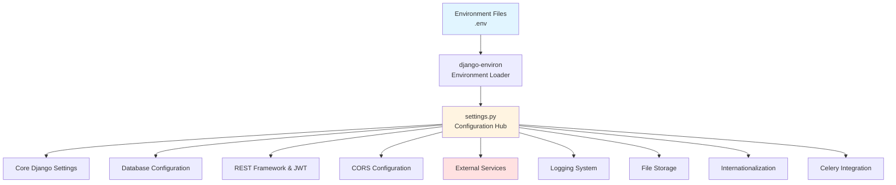
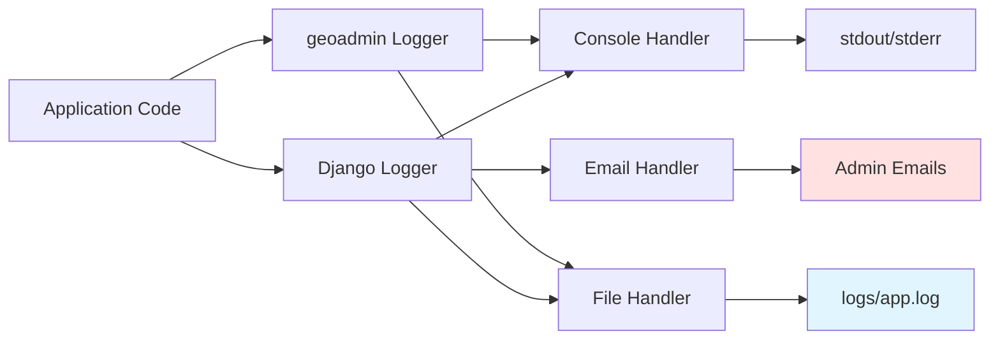
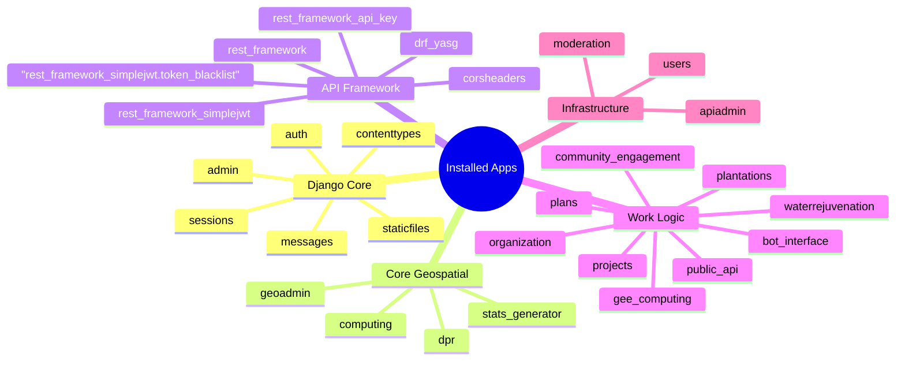
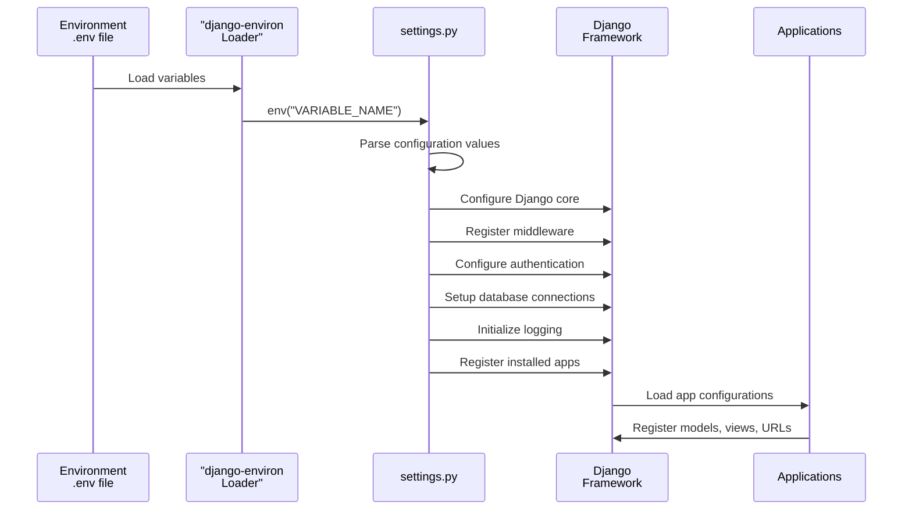

# Django Project Settings and Environment Variables

The Django project configuration for core-stack-backend demonstrates a sophisticated, production-ready geospatial application built on Django 4.2.2. The settings architecture leverages environment-based configuration for security and flexibility, integrating multiple external services including Google Earth Engine, GeoServer, and various cloud platforms. This documentation provides a comprehensive architectural overview of the configuration system, enabling intermediate developers to understand how the settings orchestrate the application's behavior across different environments.

## Settings Architecture Overview


The settings module follows Django's standard configuration pattern with enhancements for geospatial computing and multi-service integration. The architecture employs a centralized configuration approach where `django-environ` handles environment variable loading, ensuring sensitive credentials never appear in the codebase [settings.py](nrm_app/settings.py#L20-L22). This design enables seamless transitions between development, staging, and production environments while maintaining security best practices.



The configuration hierarchy begins with environment variable loading through `environ.Env.read_env()`, which automatically discovers the  file in the project root. This approach separates deployment-specific values from application logic, allowing the same codebase to function across different environments with appropriate credentials and configuration values.

`.env`

[settings.py](../nrm_app/settings.py#L20-L22)

## Environment Variable Management

The project uses `django-environ` as the primary mechanism for managing configuration values, supporting over 40 environment variables organized into logical categories. This approach provides a clean separation between code and configuration while enabling type casting and default value support.

| Category | Environment Variables | Purpose |
| --- | --- | --- |
| **Core Security** | `SECRET_KEY`, `DEBUG`, `ADMIN_GROUP_ID` | Application security and access control |
| **Database** | `DB_NAME`, `DB_USER`, `DB_PASSWORD` | PostgreSQL connection credentials |
| **ODK Integration** | `ODK_USERNAME`, `ODK_PASSWORD`, `ODK_USER_EMAIL_SYNC`, `ODK_USER_PASSWORD_SYNC` | Open Data Kit authentication and synchronization |
| **Cloud Storage** | `S3_BUCKET`, `S3_ACCESS_KEY`, `S3_SECRET_KEY`, `S3_REGION`, `CE_BUCKET_NAME` | AWS S3 and Cloud Storage access |
| **Google Earth Engine** | `GEE_SERVICE_ACCOUNT_KEY_PATH`, `GEE_HELPER_SERVICE_ACCOUNT_KEY_PATH`, `GEE_DATASETS_SERVICE_ACCOUNT_KEY_PATH` | GEE authentication with multiple service accounts |
| **GeoServer** | `GEOSERVER_URL`, `GEOSERVER_USERNAME`, `GEOSERVER_PASSWORD` | GeoServer instance access |
| **Email** | `EMAIL_HOST_USER`, `EMAIL_HOST_PASSWORD` | SMTP authentication |
| **Bot Integration** | `AUTH_TOKEN_360`, `AUTH_TOKEN_FB_META`, `CALL_PATCH_API_KEY` | Third-party bot platform authentication |
| **Data Services** | `EARTH_DATA_USER`, `EARTH_DATA_PASSWORD`, `USERNAME_GESDISC`, `PASSWORD_GESDISC` | External data service access |

The environment loading pattern follows this sequence:

1. Initialize `environ.Env()` instance [settings.py](../nrm_app/settings.py#L20)
2. Read environment variables from `.env` file using `read_env()` [settings.py](../nrm_app/settings.py#L22)    
3. Access variables through `env("VARIABLE_NAME")` method calls throughout the settings

This pattern ensures that missing environment variables raise explicit errors at startup, preventing runtime failures due to misconfiguration.

## Database Configuration

The application uses PostgreSQL as the primary database, configured with standard Django database settings populated from environment variables. The database configuration uses TCP/IP connection to localhost by default, making it suitable for containerized deployments where the database runs in a separate container [settings.py](nrm_app/settings.py#L229-L238).

```python
DATABASES = {
    "default": {
        "ENGINE": "django.db.backends.postgresql",
        "NAME": DB_NAME,
        "USER": DB_USER,
        "PASSWORD": DB_PASSWORD,
        "HOST": "127.0.0.1",
        "PORT": "",
    }
}
```

The database configuration supports standard PostgreSQL features including:

* Connection pooling through the psycopg2 adapter
* Automatic migration management via Django migrations
* Transaction handling at the ORM level
* Query optimization through Django's database abstraction layer

The project employs a custom user model `users.User` as the authentication backend, specified through `AUTH_USER_MODEL = "users.User"` [settings.py](nrm_app/settings.py#L271). This custom model enables extended user attributes required for the multi-tenant organization system described in [Multi-Tenant Organization and User Management](/6-multi-tenant-organization-and-user-management) .

## Authentication and Security Settings

The authentication system leverages Django REST Framework's SimpleJWT implementation with custom configuration tailored for long-lived sessions in geospatial applications. JWT tokens serve as the primary authentication mechanism for all API endpoints, with a 90-day access token lifetime and 120-day refresh token lifetime [settings.py](nrm_app/settings.py#L168-L189).

### JWT Configuration

```python
SIMPLE_JWT = {
    "ACCESS_TOKEN_LIFETIME": timedelta(days=90),
    "REFRESH_TOKEN_LIFETIME": timedelta(days=120),
    "ROTATE_REFRESH_TOKENS": True,
    "BLACKLIST_AFTER_ROTATION": True,
    "UPDATE_LAST_LOGIN": False,
    "ALGORITHM": "HS256",
    "SIGNING_KEY": SECRET_KEY,
    "USER_ID_FIELD": "id",
    "USER_ID_CLAIM": "user_id",
    "AUTH_TOKEN_CLASSES": ("rest_framework_simplejwt.tokens.AccessToken",),
}
```

Key security features include:

* **Token Rotation**: Refresh tokens are rotated on each use, with old tokens immediately blacklisted to prevent replay attacks [settings.py](nrm_app/settings.py#L173-L174)
* **HS256 Algorithm**: Symmetric encryption using the application's SECRET\_KEY for signing
* **User ID Claim**: Custom claim field mapping to the custom user model's ID field
* **Bearer Token Authentication**: Standard HTTP Authorization header with "Bearer" prefix

The REST Framework configuration enforces authentication by default across all API views [settings.py](nrm_app/settings.py#L158-L164):

```python
REST_FRAMEWORK = {
    "DEFAULT_AUTHENTICATION_CLASSES": (
        "rest_framework_simplejwt.authentication.JWTAuthentication",
    ),
    "DEFAULT_PERMISSION_CLASSES": ("rest_framework.permissions.IsAuthenticated",),
    "DEFAULT_RENDERER_CLASSES": [
        "rest_framework.renderers.JSONRenderer",
    ],
}
```

For detailed information on the authentication system architecture and permission handling, refer to [Authentication and Authorization System](/7-authentication-and-authorization-system) .

The 90-day access token lifetime is unusually long compared to typical API standards (usually 15-60 minutes). This design accommodates long-running geospatial computations while maintaining security through token rotation. Consider implementing shorter token lifetimes if your use case involves frequent, short-lived API interactions.

## CORS Configuration

Cross-Origin Resource Sharing (CORS) configuration handles the complex requirements of serving multiple frontend applications while maintaining security. The CORS settings are environment-aware, permitting all origins in debug mode while restricting to a whitelist in production [settings.py](nrm_app/settings.py#L131-L154).

### Development vs Production CORS

| Environment | Configuration | Behavior |
| --- | --- | --- |
| **Debug** | `CORS_ALLOW_ALL_ORIGINS = True` | All origins permitted for local development |
| **Production** | Explicit origin whitelist | Only approved domains can access the API |

The production whitelist includes:

* Core Stack production domains: `https://nrm.core-stack.org`, `https://dashboard.core-stack.org`
* UAT environments: `https://uat.dashboard.core-stack.org`
* Explorer interfaces: `https://www.explorer.core-stack.org`
* Local development addresses: `localhost:3000`, `127.0.0.1:8000`
* AWS Amplify deployments: Various Amplify domains for feature branches

Additional CORS configuration includes:

```python
CORS_ALLOWED_ORIGIN_REGEXES = [
    r"^http://localhost:\d+$",
    r"^http://127\.0\.0\.1:\d+$",
    r"^http://192\.168\.\d{1,3}\.\d{1,3}(:\d+)?$",
]

CORS_ALLOW_HEADERS = list(default_headers) + [
    "ngrok-skip-browser-warning",
    "content-disposition",
    "X-API-Key",
]

CORS_ALLOW_METHODS = [
    "DELETE", "GET", "OPTIONS", "PATCH", "POST", "PUT",
]

CORS_ALLOW_CREDENTIALS = True
```

The regex patterns accommodate development scenarios using ngrok tunnels and local network IP addresses, while the additional headers support API key authentication through the `X-API-Key` header and file uploads via multipart form data [settings.py](nrm_app/settings.py#L137-L153).

## External Service Integrations

The settings module orchestrates connections to numerous external services essential for geospatial computing, data storage, and third-party integrations. These service configurations demonstrate the application's role as a hub in a distributed geospatial ecosystem.

### Google Earth Engine Integration

Multiple GEE service accounts are configured to support different access levels and computational workloads [settings.py](nrm_app/settings.py#L354-L356):

```python
GEE_SERVICE_ACCOUNT_KEY_PATH = env("GEE_SERVICE_ACCOUNT_KEY_PATH")
GEE_HELPER_SERVICE_ACCOUNT_KEY_PATH = env("GEE_HELPER_SERVICE_ACCOUNT_KEY_PATH")
GEE_DATASETS_SERVICE_ACCOUNT_KEY_PATH = env("GEE_DATASETS_SERVICE_ACCOUNT_KEY_PATH")
```

The three-tier service account architecture supports:

* **Default Account**: Standard computational tasks (ID: 22) [settings.py](nrm_app/settings.py#L59)
* **Helper Account**: Support operations and helper functions (ID: 2) [settings.py](nrm_app/settings.py#L58)
* **Datasets Account**: Large dataset operations with elevated quotas

For detailed GEE authentication procedures and usage patterns, see [Google Earth Engine Integration and Authentication](/9-google-earth-engine-integration-and-authentication) .

### GeoServer Configuration

GeoServer provides WMS/WFS services for generated geospatial assets [settings.py](nrm_app/settings.py#L345-L347):

```python
GEOSERVER_URL = env("GEOSERVER_URL")
GEOSERVER_USERNAME = env("GEOSERVER_USERNAME")
GEOSERVER_PASSWORD = env("GEOSERVER_PASSWORD")
BASE_URL = "https://geoserver.core-stack.org/"
```

The GeoServer integration enables:

* Dynamic layer publishing from computed raster and vector data
* Styled map service delivery through OGC standards
* Asset management through the REST API

### Cloud Storage Configuration

AWS S3 integration handles asset storage and distribution across multiple buckets [settings.py](nrm_app/settings.py#L360-L369):

```python
NREGA_BUCKET = env("NREGA_BUCKET")
S3_SECRET_KEY = env("S3_SECRET_KEY")
S3_ACCESS_KEY = env("S3_ACCESS_KEY")
S3_BUCKET = env("S3_BUCKET")
S3_REGION = env("S3_REGION")
CE_BUCKET_NAME = env("CE_BUCKET_NAME")
CE_BUCKET_URL = env("CE_BUCKET_URL")
```

The multi-bucket architecture separates:

* **NREGA Bucket**: Specific data for NREGA project assets
* **Community Engagement Bucket**: User-generated content and media
* **Compute Output Bucket**: Results from geospatial computations

### Email Configuration

SMTP settings enable transactional email delivery for reports and notifications [settings.py](nrm_app/settings.py#L336-L343):

```python
EMAIL_BACKEND = "django.core.mail.backends.smtp.EmailBackend"
EMAIL_HOST = "smtpout.secureserver.net"
EMAIL_PORT = 465
EMAIL_USE_SSL = True
EMAIL_USE_TLS = False
EMAIL_HOST_USER = env("EMAIL_HOST_USER")
EMAIL_HOST_PASSWORD = env("EMAIL_HOST_PASSWORD")
EMAIL_TIMEOUT = 30
DEFAULT_FROM_EMAIL = "CoreStackSupport <[email protected]>"
```

The email system supports:

* SSL-encrypted connections on port 465
* 30-second timeout to prevent hanging requests
* Branded sender identification

## Logging Configuration

The logging system provides comprehensive monitoring and debugging capabilities with multiple handlers and formatters [settings.py](nrm_app/settings.py#L288-L330). The configuration follows Django's logging best practices while adding application-specific loggers.



### Logger Architecture

The logging configuration defines three handlers with different use cases:

| Handler | Level | Output | Purpose |
| --- | --- | --- | --- |
| **console** | DEBUG | stdout/stderr | Real-time debugging and development |
| **file** | INFO | logs/app.log | Persistent logging for audit trails |
| **mail\_admins** | ERROR | Email | Immediate notification of critical errors |

Loggers are configured per application module:

```python
"loggers": {
    "django": {
        "handlers": ["console", "file"],
        "level": "INFO",
        "propagate": True,
    },
    "geoadmin": {
        "handlers": ["console", "file"],
        "level": "DEBUG",
        "propagate": False,
    },
}
```

The `geoadmin` logger demonstrates how individual applications can have more verbose logging settings for detailed debugging, while Django's core framework operates at INFO level to reduce noise [settings.py](nrm_app/settings.py#L318-L330). The file handler writes to `logs/app.log` relative to the project base directory, ensuring logs persist across application restarts.

## File Storage and Static Files Configuration

The application separates static assets, user uploads, and temporary files into distinct storage locations following Django's file handling patterns [settings.py](nrm_app/settings.py#L273-L281).

### Storage Locations

| File Type | Configuration | Path | Purpose |
| --- | --- | --- | --- |
| **Static Files** | `STATIC_ROOT = "static/"` | `static/` | CSS, JavaScript, images |
| **User Media** | `MEDIA_ROOT = os.path.join(BASE_DIR, "data/")` | `data/` | User-uploaded content |
| **Application Assets** | `ASSET_DIR` | `/home/ubuntu/cfpt/core-stack-backend/assets/` | Application-generated assets |
| **Temporary Files** | `TMP_LOCATION` | Environment variable | Temporary computation files |
| **Excel Files** | `EXCEL_PATH` | Environment variable | Excel data processing |

The file upload configuration supports large-scale uploads with:

```python
DATA_UPLOAD_MAX_NUMBER_FILES = 1000
```

This setting accommodates batch uploads essential for geospatial data processing workflows where multiple raster or vector files may be uploaded simultaneously [settings.py](nrm_app/settings.py#L224).

## Internationalization Settings

The application is configured for the Asia/Kolkata timezone (UTC+5:30) with English as the default language [settings.py](nrm_app/settings.py#L261-L267):

```python
LANGUAGE_CODE = "en-us"
TIME_ZONE = "Asia/Kolkata"
USE_I18N = True
USE_TZ = True
```

The timezone-aware configuration ensures:

* Accurate timestamp recording for all database operations
* Correct scheduling of periodic tasks
* Proper time-based data filtering and aggregation
* Alignment with the primary deployment region in India

Django's timezone support is enabled (`USE_TZ = True`), meaning all datetime objects are stored in UTC in the database and converted to the configured timezone for display and user-facing operations.



## Installed Applications Architecture

The `INSTALLED_APPS` setting reveals the modular architecture with 19 applications organized into logical groups [settings.py](nrm_app/settings.py#L75-L130):

### Application Categories

**Core Geospatial Apps** handle specialized computing tasks:

* `computing`: Central geospatial computation modules
* `dpr`: Detailed Project Report generation
* `geoadmin`: Geographic administration boundaries
* `stats_generator`: Statistical indicator calculations

**API Framework Apps** provide REST API infrastructure:

* `rest_framework`: Django REST Framework core
* `rest_framework_simplejwt`: JWT authentication
* `rest_framework_simplejwt.token_blacklist`: Token blacklist management
* `corsheaders`: Cross-origin resource sharing
* `drf_yasg`: Swagger/OpenAPI documentation
* `rest_framework_api_key`: API key authentication for public endpoints

**Business Logic Apps** implement domain-specific functionality:

* `organization`: Multi-tenant organization management
* `projects`: Project tracking and management
* `plantations`: Plantation data management
* `plans`: Planning and layer management
* `public_api`: Public API endpoints
* `community_engagement`: Community features
* `bot_interface`: Bot conversation logic
* `gee_computing`: Google Earth Engine integration
* `waterrejuvenation`: Water body management

The application architecture is designed for modularity, allowing independent development and testing of each component while maintaining clear separation of concerns. For deeper insights into the project architecture, see [Project Architecture and Module Organization](/3-project-architecture-and-module-organization) .

## Celery Integration

Celery is configured through a separate settings file (`nrm_app/celery.py`) that imports the Django settings module and configures the Celery application [celery.py](nrm_app/celery.py#L5-L19):

```python
os.environ.setdefault("DJANGO_SETTINGS_MODULE", "nrm_app.settings")

app = Celery("nrm_app")

app.config_from_object("django.conf:settings")
app.autodiscover_tasks(INSTALLED_APPS)
```

The Celery configuration pattern enables:

* **Settings Integration**: All configuration values from Django settings are available to Celery
* **Auto-discovery**: Tasks are automatically discovered from all installed applications
* **Shared Configuration**: Database connections, cache settings, and other resources are shared between Django and Celery workers

This design ensures that background tasks have access to the same environment variables and configuration as the main Django application, maintaining consistency across synchronous and asynchronous code paths. For comprehensive Celery task processing documentation, refer to [Celery Asynchronous Task Processing](/8-celery-asynchronous-task-processing) .

## Security Considerations and Best Practices

The settings implementation follows Django security best practices with several noteworthy patterns:

### Credential Management

All sensitive credentials are loaded exclusively from environment variables using `django-environ`, preventing hardcoded secrets in version control [settings.py](nrm_app/settings.py#L31-L47). This includes:

* Database credentials
* API keys for third-party services
* Service account file paths for GEE authentication
* Encryption keys for token signing

### Allowed Hosts Configuration

The `ALLOWED_HOSTS` list restricts which domains can serve the application, preventing host header attacks [settings.py](nrm_app/settings.py#L60-L70):

```python
ALLOWED_HOSTS = [
    "geoserver.core-stack.org",
    "127.0.0.1",
    "localhost",
    "0.0.0.0",
    "api-doc.core-stack.org",
    "odk.core-stack.org",
    ]
```

This configuration explicitly whitelists valid domain names and IP addresses.

### CSRF Protection

CSRF protection is enabled with trusted origins configured for local development [settings.py](nrm_app/settings.py#L154):

```python
CSRF_TRUSTED_ORIGINS = ["http://localhost:3000"]
```

In production, this should be expanded to include all trusted frontend domains that interact with the API.

### Password Validation

Standard Django password validators are configured to enforce password complexity [settings.py](nrm_app/settings.py#L243-L256):

```python
AUTH_PASSWORD_VALIDATORS = [
    {
        "NAME": "django.contrib.auth.password_validation.UserAttributeSimilarityValidator",
    },
    {
        "NAME": "django.contrib.auth.password_validation.MinimumLengthValidator",
    },
    {
        "NAME": "django.contrib.auth.password_validation.CommonPasswordValidator",
    },
    {
        "NAME": "django.contrib.auth.password_validation.NumericPasswordValidator",
    },
]
```

The `DEBUG` setting should never be `True` in production environments. The settings file includes a warning comment, but consider adding a configuration validation check that raises an exception if `DEBUG` is enabled while connecting to a production database.




## Configuration Flow and Loading Sequence

Understanding the configuration loading sequence is crucial for troubleshooting and extending the settings architecture:

The loading sequence ensures:

1. Environment variables are loaded before any other configuration
2. Database and authentication settings are available to applications
3. Middleware is configured in the correct order
4. Applications can access the full configuration during initialization

## Next Steps

Understanding the Django settings and environment variable 


configuration provides the foundation for working with the core-stack-backend application. To continue your exploration of the system:

1. **Multi-Tenant Architecture**: Learn how the settings support multi-tenant organizations in [Multi-Tenant Organization and User Management](/6-multi-tenant-organization-and-user-management)
2. **Authentication Details**: Dive deeper into JWT authentication flows in [Authentication and Authorization System](/7-authentication-and-authorization-system)
3. **Task Processing**: Understand how Celery uses these settings for background tasks in [Celery Asynchronous Task Processing](/8-celery-asynchronous-task-processing)
4. **GEE Integration**: See how the GEE service account paths enable geospatial computing in [Google Earth Engine Integration and Authentication](/9-google-earth-engine-integration-and-authentication)

The settings architecture serves as the foundation for all system components, ensuring secure, configurable operation across diverse deployment environments while supporting the complex requirements of geospatial computing and multi-service integration.