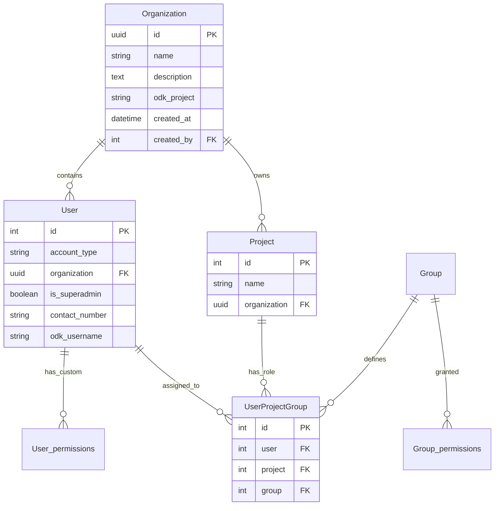
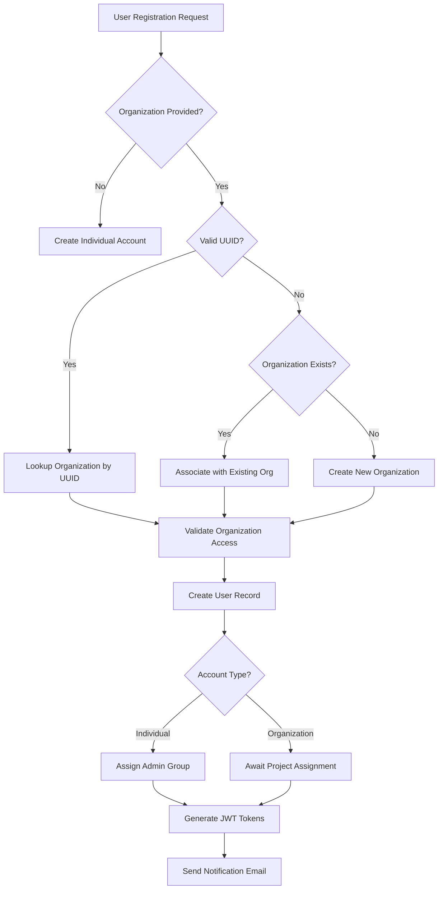
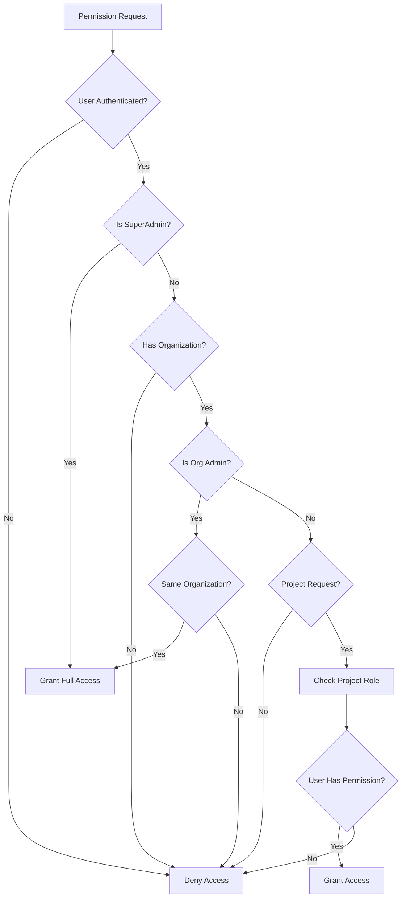
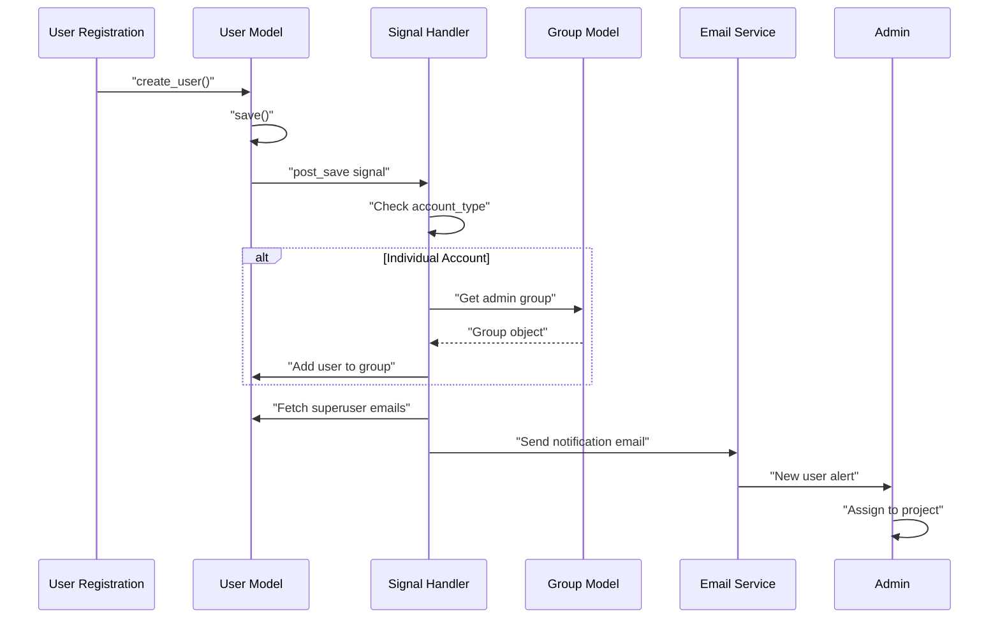

# Multi-Tenant Organization and User Management

The Core Stack backend implements a sophisticated multi-tenant architecture that enables multiple organizations to operate independently within the same system while maintaining strict data isolation. This system provides granular access control at the organization, project, and individual user levels, supporting diverse operational models from individual accounts to large organizational deployments with hierarchical permission structures.

## Architecture Overview

The multi-tenant system centers around three core abstractions: **Organizations** as top-level tenants, **Users** as system actors, and **Projects** as organizational workspaces with scoped permissions. The architecture follows a hierarchical isolation model where superadmins maintain global control,



 organization admins manage tenant-level resources, and project-specific roles control access to individual workspaces.

Sources: [organization/models.py](/organization/models.py#L11-L33), [users/models.py](/users/models.py#L13-L114)

This architecture enables **data isolation** at the organization level while supporting **collaborative workflows** through project-based role assignments. The system automatically propagates organization-level permissions to all projects within an organization for admin users, while regular users maintain scoped access to only assigned projects.

## Organization Model and Management

Organizations serve as the fundamental tenant boundary in the system, each identified by a unique UUID for security and scalability. The Organization model tracks essential metadata including name, description, ODK project integration details, and audit information through created\_by and updated\_by fields.

Sources: [organization/models.py](/organization/models.py#L11-L33), [organization/views.py](/organization/views.py#L23-L110)

### Organization API Endpoints

| Endpoint | Method | Description | Permission Level |
| --- | --- | --- | --- |
| `/organizations/` | GET | List all organizations | Authenticated users |
| `/organizations/` | POST | Create new organization | SuperAdmin only |
| `/organizations/{id}/` | GET | Retrieve organization details | Authenticated + member access |
| `/organizations/{id}/` | PUT/PATCH | Update organization | SuperAdmin or creator |
| `/organizations/{id}/users/` | GET | List organization users | SuperAdmin or member |

The `OrganizationViewSet` implements dynamic permission checks based on action type. Create and delete operations require superadmin privileges, while retrieve and update operations allow authenticated users with organization membership or creator status. The `check_organization_permissions` method validates access by verifying user roles against organization ownership [organization/views.py](/organization/views.py#L56-L65).

Organization access control follows a three-tier verification: superadmins bypass all checks, organization creators have full rights to their organizations, and organization members can retrieve but not modify organization details unless they hold admin roles.

## User Model and Authentication

The User model extends Django's AbstractUser to support multi-tenant scenarios with organization affiliation, account type classification, and hierarchical permission escalation through the is\_superadmin flag. Users can be classified as either individual accounts or organization members, with the system automatically handling permission propagation for organization-level admins.

Sources: [users/models.py](/users/models.py#L13-L114), [users/serializers.py](/users/serializers.py#L10-L72)

### User Attributes

| Attribute | Type | Description | Validation |
| --- | --- | --- | --- |
| `account_type` | CharField | Individual or Organization | AccountType.choices |
| `organization` | ForeignKey | Tenant affiliation | Optional UUID reference |
| `is_superadmin` | Boolean | Global system access | Default: False |
| `contact_number` | CharField | User contact info | Optional |
| `odk_username` | CharField | ODK system integration | Optional |
| `profile_picture` | ImageField | User avatar | Upload to profile\_pictures/ |

The registration system supports flexible organization association through the `UserRegistrationSerializer`. Users can register with an existing organization by providing either the organization UUID or name, or request creation of a new organization by specifying a non-existent organization name [users/serializers.py](/users/serializers.py#L106-L149).


### Registration Flow



Individual accounts automatically receive administrative group assignment during registration through a post-save signal handler, while organization users require explicit project assignment before gaining system access [users/signals.py](/users/signals.py#L13-L77).

The registration system automatically triggers email notifications to superadmins upon new user registration, providing direct links to the admin interface for project assignment. This manual approval workflow prevents unauthorized access while maintaining flexibility for organization onboarding.

## Permission System Architecture

The permission system implements a multi-layered access control model combining Django's built-in authorization framework with custom project-scoped permissions. The system distinguishes between global privileges, organization-level administration, and project-specific operational permissions.

Sources: [users/permissions.py](/users/permissions.py#L10-L169), [users/models.py](/users/models.py#L65-L113)

### Permission Classes

| Permission Class | Purpose | Access Logic |
| --- | --- | --- |
| `IsSuperAdmin` | Global system operations | Requires is\_superadmin flag |
| `IsSuperAdminOrOrgAdmin` | Organization management | Superadmin or organization admin groups |
| `IsOrganizationMember` | Organization resource access | Verified organization membership |
| `HasProjectPermission` | Project-level operations | Project-specific role-based access |

The `HasProjectPermission` class implements sophisticated permission checking that first verifies user authentication, then checks for superadmin privileges, followed



 by organization admin validation, and finally evaluates project-specific role assignments through the `User.has_project_permission` method [users/permissions.py](/users/permissions.py#L37-L92).

### Permission Resolution Flow

### Project-Scoped Permissions

The system generates fine-grained permissions for different application types and actions. Each permission follows the pattern `{action}_{app_type}` where actions include view, add, change, and delete, and app\_types represent different system modules like plantation or watershed planning.

Sources: [users/permissions.py](/users/permissions.py#L123-L169)

| App Type | Permissions Available | Use Case |
| --- | --- | --- |
| `plantation` | view, add, change, delete | Forestry management operations |
| `watershed` | view, add, change, delete | Water resource planning |

Organization administrators automatically inherit all permissions for projects within their organization through the permission resolution logic [users/models.py](/users/models.py#L88-L96), eliminating the need for explicit role assignments for admins while maintaining explicit control for regular users.

## Role-Based Access Control

The system implements project-scoped role assignments through the `UserProjectGroup` model, which creates a many-to-many relationship between users and projects with group (role) as the bridging entity. This design allows users to hold different roles across different projects within the same organization.

Sources: [users/models.py](/users/models.py#L116-L133), [users/permissions.py](/users/permissions.py#L146-L169)

### Default Groups and Permissions

| Group Name | Permissions | Typical Use Case |
| --- | --- | --- |
| Project Manager | Full CRUD on plantation & watershed | Project oversight and management |
| App User | View, add, change (no delete) | Field data collection and updates |
| Analyst | View-only permissions | Data analysis and reporting |
| Organization Admin | All org project permissions | Organization administration |

The `create_default_groups` function initializes these groups with appropriate permissions on system startup, ensuring consistent permission structures across deployments. Permissions are assigned at the group level and inherited by group members through Django's authorization framework.

### User-Project-Group Assignment

The `UserProjectGroupViewSet` manages user-to-project role assignments with validation to prevent duplicate assignments. The model enforces uniqueness constraints on the combination of user and project, ensuring each user can only have one active role per project [users/models.py](/users/models.py#L126-L129).

Sources: [users/views.py](/users/views.py#L428-L447), [users/serializers.py](/users/serializers.py#L203-L222)

**Assignment endpoints:**

* `POST /projects/{project_id}/users/` - Assign user to project with specific role
* `PUT /users/{user_id}/set_group/` - Assign user to global group
* `PUT /users/{user_id}/remove_group/` - Remove user from group
* `GET /users/my_projects/` - Retrieve current user's projects and roles

The `get_project_details` method in `UserSerializer` intelligently aggregates project access by returning all organization projects for admins and only explicitly assigned projects for regular users [users/serializers.py](/users/serializers.py#L46-L72).

## API Security and Authentication

The authentication system leverages Django REST Framework's JWT implementation with SimpleJWT, providing stateless token-based authentication. The system automatically issues access and refresh tokens upon registration, with token validation enforced through middleware.

Sources: [users/views.py](/users/views.py#L89-L120), [nrm\_app/settings.py](/nrm_app/settings.py#L168-L189)

### Authentication Endpoints

| Endpoint | Method | Description | Response |
| --- | --- | --- | --- |
| `/users/register/` | POST | User registration with token issuance | User object + JWT tokens |
| `/users/login/` | POST | Token generation with credentials | Access + refresh tokens |
| `/users/logout/` | POST | Refresh token invalidation | Success confirmation |
| `/users/available_organizations/` | GET | List registrable organizations | Organization catalog |

The `LoginView` extends SimpleJWT's `TokenObtainPairView` to customize response format, while the `LogoutView` implements secure token invalidation by requiring authentication and processing refresh token revocation [users/views.py](/users/views.py#L89-L120).

The registration system issues JWT tokens immediately upon successful account creation, eliminating the need for separate authentication steps. This streamlined approach improves user experience while maintaining security through proper token validation and refresh mechanisms.

## Data Isolation and Query Filtering

The system implements comprehensive data isolation at the viewset level through queryset filtering. The `UserViewSet.get_queryset` method automatically restricts data access based on user roles, returning all users for superadmins, organization-scoped users for organization admins, and self-referential data for regular users.

Sources: [users/views.py](/users/views.py#L162-L177), [organization/views.py](/organization/views.py#L28-L51)

### Queryset Filtering Rules

| User Role | Data Scope | Filter Logic |
| --- | --- | --- |
| SuperAdmin | Global | `User.objects.all()` |
| Organization Admin | Organization-scoped | `User.objects.filter(organization=user.organization)` |
| Regular User | Self-scoped | `User.objects.filter(id=user.id)` |

This pattern is consistently applied across all viewsets, ensuring that users can only access and modify resources within their authorized scope. The `IsOrganizationMember` permission class extends this protection by validating object-level permissions through organization membership verification [users/permissions.py](/users/permissions.py#L10-L34).

## Signal-Based Workflows

The system leverages Django's signal framework to implement automated workflows. The `post_save` signal on the



 User model triggers email notifications to superadmins 


upon new user registration and automatically assigns administrative groups to individual accounts.

Sources: [users/signals.py](/users/signals.py#L13-L77)

### Registration Signal Flow

The signal handler constructs HTML-formatted email notifications containing direct links to the user assignment admin interface, streamlining the approval workflow and reducing manual intervention [users/signals.py](/users/signals.py#L22-L77).

## Integration with ODK System

The system integrates with Open Data Kit (ODK) for field data collection through organization


-level ODK project mapping. Each organization can be associated with a specific ODK project, and users within the organization can have individual ODK credentials for data synchronization.

Sources: [organization/models.py](/organization/models.py#L15), [users/models.py](/users/models.py#L30)

### ODK Integration Fields

| Field | Location | Purpose |
| --- | --- | --- |
| `odk_project` | Organization | Maps organization to ODK project |
| `odk_username` | User | User's ODK authentication


 identifier |

This integration enables seamless bidirectional data flow between the CoRE Stack backend and ODK-managed field operations, with tenant-level isolation ensuring that organizations only access their designated ODK projects and data.

## Configuration and Environment

The multi-tenant system relies on several key configuration settings defined in the Django settings file. The custom user model is specified through `AUTH_USER_MODEL`, and administrative group IDs are configured through environment variables for deployment flexibility.

Sources: [nrm\_app/settings.py](/nrm_app/settings.py#L271), [nrm\_app/settings.py#L60)

### Critical Configuration

```python
AUTH_USER_MODEL = "users.User"
ADMIN_GROUP_ID = env("ADMIN_GROUP_ID")
```

The JWT authentication configuration defines token lifetimes and response formats, with standard settings for access token expiration (typically 60 minutes) and refresh token validity (longer duration, typically 24 hours).

This multi-tenant organization and user management system provides a robust foundation for secure, scalable multi-organization deployments. For deeper understanding of authentication mechanisms and JWT implementation, see [Authentication and Authorization System](/7-authentication-and-authorization-system) . To learn how user permissions integrate with project-level operations, explore [Project Management and Tracking](./23-project-management-and-tracking).