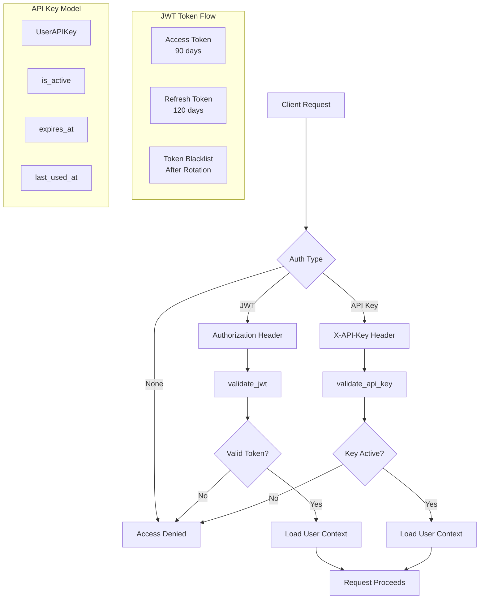
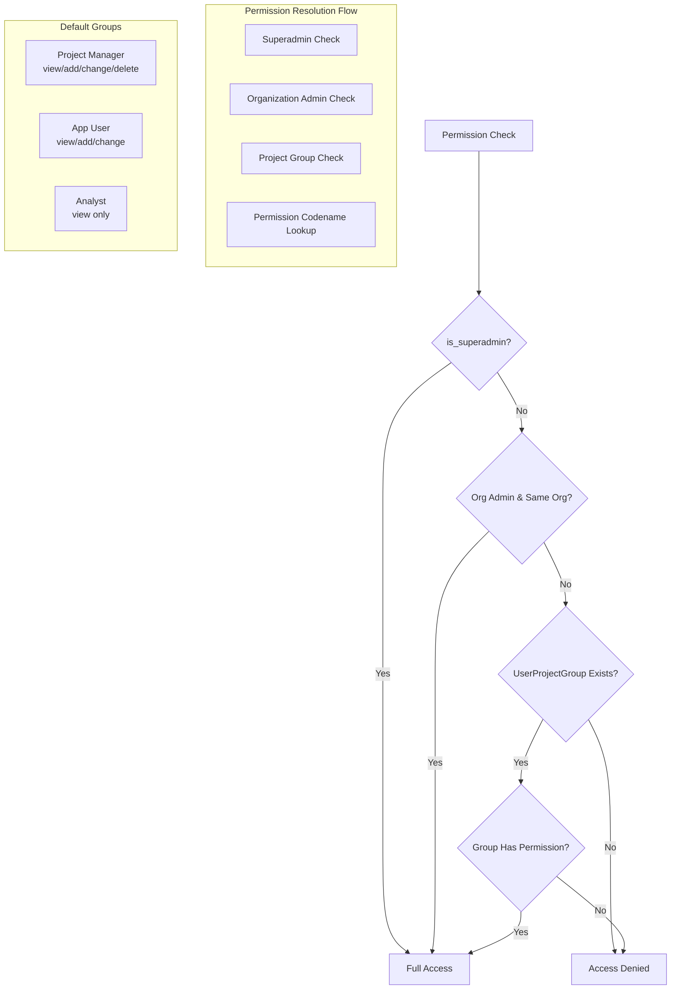
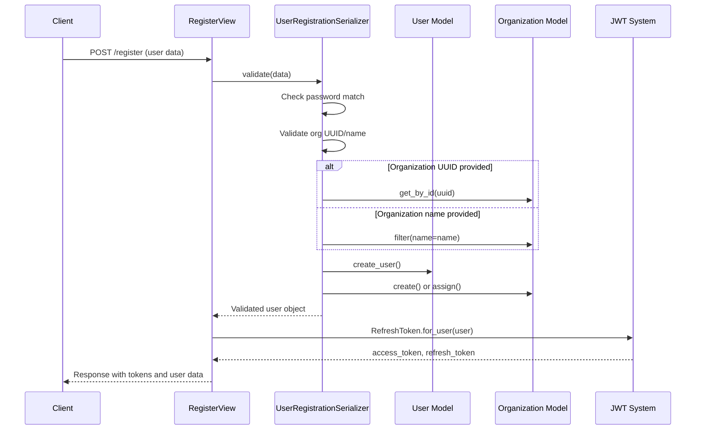

# Authentication and Authorization System

The authentication and authorization system in Core Stack Backend implements a **multi-tenant, role-based access control (RBAC)** architecture that supports both human users and programmatic API access. The system provides hierarchical permission management across organization and project boundaries, enabling fine-grained control over geospatial computing resources and administrative functions.

## Authentication Architecture

The authentication system employs a **dual-strategy approach** supporting both JWT-based authentication for standard web/mobile clients and API key authentication for programmatic integration. The architecture is built on Django REST Framework (DRF) with SimpleJWT for token management, extended with custom authentication classes to support the system's multi-tenant requirements.

At the foundation lies the custom `User` model extending Django's `AbstractUser`, which adds organization-specific fields and multi-tenant support. The model distinguishes between individual accounts and organization accounts through an `account_type` field, and includes an `is_superadmin` flag for platform-wide administrative privileges <users/models.py#L13-L39>.

The authentication configuration in `settings.py` establishes JWT as the default authentication mechanism, configured with a 90-day access token lifetime and 120-day refresh token lifetime. Token security is enhanced through refresh token rotation and automatic blacklisting after rotation, preventing token replay attacks.

[nrm_app/settings.py#L158-L187](../nrm_app/settings.py#L158-L187)

### JWT Authentication

JWT authentication follows the industry-standard bearer token pattern with the `Authorization: Bearer <token>` header format. The system uses HS256 algorithm for signing, with the signing key derived from the application's `SECRET_KEY` [nrm_app/settings.py#L175-L181](../nrm_app/settings.py#L175-L181). Token validation occurs in the `validate_jwt` function, which decodes the token payload and retrieves the associated user object [utilities/auth_check_decorator.py#L206-L213](../utilities/auth_check_decorator.py#L206-L213).

The registration flow in `RegisterView` automatically generates both access and refresh tokens upon successful user creation, providing immediate authenticated access [users/views.py#L72-L80](../users/views.py#L72-L80). The login endpoint extends SimpleJWT's `TokenObtainPairView` to customize the response format while leveraging the underlying authentication logic [users/views.py#L89-L99](../users/views.py#L89-L99).

The JWT implementation uses a 90-day access token lifetime—unusually long compared to typical 15-60 minute windows. This design trades security for reduced friction in geospatial workflows, mitigated by mandatory refresh token rotation and blacklisting.

### API Key Authentication

For programmatic access, the system implements a custom `UserAPIKey` model extending Django REST Framework's `AbstractAPIKey` [geoadmin/models.py](../geoadmin/models.py#L76-L95). Each API key includes user association, optional expiration date, activity tracking, and a human-readable name for identification purposes. The `is_expired` property automatically evaluates whether a key has passed its expiration timestamp [geoadmin/models.py](../geoadmin/models.py#L87-L90).

API key validation checks both the `is_active` flag and expiration status, updating the `last_used_at` timestamp on successful authentication [utilities/auth_check_decorator.py](../utilities/auth_check_decorator.py#L189-L199). This tracking enables monitoring of API key usage patterns and detection of inactive keys for cleanup.

The `api_security_check` decorator provides a unified interface for applying authentication requirements to function-based views, supporting flexible configuration of authentication type, allowed HTTP methods, and required headers [utilities/auth_check_decorator.py](../utilities/auth_check_decorator.py#L22-L126).

## Authorization and Permission Model

The authorization system implements a **three-tiered hierarchy**: platform-level superadmin privileges, organization-level administrative rights, and project-specific role-based permissions. This design enables multi-tenant isolation while allowing organizations to manage their own access policies autonomously.

### Permission Hierarchy

At the top level, `is_superadmin` and `is_superuser` flags grant unrestricted access to all resources across the platform [users/models.py](../users/models.py#L77-L78). Superadmin privileges bypass all permission checks in both organization membership and project permission validators [users/permissions.py](../users/permissions.py#L19-L20) and [users/permissions.py](../users/permissions.py#L46-L47).

Organization administrators—identified by membership in groups named "Organization Admin", "Org Admin", or "Administrator"—receive automatic access to all projects within their organization [users/permissions.py](../users/permissions.py#L53-L60). This enables centralized management of organization resources without requiring explicit project-level permission assignments.

Project-specific permissions are managed through the `UserProjectGroup` model, which establishes many-to-many relationships between users, projects, and Django groups [users/models.py#L116-L133](../users/models.py#L116-L133). This model enforces a unique constraint on user-project pairs, preventing duplicate role assignments within the same project.

The `has_project_permission` method in the User model implements the permission resolution logic, checking superadmin status first, then organization admin privileges, and finally specific permission codenames through the user's group assignment <users/models.py#L65-L106>.

### Permission Classes

The system provides two custom permission classes for different authorization scenarios:

`IsOrganizationMember` verifies that authenticated users belong to an organization, with superadmin bypass. It also implements object-level permission checking, ensuring users can only access resources belonging to their organization [users/permissions.py](users/permissions.py#L10-L34). This class is suitable for views where organization membership is the primary access criterion.

`HasProjectPermission` provides more granular access control by evaluating project-specific permissions. The `_get_permission_codename` method intelligently maps HTTP methods to permission actions (GET→view, POST→add, PUT/PATCH→change, DELETE→delete) and incorporates the application type from the view or queryset <users/permissions.py#L94-L120>. This enables declarative permission enforcement without requiring explicit permission codename specification in views.

| Permission Class | Use Case | Organization Admin Bypass | Object-Level Support |
| --- | --- | --- | --- |
| `IsOrganizationMember` | Organization-scoped resources | Yes | Yes |
| `HasProjectPermission` | Project-specific resources | Yes (same org) | Yes |

### Default Groups and Permissions

The system automatically creates default groups with predefined permission sets during initialization. The `create_default_groups` function establishes three standard roles: "Project Manager", "App User", and "Analyst" <users/permissions.py#L146-L169>.

Project Managers receive full CRUD permissions for all application types, App Users get view/add/change access (excluding delete), and Analysts are restricted to read-only access. These groups are populated with permissions created by `create_app_permissions`, which generates custom permissions like `view_plantation`, `add_watershed`, etc., linked to the Project content type <users/permissions.py#L123-L144>.

The permission system uses content\_type-based permission codenames tied to the Project model, not the individual app models. This centralizes permission management and allows consistent permission patterns across different application types without requiring database migrations for each app.

## User Registration and Authentication Flows

### Registration Process

User registration is handled through the `UserRegistrationSerializer`, which implements comprehensive validation and supports both existing organization association and new organization creation <users/serializers.py#L75-L183>. The serializer accepts organization identifiers as either UUIDs for existing organizations or string names for creating new ones.

The validation logic checks for password matching, verifies organization existence when a UUID is provided, or prepares for organization creation when a name is provided <users/serializers.py#L106-L149>. During user creation, the serializer first creates the User object with Django's `create_user` method, then associates the user with the appropriate organization <users/serializers.py#L151-L183>.

### Login and Token Management

The login process leverages SimpleJWT's `TokenObtainPairView` with minimal customization, focusing on token generation and user credential validation <users/views.py#L89-L99>. Upon successful authentication, the system returns both access and refresh tokens with the user's profile information.

Logout functionality is implemented through `LogoutView`, which accepts the refresh token and adds it to the token blacklist <users/views.py#L111-L126>. Combined with the `BLACKLIST_AFTER_ROTATION` setting, this ensures that compromised tokens cannot be reused after logout.

The password change functionality is secured by requiring the old password for verification before allowing updates <users/serializers.py#L223-L247>. This prevents unauthorized password changes even if an attacker gains access to an authenticated session.

## User and Group Management API

### User Management

The `UserViewSet` provides comprehensive user management capabilities through a REST API, with permission-based access control enforced by the `IsSuperAdminOrOrgAdmin` permission class <users/views.py#L131-L141>. This permission ensures that only superadmins or organization admins can manage user accounts.

The viewset implements dynamic queryset filtering based on the requesting user's role <users/views.py#L162-L177>. Superadmins see all users, while organization admins see only users within their organization. This data isolation is enforced at the database query level, preventing unauthorized access through API enumeration.

Key user management actions include:

* **set\_organization**: Assigns users to organizations, restricted to superadmins and organization admins <users/views.py#L260-L289>
* **set\_group**: Adds users to Django groups for role assignment <users/views.py#L291-L352>
* **remove\_group**: Removes users from groups <users/views.py#L354-L382>
* **my\_projects**: Retrieves all projects accessible to the current user with their assigned roles <users/views.py#L383-L418>

### Project Role Assignment

The `UserProjectGroupViewSet` manages the assignment of users to specific projects with designated roles <users/views.py#L428-L447>. This viewset enforces permission checks to ensure that only authorized users can create or modify role assignments.

The serializer for user-project relationships includes read-only fields for user and group names to provide human-readable representations without exposing sensitive internal identifiers <users/serializers.py#L203-L221>. This design supports API users that display user roles in UI elements while maintaining referential integrity at the database level.

## Security Considerations

The authentication and authorization system incorporates several security measures beyond standard Django authentication:

**API Request Logging**: The optional `ApiHitLoggerMiddleware` tracks all API endpoint requests, capturing the path, method, authenticated user, IP address, query parameters, and request body <apiadmin/middleware.py#L1-L41>. This provides an audit trail for security investigations and usage analytics.

**Token Blacklisting**: Integration with SimpleJWT's token blacklist prevents replay attacks by invalidating used refresh tokens. Combined with token rotation, this significantly reduces the window for token abuse.

**Multi-Tenant Isolation**: Organization and project boundaries are enforced at both the object and query levels, preventing cross-tenant data access through either direct object references or API enumeration.

**Custom Authentication Classes**: The `NoAuthentication` class provides a bypass for authentication in specific scenarios, useful for public endpoints that don't require user identity <utilities/auth_utils.py#L8-L14>. The `auth_free` decorator offers a convenient way to apply this bypass to function-based views <utilities/auth_utils.py#L17-L19>.

## Integration Points

The authentication system integrates with several subsystems across the Core Stack Backend:

**Organization Management**: User-organization relationships are established during registration and can be modified through the user management API. This integration enables the multi-tenant architecture described in [Multi-Tenant Organization and User Management](/6-multi-tenant-organization-and-user-management) .

**Project Management**: User-project-group assignments link users to specific projects with role-based permissions, supporting the project management workflows detailed in [Project Management and Tracking](/23-project-management-and-tracking) .

**Public API**: API key authentication provides secure access to public endpoints without requiring user credentials, as described in [Public API Architecture and Design](/28-public-api-architecture-and-design) .

**Bot Interface**: The bot authentication system uses external platform tokens (Facebook, WhatsApp) rather than Django authentication, as documented in [WhatsApp and Facebook Bot Integration](/16-whatsapp-and-facebook-bot-integration)  <bot_interface/auth.py#L10-L36>.