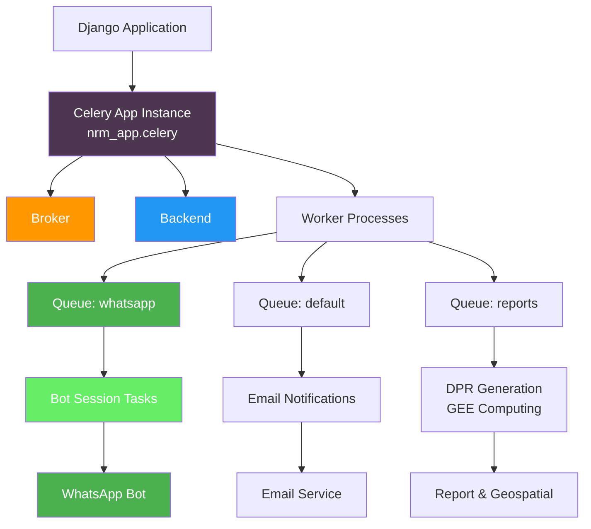

# Celery Asynchronous Task Processing

Celery serves as the distributed task queue system that enables the Core Stack backend to handle long-running operations without blocking HTTP requests. This architecture is essential for geospatial computations, report generation, email notifications, and bot session management—operations that would timeout typical HTTP connections. The implementation follows Django-Celery patterns with automatic task discovery across 15+ Django applications.

## Architecture Overview

The Celery integration follows a centralized configuration model with distributed task modules. The core Celery instance in `nrm_app/celery.py` initializes the application and automatically discovers task modules from all registered Django applications using the `app.autodiscover_tasks()` method.

The task execution flow demonstrates how requests from Django views or signals are dispatched to Celery workers through the message broker, allowing the main application thread to respond immediately while tasks process asynchronously.



Sources: [nrm\_app/celery.py](nrm_app/celery.py#L1-L19)

## Celery Configuration

The Celery application is initialized with a minimalist configuration that leverages Django's settings infrastructure. The core configuration file demonstrates the recommended pattern for Django-Celery integration.

**Core Initialization**: The Celery instance is created with the project name `"nrm_app"` and configured to read settings from Django's configuration module. This approach allows task settings to be managed alongside other Django configurations.

```python
app = Celery("nrm_app")
app.config_from_object("django.conf:settings")
app.autodiscover_tasks(INSTALLED_APPS)
```

**Configuration Pattern**: Using `config_from_object("django.conf:settings")` enables the use of environment variables for broker and backend configuration without explicit `CELERY_*` prefixes in the settings file. Tasks are automatically discovered from all applications listed in `INSTALLED_APPS`, scanning for `tasks.py` modules.

Sources: [nrm\_app/celery.py](nrm_app/celery.py#L1-L19), [nrm\_app/settings.py](nrm_app/settings.py#L55-L110)

## Task Patterns and Implementation

The repository demonstrates two primary task decorator patterns across multiple applications: the `@app.task` decorator for application-specific tasks and `@shared_task` for tasks that can be used across any Celery instance.

**Named Tasks**: Tasks are explicitly named using the `name` parameter to ensure stable task IDs even if module paths change. This is critical for task routing and monitoring.

```python
@app.task(bind=True, name="StartUserSession", queue="whatsapp")
def StartUserSession(self, event_packet: Dict[str, Any], event: str, bot_id: str, app_type: str) -> None:
    """WhatsApp bot session initialization"""
```

**Task Binding**: The `bind=True` parameter provides access to task context through the `self` argument, enabling features like task retries and state tracking. The pattern is particularly useful for long-running geospatial computations that may need error handling and retry logic.

Sources: [bot\_interface/tasks.py](bot_interface/tasks.py#L1-L200), [dpr/tasks.py](dpr/tasks.py#L1-L66)

## Queue-Based Task Routing

The implementation demonstrates queue-based task routing to prioritize and isolate different task types. The WhatsApp bot tasks are explicitly routed to a dedicated `whatsapp` queue, preventing bot interactions from being delayed by long-running computations.

**Queue Assignment**: Tasks are assigned to queues using the `queue` parameter during task definition. This allows the system to run separate worker processes with different resource allocations for different task types.

```python
@app.task(bind=True, name="StartUserSession", queue="whatsapp")
def StartUserSession(...)
```

**Worker Implications**: Queue configuration requires running separate worker processes with appropriate queue specifications. This architecture enables horizontal scaling based on task-specific load patterns.

Sources: [bot\_interface/tasks.py](bot_interface/tasks.py#L16-L21)

## Task Categorization by Domain

The repository organizes Celery tasks across six major domains, each serving specific business requirements.

**Bot Interface Tasks**: The `bot_interface/tasks.py` module contains the `StartUserSession` task that handles WhatsApp webhook events, validates user community membership, and manages bot conversation state. This task demonstrates complex logic with database queries, HTTP requests, and state management—all executed asynchronously to provide immediate webhook responses.

**Report Generation Tasks**: The `dpr/tasks.py` module implements `generate_dpr_task`, which orchestrates the generation of Detailed Project Reports (DPR) including micro-watershed (MWS) reports and resource reports. This task involves PDF rendering, API calls to report services, and email delivery—a perfect candidate for asynchronous execution.

**Google Earth Engine Integration**: The `gee_computing/tasks.py` module defines periodic computation tasks for hydrological variables. These tasks, including `ComputeSEVariables` and `ComputeDeltaG`, are designed for scheduled execution (likely via Celery Beat) to update geospatial datasets on a recurring basis.

**Email Notifications**: The `geoadmin/tasks.py` module implements `send_email_notification`, a reusable task for sending emails with attachments. This task abstracts email delivery from the application flow, improving reliability by handling SMTP timeouts asynchronously.

**Water Rejuvenation Processing**: The `waterrejuvenation/tasks.py` module contains `Upload_Desilting_Points`, a shared task for processing Excel uploads containing water body desilting data. This task performs extensive geospatial computations including watershed delineation, land use/land cover analysis, and Google Earth Engine operations.

Sources: [bot\_interface/tasks.py](bot_interface/tasks.py#L1-L200), [dpr/tasks.py](dpr/tasks.py#L1-L66), [gee\_computing/tasks.py](gee_computing/tasks.py#L1-L39), [geoadmin/tasks.py](geoadmin/tasks.py#L1-L30), [waterrejuvenation/tasks.py](waterrejuvenation/tasks.py#L1-L200)

## Task Execution Patterns

When implementing tasks that process batch data (like `Upload_Desilting_Points`), create individual database records first, then perform processing in a try-catch block. This pattern ensures audit trails even when individual items fail processing.

The implementation demonstrates several advanced task execution patterns suitable for intermediate-level developers:

**Database-First Pattern**: In `waterrejuvenation/tasks.py`, the task first creates database records for each Excel row before performing expensive GEE operations. This ensures data persistence even when geospatial processing fails, and allows tracking individual item status.

**Progressive Processing**: The DPR generation task in `dpr/tasks.py` demonstrates chained operations where MWS reports are generated individually, allowing partial success even if some reports fail. The task collects successful report URLs and continues with email generation.

**Error Isolation**: Task implementations use comprehensive error handling with logger statements to track failures without propagating exceptions to the task queue. This pattern prevents single-task failures from blocking the entire worker process.

**Context Preservation**: The bot session task demonstrates complex state management where user conversation context (state, SMJ ID) is preserved across asynchronous executions, enabling conversation continuity despite webhook processing delays.

Sources: [waterrejuvenation/tasks.py](waterrejuvenation/tasks.py#L88-L140), [dpr/tasks.py](dpr/tasks.py#L10-L66), [bot\_interface/tasks.py](bot_interface/tasks.py#L80-L140)

## Integration with Google Earth Engine

The `gee_computing` and `waterrejuvenation` modules demonstrate tight integration between Celery and Google Earth Engine for heavy geospatial computations. Tasks initialize GEE credentials, process large datasets, and manage asset lifecycle—all orchestrated through Celery's distributed execution model.

**Credential Management**: Tasks accept `gee_account_id` parameters to initialize appropriate GEE service accounts, enabling multi-tenant GEE access. The `ee_initialize()` function sets up authentication before task execution begins.

**Asset Lifecycle Management**: Tasks include functions for making assets public (`make_asset_public`), deleting failed assets (`delete_asset_on_GEE`), and waiting for long-running GEE computations to complete (`wait_for_task_completion`).

**Batch Processing**: The `Upload_Desilting_Points` task demonstrates batch processing of geospatial features, merging results into a single FeatureCollection for downstream analysis—a pattern essential for processing large datasets efficiently.

Sources: [gee\_computing/tasks.py](gee_computing/tasks.py#L1-L39), [waterrejuvenation/tasks.py](waterrejuvenation/tasks.py#L28-L80)

## Task Discovery and Organization

Celery's autodiscovery mechanism scans all applications registered in `INSTALLED_APPS`, looking for `tasks.py` modules. This decentralized organization allows each Django application to define its own asynchronous operations without central configuration overhead.

**Installed Apps with Tasks**: The following applications contain task modules:

* `bot_interface` - WhatsApp bot session management
* `dpr` - Report generation and email delivery
* `gee_computing` - Periodic GEE computations
* `geoadmin` - Email notifications
* `waterrejuvenation` - Water body data processing
* `app_controller` - Test tasks and utility operations

**Naming Convention**: Tasks follow the pattern `tasks.<TaskName>` when using explicit naming, or `appname.tasks.function_name` when relying on module-based naming. The repository uses explicit naming for critical tasks to ensure stability across deployments.

Sources: [nrm\_app/settings.py](nrm_app/settings.py#L55-L110)

## Monitoring and Logging

Task implementations throughout the repository use Python's standard logging module with application-specific loggers. The `bot_interface` module uses module-level loggers with `logging.getLogger(__name__)`, while other modules import custom logging utilities from `utilities/logger`.

**Logging Patterns**: Tasks log at appropriate levels—INFO for normal operations, ERROR for failures, and DEBUG for detailed diagnostic information. The DPR generation task uses `setup_logger` from utilities, indicating a centralized logging configuration.

**Error Handling**: Most tasks wrap critical operations in try-except blocks, logging errors without raising exceptions. This pattern allows tasks to fail gracefully while maintaining queue processing capacity.

Sources: [bot\_interface/tasks.py](bot_interface/tasks.py#L18-L19), [dpr/tasks.py](dpr/tasks.py#L1-L10), [geoadmin/tasks.py](geoadmin/tasks.py#L5-L10)

## Common Use Cases

The repository's Celery implementation supports four primary use cases relevant to geospatial and web applications:

**Long-Running Computations**: Google Earth Engine operations in `gee_computing` and `waterrejuvenation` tasks often require minutes to hours of processing time. Celery enables these operations without blocking HTTP requests or triggering timeouts.

**Notification Systems**: Email tasks in `geoadmin` and `dpr` decouple message delivery from request processing, improving application responsiveness and reliability.

**External Service Integration**: The bot session task in `bot_interface` makes HTTP requests to community APIs, handling potential service delays and network issues asynchronously.

**Batch Processing**: The water rejuvenation task processes Excel uploads with hundreds of rows, performing individual validations and computations while maintaining overall request responsiveness.

Sources: [gee\_computing/tasks.py](gee_computing/tasks.py#L15-L39), [waterrejuvenation/tasks.py](waterrejuvenation/tasks.py#L88-L200), [geoadmin/tasks.py](geoadmin/tasks.py#L11-L30)

## Development Workflow

When working with Celery tasks in this repository, developers should follow these established patterns:

1. **Task Definition**: Define tasks in application-specific `tasks.py` modules using appropriate decorators. Use `@shared_task` for reusable tasks and `@app.task` for application-specific tasks.
2. **Task Naming**: Always specify explicit task names using the `name` parameter to maintain stable task IDs across refactoring.
3. **Error Handling**: Implement comprehensive error handling with logging to prevent task failures from blocking worker processes.
4. **Database Operations**: Create database records before expensive operations to ensure data persistence and auditability.
5. **Queue Assignment**: Route tasks to appropriate queues based on resource requirements and priority, especially for bot interactions and long-running computations.