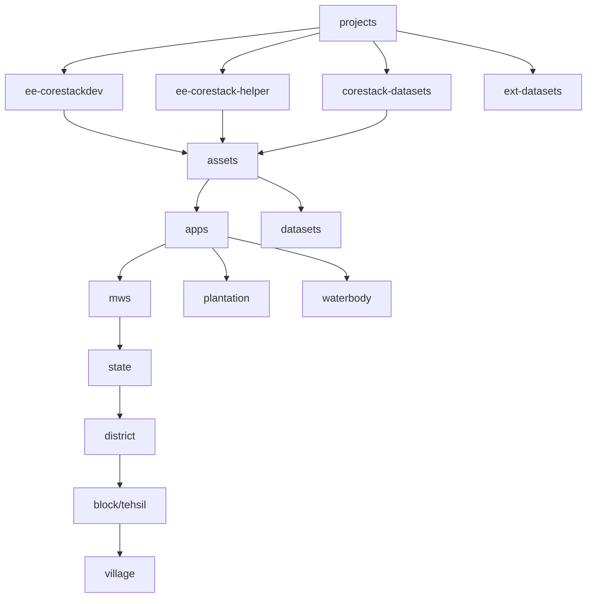
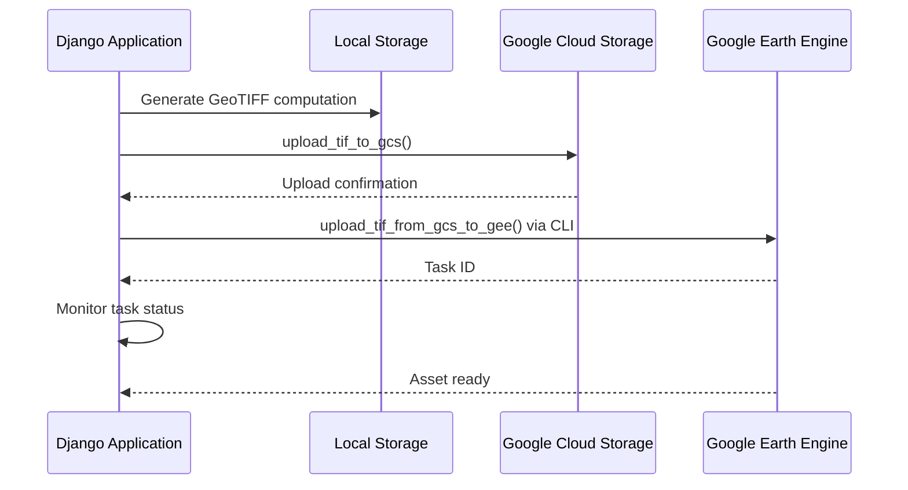

# Google Earth Engine Integration and Authentication

This documentation provides a comprehensive architectural analysis of how the core-stack-backend integrates with Google Earth Engine (GEE), focusing on authentication mechanisms, multi-account management, asset organization, and computational workflows. The system implements a secure, scalable approach to geospatial computing with service account authentication and encrypted credential storage.

## Authentication Architecture

The foundation of the GEE integration rests on a service account-based authentication system that securely manages multiple GEE accounts through Django models with encrypted credential storage. The authentication flow leverages Google OAuth2 service account credentials with dual-scope authorization for both Earth Engine and Google Cloud Storage access.

The core authentication function [`ee_initialize()`](utilities/gee_utils.py#L30-L43) retrieves service account credentials from the database, decrypts them using Fernet symmetric encryption, and initializes the Earth Engine client with the appropriate scopes:

```python
def ee_initialize(account_id=GEE_DEFAULT_ACCOUNT_ID):
account = GEEAccount.objects.get(pk=account_id)
key_dict = json.loads(account.get_credentials().decode("utf-8"))
credentials = service_account.Credentials.from_service_account_info(
key_dict,
scopes=[
"https://www.googleapis.com/auth/earthengine",
"https://www.googleapis.com/auth/devstorage.full_control",
],
)
ee.Initialize(credentials)
return ee, credentials.service_account_email
```

Sources: [utilities/gee\_utils.py](utilities/gee_utils.py#L30-L43)

### Credential Management Model

The [`GEEAccount`](gee_computing/models.py#L6-L32) model implements a secure credential storage pattern using Django's BinaryField for encrypted JSON service account keys:

| Field | Type | Purpose |
| --- | --- | -------- |
| `name` | CharField(100) | Unique identifier for the GEE account |
| `service_account_email` | EmailField | Service account email address |
| `helper_account` | ForeignKey | Optional reference to a helper account |
| `is_visible` | BooleanField | Visibility flag for account listing |
| `credentials_file` | FileField | Temporary upload location for JSON keys |
| `credentials_encrypted` | BinaryField | Permanent encrypted storage |

The model's [`get_credentials()`](gee_computing/models.py#L27-L32) method decrypts stored credentials on-demand using Fernet encryption with the project-wide `FERNET_KEY`.

Sources: [gee\_computing/models.py](gee_computing/models.py#L6-L32)

### Automatic Credential Encryption

A Django signal handler [`encrypt_credentials`](gee_computing/signals.py#L10-L27) automatically processes uploaded service account JSON files during account creation:

1. Reads the raw JSON file content from the temporary upload
2. Encrypts the data using Fernet with the environment-specific key
3. Stores the encrypted binary in the database
4. Deletes the temporary unencrypted file

This zero-touch encryption ensures that service account keys never exist in plaintext outside the encrypted database field.

Sources: [gee\_computing/signals.py](gee_computing/signals.py#L10-L27)

## Multi-Account Architecture

The system supports multiple GEE service accounts with a hierarchical relationship between main accounts and helper accounts. This design enables:

* **Compute quota management** across multiple GEE projects
* **Asset organization** by application domain (MWS, Plantation, Waterbody)
* **Access control** through account visibility flags
* **Account delegation** through helper account references

The default account is controlled by [`GEE_DEFAULT_ACCOUNT_ID`](nrm_app/settings.py#L354-L357), which can be overridden in function calls for specific operations requiring alternate credentials.

The multi-account pattern is essential for production environments where GEE imposes compute quotas per project. By distributing computational load across multiple service accounts, the system maintains high-throughput geospatial processing capabilities without hitting rate limits.

Sources: [nrm\_app/settings.py](nrm_app/settings.py#L354-L357), [gee\_computing/models.py](gee_computing/models.py#L9-L15)

## GEE Asset Organization

The system maintains a structured asset hierarchy across multiple GEE projects, defined in [`GEE_PATHS`](utilities/constants.py#L173-L187):

```python
GEE_PATHS = {
    "MWS": {
        "GEE_ASSET_PATH": GEE_BASE_PATH + "/mws/",
        "GEE_HELPER_PATH": GEE_HELPER_BASE_PATH + "/mws/",
    },
    "PLANTATION": {
        "GEE_ASSET_PATH": GEE_BASE_PATH + "/plantation/",
        "GEE_HELPER_PATH": GEE_HELPER_BASE_PATH + "/plantation/",
    },
    "WATERBODY": {
        "GEE_ASSET_PATH": GEE_BASE_PATH + "/waterbody/",
        "GEE_HELPER_PATH": GEE_HELPER_BASE_PATH + "waterbody/",
        "GEE_ASSET_FOLDER": "waterbody/",
    },
}
```

The asset paths follow a geographic hierarchy: `projects/{project_id}/assets/apps/{app_type}/{state}/{district}/{block}/`. Utility functions like [`create_gee_directory()`](utilities/gee_utils.py#L198-L223) and [`get_gee_asset_path()`](utilities/gee_utils.py#L224-L231) generate hierarchical paths for organizing computed assets by administrative boundaries.



Sources: [utilities/constants.py](utilities/constants.py#L156-L187), [utilities/gee\_utils.py](utilities/gee_utils.py#L198-L231)

### Asset Path Hierarchy

This structure supports multi-tenant asset isolation while enabling shared access to helper project resources for collaborative computations.

Sources: [utilities/gee\_utils.py](utilities/gee_utils.py#L224-L231), [utilities/constants.py](utilities/constants.py#L173-L187)

## Computational Layer

The [`ComputeOnGEE`](gee_computing/compute.py#L4-L360) class provides the primary interface for executing geospatial computations on the GEE platform. Each method initializes an Earth Engine session and performs domain-specific analyses:

* [`precipitation()`](gee_computing/compute.py#L8-L41): Computes rainfall accumulation from GPM/IMERGE datasets
* [`run_off()`](gee_computing/compute.py#L45-L352): Calculates surface runoff using slope, soil, and LULC layers
* [`evapotranspiration()`](gee_computing/compute.py#L353-L354): Computes actual evapotranspiration
* [`soil_moisture()`](gee_computing/compute.py#L356-L357): Analyzes soil moisture dynamics
* [`delta_g()`](gee_computing/compute.py#L359-L360): Calculates groundwater storage change

The precipitation computation demonstrates the typical workflow:

```python
active_district = ee.FeatureCollection(mws_path)
dataset = ee.ImageCollection(data_path).filter(ee.Filter.date(start_date, end_date))
area = dataset.reduce(ee.Reducer.sum())
clipped_area = area.clip(active_district)
stats = clipped_area.reduceRegions(
    reducer=ee.Reducer.mean(),
    collection=active_district,
    scale=11132,
)
```

All computations use [`ee.batch.Export`](gee_computing/compute.py#L34-L38) for asynchronous processing, with task IDs returned for status monitoring.

Sources: [gee\_computing/compute.py](gee_computing/compute.py#L4-L360), [gee\_computing/tasks.py](gee_computing/tasks.py#L25-L31)

## Task Management and Monitoring

GEE computations execute asynchronously, requiring robust task management. The system provides two monitoring functions:

1. [`check_gee_task_status()`](utilities/gee_utils.py#L114-L123): Queries status for a specific task ID
2. [`check_task_status()`](utilities/gee_utils.py#L126-L150): Monitors multiple tasks with configurable polling intervals

These utilities integrate with the Celery task system defined in [`gee_computing/tasks.py`](gee_computing/tasks.py#L17-L38) for periodic computations:

* [`upload_assets_GEE`](gee_computing/tasks.py#L17-L22): Fortnightly asset uploads for ET and soil moisture data
* [`compute_se_variables`](gee_computing/tasks.py#L25-L31): Bi-weekly computation of precipitation, runoff, and evapotranspiration
* [`compute_delta_g`](gee_computing/tasks.py#L34-L38): Periodic groundwater storage change calculation

The combination of Celery for orchestration and GEE batch exports for computation creates a fault-tolerant pipeline where long-running geospatial analyses don't block application responsiveness, and failed tasks can be retried without reprocessing entire workflows.

Sources: [utilities/gee\_utils.py](utilities/gee_utils.py#L114-L150), [gee\_computing/tasks.py](gee_computing/tasks.py#L1-L38)

## Google Cloud Storage Integration

The system leverages Google Cloud Storage as an intermediate layer for asset transfers between local storage and GEE assets. The [`gcs_config()`](utilities/gee_utils.py#L70-L92) function authenticates with GCS using the same service account credentials as GEE:

```python
credentials = service_account.Credentials.from_service_account_info(
    key_dict,
    scopes=[
        "https://www.googleapis.com/auth/earthengine",
        "https://www.googleapis.com/auth/devstorage.full_control",
    ],
)
storage_client = storage.Client(credentials=credentials)
bucket = storage_client.bucket(GCS_BUCKET_NAME)
```

This dual-scope authorization enables seamless data flow:

* **Raster uploads**: Local → GCS → GEE (via CLI)
* **Vector uploads**: Direct to GEE via API
* **Result downloads**: GEE → GCS → Local or GeoServer

The bucket name [`GCS_BUCKET_NAME = "core_stack"`](utilities/constants.py#L157) serves as the central staging area for all geospatial data transfers.

Sources: [utilities/gee\_utils.py](utilities/gee_utils.py#L70-L92), [utilities/constants.py](utilities/constants.py#L156-L157)



## Data Transfer Workflows

The system implements multiple data transfer patterns depending on data type and destination:

### Raster Asset Transfer Flow

### Vector Asset Transfer Flow

Key utility functions supporting these workflows include:

* [`upload_tif_to_gcs()`](../utilities/gee_utils.py#L434-L453): Uploads GeoTIFF files to GCS bucket
* [`upload_tif_from_gcs_to_gee()`](../utilities/gee_utils.py#L461-L482): Transfers GCS files to GEE via Earth Engine CLI
* [`export_vector_asset_to_gee()`](../utilities/gee_utils.py#L248-L264): Direct vector uploads to GEE
* [`export_raster_asset_to_gee()`](../utilities/gee_utils.py#L266-L298): Raster exports from Earth Engine computations

Sources: [utilities/gee\_utils.py](../utilities/gee_utils.py#L397-L482), [utilities/gee\_utils.py](../utilities/gee_utils.py#L248-L298)

## Asset Management Utilities

Comprehensive asset management utilities provide fine-grained control over GEE assets:

| Utility Function | Purpose |
| --- | --- |
| [`is_gee_asset_exists()`](utilities/gee_utils.py#L329-L335) | Check if an asset path exists |
| [`make_asset_public()`](utilities/gee_utils.py#L357-L383) | Set ACL for public read access |
| [`is_asset_public()`](utilities/gee_utils.py#L385-L395) | Verify asset public status |
| [`move_asset_to_another_folder()`](utilities/gee_utils.py#L337-L355) | Restructure asset hierarchy |
| [`create_gee_folder()`](utilities/gee_utils.py#L186-L196) | Create asset directories |
| [`merge_fc_into_existing_fc()`](utilities/gee_utils.py#L683-L715) | Combine feature collections |

These utilities support dynamic asset reorganization, access control management, and data consolidation operations essential for maintaining large-scale geospatial datasets.

Sources: [utilities/gee\_utils.py](utilities/gee_utils.py#L329-L715)

## External Data Integration

The system integrates with external geospatial data providers, particularly NASA datasets for climate and hydrological analysis:

* [`earthdata_auth()`](utilities/gee_utils.py#L

156-L175): Authenticates with NASA Earthdata for MODIS and related datasets
* [`download_et_data()`](gee_computing/utils.py#L16-L67): Downloads evapotranspiration data from NASA GESDISC
* [`download_sm_data()`](gee_computing/utils.py#L69-L130): Retrieves soil moisture data products

Configuration for external services is managed through environment variables:

* [`EARTH_DATA_USER`](nrm_app/settings.py#L351-L352): NASA Earthdata authentication
* [`EARTH_DATA_PASSWORD`](nrm_app/settings.py#L351-L352): NASA Earthdata credentials

Sources: [gee\_computing/utils.py](gee_computing/utils.py#L16-L130), [utilities/gee\_utils.py](utilities/gee_utils.py#L156-L175), [nrm\_app/settings.py](nrm_app/settings.py#L351-L352)

## API Layer and Access Control

The GEE integration exposes a RESTful API through [`GEEAccountView`](gee_computing/views.py#L16-L24), which provides:

* **List operation**: Retrieve all visible GEE accounts
* **Create operation**: Register new GEE accounts with credential uploads

The view enforces JWT-based authentication through [`permissions.IsAuthenticated`](gee_computing/views.py#L23), ensuring only authenticated users can manage GEE service accounts. The serializer [`GeeAccountSerializers`](gee_computing/serializers.py#L4-L17) exposes only the account name and ID, protecting sensitive credential information.

API endpoint: `/api/v1/geeaccounts/` (registered in [`gee_computing/urls.py`](gee_computing/urls.py#L8))

Sources: [gee\_computing/views.py](gee_computing/views.py#L16-L24), [gee\_computing/serializers.py](gee_computing/serializers.py#L4-L17), [gee\_computing/urls.py](gee_computing/urls.py#L1-L13)

## Configuration and Environment Setup

The GEE integration requires several environment variables configured in [`nrm_app/settings.py`](nrm_app/settings.py#L354-L382):

| Environment Variable | Purpose |
| --- | --- |
| `GEE_SERVICE_ACCOUNT_KEY_PATH` | Main service account key file path |
| `GEE_HELPER_SERVICE_ACCOUNT_KEY_PATH` | Helper project account key path |
| `GEE_DATASETS_SERVICE_ACCOUNT_KEY_PATH` | Dataset project account key path |
| `FERNET_KEY` | Encryption key for credential storage |
| `EARTH_DATA_USER` | NASA Earthdata username |
| `EARTH_DATA_PASSWORD` | NASA Earthdata password |
| `CE_BUCKET_URL` | Computing Engine bucket URL |

The Fernet encryption key is critical for secure credential storage, while the multiple service account paths support the multi-project architecture.

Sources: [nrm\_app/settings.py](nrm_app/settings.py#L354-L382)

## Error Handling and Resilience

The system implements several error handling patterns:

1. **Task monitoring**: Poll-based status checking with configurable sleep intervals
2. **Exception handling**: Try-catch blocks around GEE API calls with logging
3. **Asset existence checks**: Pre-flight verification before asset operations
4. **Credential validation**: Automatic encryption failure handling during account creation

The logging configuration in [`nrm_app/settings.py`](nrm_app/settings.py#L288-L330) captures GEE-related operations for debugging and monitoring purposes.

Sources: [utilities/gee\_utils.py](utilities/gee_utils.py#L114-L150), [nrm\_app/settings.py](nrm_app/settings.py#L288-L330)

## Integration with Hydrological Computing

The GEE authentication system underpins hydrological analysis workflows across multiple computing modules. While this page covers the foundational authentication and integration mechanisms, the actual hydrological implementations leverage these primitives for domain-specific analyses.

For detailed implementation of hydrological algorithms using GEE, refer to [Hydrological Computing Modules](/10-hydrological-computing-modules), which build upon the authentication infrastructure documented here.