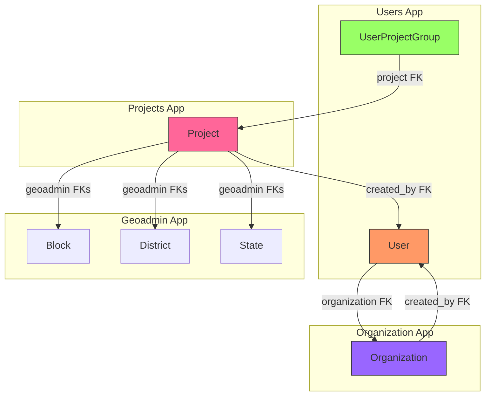

# Migration Scripts

This directory contains automated scripts for managing database migrations in the Core Stack Backend project.

## Overview

The migration scripts handle the complete database migration process, including:
- Generating migrations for all apps
- Resolving circular dependencies
- Applying migrations to the database
- Verifying migration status

## Scripts

### `setup_migrations.sh` (Recommended)

Complete migration setup script that handles the entire process.

**Usage:**
```bash
bash installation/setup_migrations.sh
```

**What it does:**
1. Checks for existing migrations for core apps (organization, projects, users)
2. Generates missing migrations for core apps in proper dependency order
3. Generates migrations for geoadmin (required by projects)
4. Generates migrations for all other apps

**When to use:**
- First-time setup
- After adding new models
- After modifying existing models

### `generate_migrations.sh`

Generates migrations for all apps in dependency order.

**Usage:**
```bash
bash installation/generate_migrations.sh
```

**What it does:**
1. Generates migrations for geoadmin (foundation app)
2. Generates migrations for organization (foundation app)
3. Generates migrations for users (foundation app)
4. Generates migrations for projects (depends on foundation apps)
5. Generates migrations for dependent apps
6. Generates migrations for other apps

**When to use:**
- When you want to generate migrations without applying them
- When you want to review migrations before applying

### `apply_migrations.sh`

Applies all migrations to the database.

**Usage:**
```bash
bash installation/apply_migrations.sh
```

**What it does:**
1. Checks database connection
2. Applies all pending migrations
3. Reports completion status

**When to use:**
- After generating migrations
- After pulling changes from git
- When deploying to production

### `verify_migrations.sh`

Verifies that all migrations have been applied.

**Usage:**
```bash
bash installation/verify_migrations.sh
```

**What it does:**
1. Shows migration status for all apps
2. Checks for unapplied migrations
3. Reports success or failure

**When to use:**
- After applying migrations
- Before deploying to production
- When troubleshooting migration issues

## Quick Start

For a complete migration setup, run:

```bash
# 1. Generate all migrations
bash installation/setup_migrations.sh

# 2. Apply migrations to database
bash installation/apply_migrations.sh

# 3. Verify migrations were applied
bash installation/verify_migrations.sh
```

## Manual Migration Process

If you prefer to run migrations manually:

```bash
# Activate conda environment
conda activate corestack-backend

# Generate migrations for specific app
python manage.py makemigrations <app_name>

# Apply all migrations
python manage.py migrate

# Verify migration status
python manage.py showmigrations
```

## Migration Order

The migrations are applied in this order to resolve circular dependencies:

```mermaid
flowchart LR
    subgraph foundation[Foundation Apps - No Dependencies]
        ct[contenttypes]
        auth[auth]
    end
    
    subgraph step1[Step 1 - Foundation Models]
        org1[organization.0001_initial]
        geo1[geoadmin.0001_initial]
        users1[users.0001_initial]
    end
    
    subgraph step2[Step 2 - Dependent Models]
        users2[users.0002_initial]
        projects1[projects.0001_initial]
    end
    
    subgraph step3[Step 3 - Add User References]
        org2[organization.0002_add_created_by]
        projects2[projects.0002_add_user_fields]
    end
    
    subgraph step4[Step 4 - Other Apps]
        admin[admin]
        sessions[sessions]
        rest[rest_framework_api_key]
        token[token_blacklist]
        others[Other Apps]
    end
    
    ct --> org1
    ct --> auth
    org1 --> geo1
    geo1 --> users1
    users1 --> users2
    users1 --> projects1
    users2 --> org2
    projects1 --> projects2
    org2 --> projects2
    projects2 --> admin
    admin --> sessions
    sessions --> rest
    rest --> token
    token --> others
    
    style step1 fill:#9cf,stroke:#333
    style step2 fill:#ff9,stroke:#333
    style step3 fill:#f9f,stroke:#333
    style step4 fill:#cf9,stroke:#333
```



| Order | Migration | Purpose |
|-------|-----------|---------|
| 1 | contenttypes | Django's content types framework |
| 2 | auth | Django's authentication system |
| 3 | organization.0001_initial | Organization model (without user references) |
| 4 | geoadmin.0001_initial | Geographic administrative boundaries |
| 5 | users.0001_initial | User model (without UserProjectGroup) |
| 6 | users.0002_initial | UserProjectGroup (depends on projects.Project) |
| 7 | projects.0001_initial | Project model (without user references) |
| 8 | organization.0002_add_created_by | Add user references to Organization |
| 9 | projects.0002_add_user_fields | Add user references to Projects |
| 10 | admin | Django admin |
| 11 | sessions | Django sessions |
| 12 | rest_framework_api_key | API key management |
| 13 | token_blacklist | JWT token blacklist |
| 14+ | Other apps | All other project apps |

## Circular Dependencies

The project has circular foreign key relationships that form a chain:



### Circular Dependency Chain

The circular dependency is created by the following model relationships:

| App | Model | References |
|-----|-------|------------|
| users | `UserProjectGroup` | `projects.Project` |
| projects | `Project` | `geoadmin` models (Block, District, State, etc.) |
| users | `User` | `organization.Organization` |
| organization | `Organization` | `users.User` (AUTH_USER_MODEL) |

**Cycle: `users` → `projects` → `geoadmin` → `users`**

To resolve this, migrations are split into multiple files:

### Organization
- `0001_initial.py` - Creates Organization table without `created_by` field
- `0002_add_created_by.py` - Adds `created_by` field after users table exists

### geoadmin
- `geoadmin/migrations/__init__.py`
- `geoadmin/migrations/0001_initial.py` - Creates State, District, Block, StateSOI, DistrictSOI, TehsilSOI, UserAPIKey

### Users
- `0001_initial.py` - Creates User table only (no UserProjectGroup)
- `0002_initial.py` - Creates UserProjectGroup (depends on projects.Project)

### Projects
- `0001_initial.py` - Creates Project table without user fields
- `0002_add_user_fields.py` - Adds user fields after users table exists

This split is important because `UserProjectGroup` references `projects.Project`, which would create a circular dependency if in the same migration file.

## Troubleshooting

### Error: "relation does not exist"

**Problem:** A migration is trying to reference a table that doesn't exist yet.

**Solution:** This usually indicates a circular dependency issue. Run `bash installation/setup_migrations.sh` to ensure migrations are generated in the correct order.

### Error: "CircularDependencyError"

**Problem:** Two or more migrations depend on each other.

**Solution:** The migration scripts handle this automatically by splitting migrations into multiple files. If you encounter this error, ensure you're using the latest version of the scripts.

### Error: "ProgrammingError: relation already exists"

**Problem:** A table already exists in the database.

**Solution:** This can happen if you're running migrations on an existing database. You may need to:
1. Drop the table manually: `DROP TABLE table_name;`
2. Or use `python manage.py migrate --fake` to mark the migration as applied

### Error: "ModuleNotFoundError: No module named 'django'"

**Problem:** Django is not installed or the conda environment is not activated.

**Solution:** Activate the conda environment:
```bash
conda activate corestack-backend
```

## Integration with Installation Script

The migration scripts are integrated with the main installation script (`installation/install.sh`).

The installation process:
1. Installs dependencies (Miniconda, PostgreSQL, Apache)
2. Sets up conda environment
3. Clones the repository (with git conflict handling)
4. **Sets up migrations** (via user-selected option)
5. Collects static files
6. Configures Apache

### Git Conflict Handling

The installation script now handles git conflicts gracefully. When local changes are detected, you'll be presented with options:

1. **Stash local changes, pull, then restore stash** (recommended) - Preserves your work while getting latest updates
2. **Discard local changes and pull** - Removes all local changes and gets latest updates
3. **Skip pull and keep local changes** - Keeps your local changes without pulling updates
4. **Abort installation** - Stops the installation process

### Migration Setup Options

The installation script provides three migration setup options:

1. **Fully automated** (recommended for new installations) - Automatically generates and applies all migrations
2. **Manual** - Provides instructions for running individual migration scripts manually
3. **Skip** - For existing setups where migrations are already configured

## Best Practices

1. **Always backup your database** before running migrations on production
2. **Test migrations** on a staging environment before applying to production
3. **Review migration files** before applying them to understand what changes will be made
4. **Use version control** for migration files to track changes
5. **Run verification** after applying migrations to ensure success

## Essential Migration Files

The following migration files **MUST** be committed to version control because they contain special handling for circular dependencies:

### Core Foundation Apps
| App | Migration Files | Reason |
|-----|-----------------|--------|
| geoadmin | `0001_initial.py` | Creates geographic models |
| organization | `0001_initial.py`, `0002_add_created_by.py` | Splits User FK to avoid circular dependency |
| users | `0001_initial.py`, `0002_initial.py` | Splits UserProjectGroup to avoid circular dependency |
| projects | `0001_initial.py`, `0002_add_user_fields.py` | Splits User FKs to avoid circular dependency |

### Other Apps (Auto-Generated)
The following apps' migration files are **NOT committed** - they are auto-generated by Django:
- `computing`, `dpr`, `gee_computing`, `moderation`, `plans`, `plantations`, `public_api`, `stats_generator`, `waterrejuvenation`, `community_engagement`, `bot_interface`, `apiadmin`, `drf-yasg`, `nrm_app`, `public_dataservice`

> **Note:** These files are generated automatically when running `makemigrations` (or automated scripts) and do not need to be tracked in version control.

## Support

For more information, see:

- [Django Migrations Documentation](https://docs.djangoproject.com/en/stable/topics/migrations/)
- [Django Deployment Checklist](https://docs.djangoproject.com/en/stable/howto/deployment/checklist/)
- [django-cors-headers Documentation](https://github.com/adamchainz/django-cors-headers)
