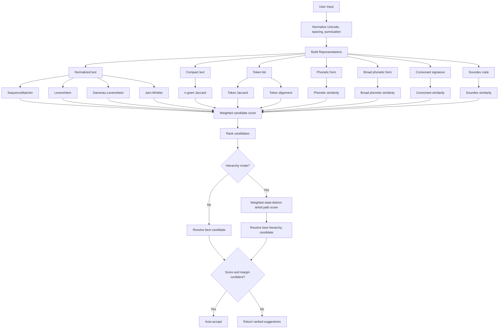

# Hierarchy Matching Utility

[`utilities/hierarchy_matching.py`](/mnt/y/core-stack-org/backend-test-2/utilities/hierarchy_matching.py) provides reusable approximate matching helpers for administrative hierarchies such as:

- state
- district
- tehsil or block
- village names when needed

It is designed for this project’s specific reality:

- users often know place names by sound, not by official spelling
- romanized spellings vary across English transliterations
- state, district, and tehsil context should influence each other
- we need safe auto-resolution for obvious matches, but not reckless guessing

## Goals

- rank exact, approximate, and phonetic matches in a stable way
- support romanized South Asian name variants
- expose useful suggestions when confidence is low
- allow callers like [`installation/public_api_client.py`](/mnt/y/core-stack-org/backend-test-2/installation/public_api_client.py) to auto-accept only high-confidence matches

## Algorithms Used

The module combines standard approximate-matching techniques with domain-tuned phonetic heuristics:

- Unicode normalization and token cleanup
- Levenshtein distance
- Damerau-Levenshtein distance for transposition-aware typos
- Jaro-Winkler similarity for short-string near matches
- character 2-gram and 3-gram Jaccard overlap
- token Jaccard overlap
- token alignment scoring
- Soundex-style phonetic bucketing
- heuristic phonetic normalization for common romanized variations such as:
  - `ph` / `f`
  - `bh` / `b`
  - `dh` / `d`
  - `kh` / `k`
  - `sh` / `s`
  - `ch` / `c`
  - `v` / `w`
  - vowel-length variants like `aa`, `ee`, `oo`
- broad phonetic grouping
- consonant-signature comparison
- weighted hierarchy scoring across state, district, and tehsil

## Flow



## Confidence Model

The utility intentionally separates ranking from acceptance:

- `rank_candidates()` and `rank_hierarchy_candidates()` always score and sort
- `resolve_best_candidate()` and `resolve_best_hierarchy_candidate()` decide whether the top result is confident enough to auto-select

The default acceptance rule is:

- accept immediately if the score is effectively exact
- otherwise accept only if:
  - top score is at least `0.84`
  - and the gap from the runner-up is at least `0.06`

This keeps behavior practical for cases like `kachar -> Cachar`, while avoiding unsafe automatic resolution when multiple close names exist.

## Typical Use

### Single-level matching

```python
from utilities.hierarchy_matching import resolve_best_candidate

resolution = resolve_best_candidate(
    "gauhati",
    ["Guwahati", "Silchar", "Tezpur"],
)

if resolution.accepted:
    print(resolution.best_match.candidate)
else:
    print([item.candidate for item in resolution.alternatives])
```

### Hierarchy matching

```python
from utilities.hierarchy_matching import (
    HierarchyCandidate,
    resolve_best_hierarchy_candidate,
)

candidates = [
    HierarchyCandidate(state="Assam", district="Cachar", tehsil="Lakhipur"),
    HierarchyCandidate(state="Assam", district="Kamrup", tehsil="Rangia"),
]

resolution = resolve_best_hierarchy_candidate(
    candidates=candidates,
    state_query="assam",
    district_query="kachar",
    tehsil_query="lakhipur",
)
```

## Project Integration

Current primary consumer:

- [`installation/public_api_client.py`](/mnt/y/core-stack-org/backend-test-2/installation/public_api_client.py)

The public API client uses the utility for:

- state/district/tehsil resolution against activated locations
- fuzzy fallback during `download`
- fuzzy fallback during `resolve`
- fuzzy fallback for filtered `locations`
- village-name fallback when filtering village geometries

## Peculiarities Of This Use Case

This is not generic English fuzzy search. The names in this project commonly show:

- sound-driven spelling instead of dictionary spelling
- transliteration variance across `sh/s`, `v/w`, `ph/f`, `ch/c`
- spacing variance such as `Bagan Para` vs `Baganpara`
- repeated-letter or vowel-length variance such as `aa/a`, `oo/u`
- hierarchy context that should outweigh isolated token similarity

That is why the module uses both world-standard similarity algorithms and domain-tuned phonetic heuristics instead of relying on a single distance metric.
