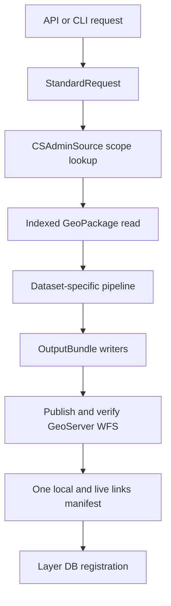

# Local Pipeline Core

Shared helpers for fast local geospatial pipelines in `utilities/pipelines`.

The core package keeps reusable mechanics separate from dataset-specific
pipelines:

- SQLite-backed GeoPackage inspection, filtered reads, and first-run indexes.
- Standard admin scope resolution from `cs_admin_standard.gpkg`.
- CSV-to-SQLite sidecars for repeated keyed lookups.
- Standard request parsing for API and CLI execution.
- Standard output bundle writers for Unicode-normalized GPKG, README, run
  metadata (column descriptions, optional rename mappings, and EDA), and one
  JSON links manifest.

Dataset-specific runtime scripts should import this package from
`utilities.pipelines` and should not use `pyogrio`. The shared package reads
GeoPackage rows through SQLite and writes GeoPackages through GeoPandas/Fiona.
