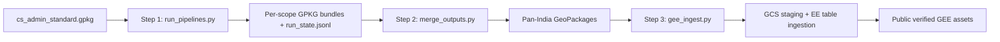

# Pan-India GEE Asset Builds

Build pan-India GeoPackages and Earth Engine assets from the local dataset
pipelines (`computing/misc/facilities`, `computing/misc/antyodaya`,
`computing/misc/livestocks`) with one source of truth: the same pipeline code
and request contract the tehsil/district APIs execute.



## Files

- Config (single source of truth): `pan_india_assets.yaml`
- Step 1: `run_pipelines.py` — run every configured pipeline over every
  tehsil (or district) enumerated from `cs_admin_standard.gpkg`.
- Step 2: `merge_outputs.py` — stream the recorded per-scope GeoPackages into
  pan-India GeoPackages without changing structure.
- Step 3: `gee_ingest.py` — TSV export, GCS staging, and Earth Engine table
  ingestion, following the proven Core Stack ingestion flow.
- Run state: `data/pan_india_gee_assets/state/run_state.jsonl`
- Merged outputs: `data/pan_india_gee_assets/outputs/`
- GEE staging and summaries: `data/pan_india_gee_assets/gee/`

## Contract

- Requests are normalized through `api_request_payload`, so every scope run is
  byte-for-byte the request the HTTP API would queue. GeoServer, GeoLibre, and
  Layer DB registration stay off; `use_pregenerated` reuses each pipeline's
  cached bundle when its inputs are unchanged.
- The merged GeoPackages concatenate the per-scope layers with a
  union-of-columns schema, so pan-India assets carry exactly the columns and
  values of the tehsil/district API outputs.
- Earth Engine assets ingest every column of the merged GeoPackages unchanged:
  - `cs_village_facility_proximity` — village polygons with facility status,
    `l2_*`, and `l3_*` proximity columns.
  - `cs_pan_india_facilities` — `tehsil_facility_collection` points.
  - `cs_village_nearest_facilities` — `village_nearest_facility_collection` points.
  - `cs_antyodaya_2020` — Mission Antyodaya village layer.
  - `cs_village_livestock_census_20` — Livestock Census village layer.

## Commands

Use the `corestack-backend` conda environment for steps 1 and 2 (they import
the Django pipeline modules and Fiona). Step 3 only needs
`pyyaml`/`shapely` to build and `earthengine-api`/`google-cloud-storage` to
upload, so `uv run --with ...` also works.

### Step 1: run the pipelines across India

Smoke test on a couple of tehsils first:

```bash
PROJ_LIB=/usr/share/proj DJANGO_SETTINGS_MODULE=nrm_app.settings \
/home/amitportal/miniconda3/envs/corestack-backend/bin/python \
  -m utilities.scripts.build_pan_india_gee_assets.run_pipelines \
  --pipelines facilities antyodaya livestocks \
  --states jharkhand --districts dumka --limit 2
```

Full run (resumable; interrupted runs skip recorded successes):

```bash
PROJ_LIB=/usr/share/proj DJANGO_SETTINGS_MODULE=nrm_app.settings \
nohup /home/amitportal/miniconda3/envs/corestack-backend/bin/python \
  -m utilities.scripts.build_pan_india_gee_assets.run_pipelines \
  --pipelines facilities antyodaya livestocks --jobs 2 \
  > logs/pan_india_run_$(date -u +%Y%m%dT%H%M%SZ).log 2>&1 &
```

Useful flags: `--dry-run` lists pending scopes; `--skip-failed` stops retrying
recorded failures; `--force` reruns and overwrites cached bundles; `--level
district` builds district-scoped assets instead.

### Step 2: merge per-scope outputs into pan-India GeoPackages

```bash
PROJ_LIB=/usr/share/proj \
/home/amitportal/miniconda3/envs/corestack-backend/bin/python \
  -m utilities.scripts.build_pan_india_gee_assets.merge_outputs --asset all
```

The merge summary records rows, sources merged, and any scopes skipped for
missing layers. For smoke runs, pass `--output-suffix .smoke` so full outputs
are not replaced.

### Step 3: build tables, upload, monitor, publish, verify

```bash
# Inspect sources
uv run --with pyyaml --with shapely \
  python utilities/scripts/build_pan_india_gee_assets/gee_ingest.py inspect --asset all

# Build the local ingestion tables
nohup uv run --with pyyaml --with shapely \
  python utilities/scripts/build_pan_india_gee_assets/gee_ingest.py build \
  --asset all --jobs 2 --overwrite --max-rss-mb 5000 \
  > logs/pan_india_gee_build_$(date -u +%Y%m%dT%H%M%SZ).log 2>&1 &

# Stage to GCS and start Earth Engine ingestion
nohup uv run --with earthengine-api --with google-cloud-storage --with pyyaml --with shapely \
  python utilities/scripts/build_pan_india_gee_assets/gee_ingest.py upload \
  --asset all --jobs 2 --replace-existing \
  > logs/pan_india_gee_upload_$(date -u +%Y%m%dT%H%M%SZ).log 2>&1 &

# Check ingestion task status later
uv run --with earthengine-api --with google-cloud-storage --with pyyaml \
  python utilities/scripts/build_pan_india_gee_assets/gee_ingest.py status

# Make assets public once ingestion succeeds
uv run --with earthengine-api --with google-cloud-storage --with pyyaml \
  python utilities/scripts/build_pan_india_gee_assets/gee_ingest.py make-public --asset all

# Verify feature counts and schemas against the merged GeoPackages
uv run --with earthengine-api --with google-cloud-storage --with pyyaml \
  python utilities/scripts/build_pan_india_gee_assets/gee_ingest.py verify --asset all
```

## Notes

- Admin rows with a null state/district/tehsil name cannot be addressed by a
  name-based scope; step 1 logs how many village rows fall outside the
  enumerated scopes.
- Scopes whose pipelines produce no rows for a layer (for example, a tehsil
  with no in-boundary facilities) are recorded in the merge summary as skipped
  sources; that mirrors the per-tehsil API behavior of omitting empty layers.
- `cs_pan_india_facilities.gpkg` holds both facility point layers, mirroring
  the per-tehsil facility-points GeoPackage; two Earth Engine assets ingest
  its two layers separately.
- The memory guard, chunked SQLite reads, and manifest-based ingestion match
  `utilities/scripts/gee/core_stack_gee_ingest.py` from the
  `build-core-stack-gee-upload` branch.
