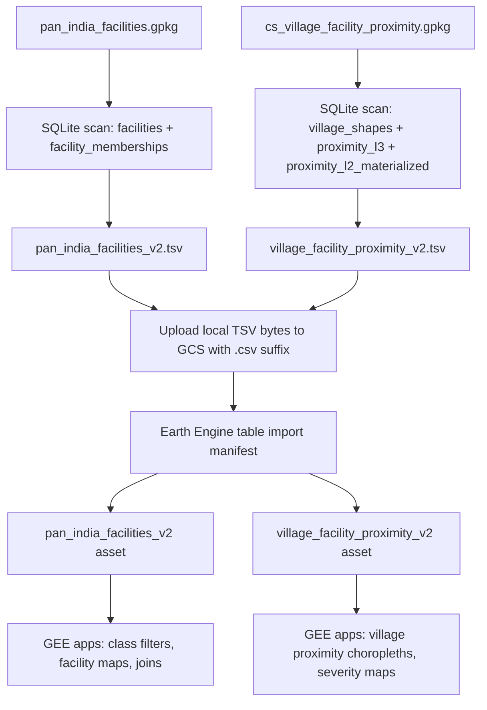

# Facilities GEE Ingestion Flow

This document describes the reproducible path for creating the two CoRE Stack
facilities Earth Engine table assets from local GeoPackage outputs.

## Assets

| Local source | GEE asset | Shape |
| --- | --- | --- |
| `data/facilities/outputs/pan_india_facilities.gpkg` | `projects/corestack-datasets/assets/datasets/pan_india_facilities_v2` | Point table, one row per facility membership |
| `data/facilities/outputs/cs_village_facility_proximity.gpkg` | `projects/corestack-datasets/assets/datasets/village_facility_proximity_v2` | Village polygon table, one row per village |

The source of truth for this ingestion step is:

- `utilities/scripts/facilities_utils/facilities_gee_assets.py`
- `utilities/scripts/facilities_utils/facilities_gee_assets.yaml`

## Flow



## Why This Shape

Earth Engine works best here with two flat assets rather than the relational
GeoPackage structure.

`pan_india_facilities_v2` is expanded by facility membership. This means one
physical facility can appear in more than one row when it has more than one
classification, and GEE can filter directly on `class_l1_domain`,
`class_l2_filter_group`, `class_l3_facility_class`, `class_l4_facility_subtype`,
and `class_k*`.

`village_facility_proximity_v2` is wide by village. Each row keeps the village
polygon and stores L3, L2, and L1-summary proximity columns. This avoids
duplicating village polygons across millions of long proximity rows and makes
distance styling fast in GEE.

Process-only columns are intentionally excluded. The GEE assets should carry
usable data columns, not build bookkeeping such as `filter_logic`,
`source_row_count`, `source_file_count`, `resolution_status`, or
`membership_count`.

## Format Decision

The local export files are tab-delimited `*.tsv` files. Tab delimiters are more
robust for messy names and text values than comma-separated output.

For upload, the same bytes are staged to GCS with a `.csv` suffix because Earth
Engine table ingestion recognizes CSV sources by extension. The manifest still
sets:

```yaml
csv_delimiter: "\t"
csv_qualifier: '"'
gcs_object_extension: .csv
```

So the uploaded object is a tab-delimited CSV source from Earth Engine's point
of view.

## Libraries

Build-time dependencies:

- `pyyaml`: reads the ingestion config.
- `shapely`: decodes GeoPackage geometry blobs into GeoJSON geometry strings.
- Python standard library `sqlite3`: reads the GeoPackage tables directly.
- Python standard library `csv`: writes quoted tab-delimited table files.

Upload-time dependencies:

- `geemap`: provides the standard Earth Engine Python stack and versioned user
  agent context.
- `earthengine-api`: starts the table ingestion task.
- `google-cloud-storage`: stages the generated table files into GCS.

The script does not use `geopandas` or `pyogrio` for this step. Direct SQLite
scans keep memory bounded and avoid loading the full 2 GB to 6 GB GeoPackages
into memory.

## Rebuild Commands

Smoke test with a small sample output:

```bash
uv run --with pyyaml --with shapely \
  python utilities/scripts/facilities_utils/facilities_gee_assets.py build \
  --asset village_facility_proximity_v2 \
  --limit-villages 10 \
  --output-suffix .sample \
  --overwrite
```

Build both local GEE ingestion files:

```bash
uv run --with pyyaml --with shapely \
  python utilities/scripts/facilities_utils/facilities_gee_assets.py build \
  --asset all \
  --overwrite
```

Inspect configured local outputs:

```bash
uv run --with pyyaml \
  python utilities/scripts/facilities_utils/facilities_gee_assets.py inspect \
  --asset all
```

Upload both built tables to Earth Engine:

```bash
uv run --with geemap --with google-cloud-storage --with pyyaml --with shapely \
  python utilities/scripts/facilities_utils/facilities_gee_assets.py upload \
  --asset all \
  --replace-existing \
  --wait \
  --make-public \
  --cleanup-gcs
```

Run a single asset upload:

```bash
uv run --with geemap --with google-cloud-storage --with pyyaml --with shapely \
  python utilities/scripts/facilities_utils/facilities_gee_assets.py upload \
  --asset pan_india_facilities_v2 \
  --replace-existing \
  --wait \
  --make-public \
  --cleanup-gcs
```

## Reliability Notes

The upload uses a GCS staging object and an Earth Engine table manifest. This is
more reliable for large tables than converting the full file into an in-memory
`ee.FeatureCollection` with `geemap.csv_to_ee`, `geemap.geojson_to_ee`, or
`geemap.gdf_to_ee`.

The current service account is configured in:

```text
data/gee_confs/core-stack-learn-818963fa8f26.json
```

It can stage new objects, but it may not have `storage.objects.delete` on the
GCS bucket. When `--cleanup-gcs` cannot delete a staged object, the script logs a
warning and records `cleaned_gcs: false` instead of failing a successful Earth
Engine ingestion.

If a stale staged object must be removed manually, use a Google Cloud account
with delete permission:

```bash
gcloud storage rm gs://core_stack/gee/facilities_rev/<object-name>.csv
```

## Outputs

Local build outputs:

- `data/facilities/gee/pan_india_facilities_v2.tsv`
- `data/facilities/gee/village_facility_proximity_v2.tsv`
- `data/facilities/gee/facilities_gee_assets_summary.yaml`

Upload summary:

- `data/facilities/gee/facilities_gee_upload_summary.yaml`

GCS staging prefix:

- `gs://core_stack/gee/facilities_rev/`

GEE assets:

- `projects/corestack-datasets/assets/datasets/pan_india_facilities_v2`
- `projects/corestack-datasets/assets/datasets/village_facility_proximity_v2`

## Tehsil API and GeoServer Layers

The backend endpoint `generate_facilities_proximity/` keeps its public name, but
the task now publishes a three-layer bundle for each requested tehsil:

| Layer suffix | Geometry | Meaning |
| --- | --- | --- |
| `facilities_inventory_{district}_{tehsil}` | Point | Facility membership points inside the tehsil boundary. |
| `facilities_nearest_{district}_{tehsil}` | Point | The selected nearest facility for each village-service metric, carrying the village ID, service purpose, selected L3 class, nearest facility UID, and distance. |
| `facilities_village_service_{district}_{tehsil}` | Polygon | Village geography with wide service access and proximity properties attached. |

Each layer is exported as its own GEE asset under the tehsil asset folder, saved
as its own `Layer` database row under the `Facilities Proximity` dataset, and
synced as its own GeoServer layer in the `facilities_proximity` workspace. When
all three GeoServer layers sync successfully, the task also attempts to create a
convenience GeoServer layer group named `facilities_{district}_{tehsil}`. The
individual layers remain the source of truth if layer-group support differs
across GeoServer versions.

## GEE Explorer

After both assets are available in Earth Engine, paste this script into the GEE
Code Editor:

```text
utilities/scripts/facilities_utils/corestack_facitlities_explorer.js
```

The explorer includes single-metric access maps, essential facility gap maps,
facility-density maps, village profile mode, editable planning thresholds, admin
filters, summaries, histograms, facility point overlays, and village click
inspection. Village profile mode draws a 25-spoke L3 access star around the
clicked village, highlights the nearest facilities, and compares the village
against surrounding villages and India-level access pressure.

The Code Editor script keeps lightweight session caches for computed comparison
stats where practical. Durable caching should be done by exporting additional
derived Earth Engine assets, for example a precomputed village access-pressure
asset or district/block summary table.
